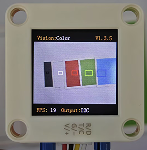
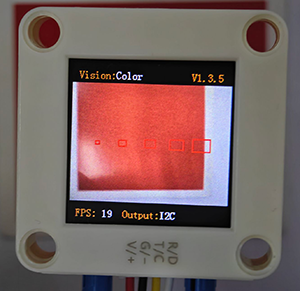
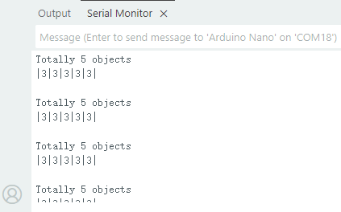
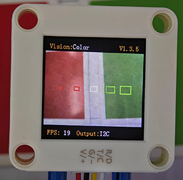
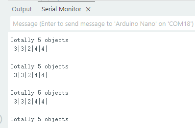
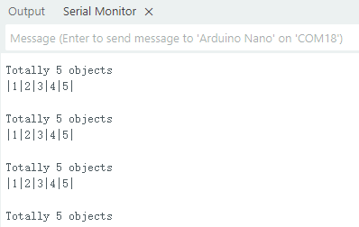

# 4.1 Color Recognition

## 4.1.1 Algorithm



It will specify one or more recognition areas, whose positions and sizes can be set as needed, and then it will return the color label of this area as well as the red component value R, green component value G and blue component value B.

---------------------

## 4.1.2 Color Label

Sengo2 defines 7 colors of labels:

| Label value | Meaning | Label value | Meaning |
| :---------: | :-----: | :---------: | :-----: |
|      1      |  Black  |      2      |  White  |
|      3      |   Red   |      4      |  Green  |
|      5      |  Blue   |      6      | Yellow  |
|      0      | Unknown |             |         |

<span style="color:red;font-size:20px;">Note: Common colors not listed in the table, such as purple, cyan(blue-green), orange, and gray, have relatively low color discrimination and are easily misidentified as the colors in the table. Therefore, they are classified as unknown ones. If you need to recognize the above colors, you can make your own judgment based on the returned RGB values.</span>

Sample 1:



The serial port outputs the label values: (5 recognition boxes all output 3, corresponding to the label values in the table.)



Sample 2:



The serial port outputs the label values: (The first two boxes recognize red, the middle one is white, and the last two are green, which all correspond to the color label table.)



-------------------------

## 4.1.3 Configuration Parameters

Users can set the coordinates of the recognition area and the size of the recognition box. If no new parameters are specified, it will run with the default values that are defined as follows:

|   Parameter   |                  Definition                  | Default |
| :-----------: | :------------------------------------------: | :-----: |
| param.x_value | Central coordinate x of the recognition area |   50    |
| param.y_value | Central coordinate y of the recognition area |   50    |
|  param.width  |       Width w of the recognition area        |    3    |
| param.height  |       Height h of the recognition area       |    4    |

Code: (for setting 5 recognition boxes in the code)

```c
	  int param_num = 5;       // Set the number of detection points (range 1 to 5)
	//Other codes...
  for (size_t i = 1; i <= param_num; i++) {
    // Set the location of the detection area (horizontally and equidistant distribution)
    param.x_value = 100 * i / (param_num + 1);  // x-coordinate (0-100%)
    param.y_value = 50;                         // y-coordinate fixed at 50%

    // Set the size of the detection area (incrementing)
    param.width = i * 2 + 1;   // Area width (odd)
    param.height = i * 2 + 1;  // Area height (odd)

    // Write the parameters into the sensor
    err = sengo.SetParam(VISION_TYPE, &param, i);
	//Other codes...
  }
```

---------------

## 4.1.4 Returned Values

When the main controller acquires the detection results, the algorithm will return the followings:

| Formal parameter |                   Definition                   |
| :--------------: | :--------------------------------------------: |
|     kRValue      |  red component value R, with a range of 0-255  |
|     kGValue      | green component value G, with a range of 0-255 |
|     kBValue      | blue component value B, with a range of 0-255  |
|      kLabel      |               color label value                |

Code:

```c
      // Obtain the label (color ID) of the i-th object
      int label = sengo.GetValue(VISION_TYPE, kLabel, i);
```

In `sengo.GetValue(VISION_TYPE, kLabel, i);`, kLabel = 5, so the returned value is that of the color label. If I replaced it with “kRValue”: `sengo.GetValue(VISION_TYPE, kRValue, i);`, it will return the red component value R(0-255).

--------------------

## 4.1.5 Tips of Color Recognition Algorithm

1. When the recognition area is relatively small, such as 2x2, although the recognition speed is fast, there will be an impact on results due to the small number of pixels, thus with low credibility. It is only suitable for scenarios with a single controllable background.
2. When the recognition area is large, such as 20x20 with the large number of pixels, the interference of variegated colors will be filtered out, resulting in a relatively high credibility, but the recognition speed is slow.
3. Within the recognition area, when the areas occupied by different colors are approximately the same, the results may repeatedly change.

-----------------------

## 4.1.6 Test Code

```c
#include <Arduino.h>
#include <Sentry.h>  // Import the Sentry vision sensor library

typedef Sengo2 Sengo;  // Create an alias Sengo for the Sengo2 type to simplify subsequent usage

// Select the communication method (enable one by uncommenting)
#define SENGO_I2C  // I2C communication is currently enabled
// #define SENGO_UART   // Alternative option: UART serial communication

#ifdef SENGO_I2C
#include <Wire.h>  // Libraries required for I2C communication
#endif

#ifdef SENGO_UART
#include <SoftwareSerial.h>               // Soft serial port library (for non-hardware serial ports)
#define TX_PIN 11                         // Customize the TX pin
#define RX_PIN 10                         // Customize the RX pin
SoftwareSerial mySerial(RX_PIN, TX_PIN);  // Create a soft serial port object
#endif

#define VISION_TYPE Sengo::kVisionColor  // Define the type of visual algorithm (color recognition)
Sengo sengo;                             // Create a Sengo sensor object

void setup() {
  sentry_err_t err = SENTRY_OK;  // Error status variable

  Serial.begin(9600);  // Initialize the serial port for debugging the output
  Serial.println("Waiting for sengo initialize...");

  // Initialize the sensor according to the selected communication method
#ifdef SENGO_I2C
  Wire.begin();  // Initialize I2C bus
  // Keep trying to connect until done
  while (SENTRY_OK != sengo.begin(&Wire)) {
    yield();  // Allow other tasks to run while waiting
  }
#endif

#ifdef SENGO_UART
  mySerial.begin(9600);  // Initialize the soft serial port
  while (SENTRY_OK != sengo.begin(&mySerial)) {
    yield();
  }
#endif

  Serial.println("Sengo begin Success.");

  // Configure detection parameters
  int param_num = 5;                          // Set the number of detection points (1-5)
  sengo.SetParamNum(VISION_TYPE, param_num);  // Apply the number of detection points

  sentry_object_t param;  // Parametric structure
  for (size_t i = 1; i <= param_num; i++) {
    // Set the location of the detection area (horizontally and equidistant distribution)
    param.x_value = 100 * i / (param_num + 1);  // X-axis (0-100%)
    param.y_value = 50;                         // Y-axis (fixed 50%)

    // Set the size of the detection area (incrementing)
    param.width = i * 2 + 1;   // Area width (odd)
    param.height = i * 2 + 1;  // Area height (odd)

    // Write the parameters into the sensor
    err = sengo.SetParam(VISION_TYPE, &param, i);
    if (err) {  // Error handling
      Serial.print("sengo.SetParam");
      Serial.print(i);
      Serial.print(" Error: 0x");
      Serial.println(err, HEX);  // Print hexadecimal error code
      while (1)
        ;  // Infinite loop blocking (manual restart required)
    }
  }

  // Enable the visual recognition algorithm
  err = sengo.VisionBegin(VISION_TYPE);
  Serial.print("sengo.VisionBegin(kVisionColor) ");
  if (err) {
    Serial.print("Error: 0x");
  } else {
    Serial.print("Success: 0x");
  }
  Serial.println(err, HEX);  // Output the initialization result
}

void loop() {
  // Read the number of detected objects (kStatus is the acquisition status)
  int obj_num = sengo.GetValue(VISION_TYPE, kStatus);

  if (obj_num > 0) {  // If an object is detected
    Serial.print("Totally ");
    Serial.print(obj_num);
    Serial.println(" objects");

    // Traverse all the detected objects
    for (int i = 1; i <= obj_num; ++i) {
      // Obtain the label (color ID) of the i-th object
      int label = sengo.GetValue(VISION_TYPE, kLabel, i);
      Serial.print('|');
      Serial.print(label);  // Output label (such as |1|3|5|)
    }
    Serial.println("|\n");  // End mark
  }
  delay(500);  // Delay 500ms to reduce the refresh rate
}
```

----------------

## 4.1.7 Test Result

After uploading the code, 5 recognition boxes of different sizes will appear on the AI vision module. Each box will match a color, and then their corresponding label values will be printed on the serial monitor.




## 4.1.8 Extension Gameplay

**Color Password Lock**

- **Game rule:** Set a color sequence as the “password”(e.g., red - blue - green). Only when the colors are displayed to the camera in the correct order can the success signal (such as rotating servo or the lighting on) be triggered.
- **Practice:** Program to record the color sequence recognized within a short period of time. Only when the sequence exactly matches the preset “password” will it be unlocked. This can be used to simply open a box or start a device.