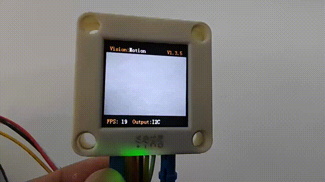
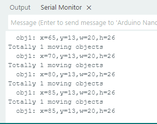

# 4.10 Moving Object Detection

## 4.10.1 Algorithm

Sengo2 needs to remain stationary, and the algorithm will determine whether there are any changed areas in the image by comparing the pixel differences between adjacent frames. If so, it is considered that there is a moving object within the field of view, and the coordinates of this area will be returned. Note that the algorithm returns only one detection result.

## 4.10.2 Returned Values

When the controller acquires the recognition result, the algorithm will return the followings:

|  Parameter   |         Definition          |
| :----------: | :-------------------------: |
|   kXValue    | Object central coordinate x |
|   kYValue    | Object central coordinate y |
| kWidthValue  |       Object width w        |
| kHeightValue |       Object height h       |

Code:

```c
 // Traverse all the detected object
    for (int i = 1; i <= obj_num; ++i) {
      // Obtain the coordinate and size of the object
      int x = sengo.GetValue(VISION_TYPE, kXValue, i);      // Moving area upper-left coordinate x
      int y = sengo.GetValue(VISION_TYPE, kYValue, i);      // Moving area upper-left coordinate y
      int w = sengo.GetValue(VISION_TYPE, kWidthValue, i);  // Moving area width
      int h = sengo.GetValue(VISION_TYPE, kHeightValue, i); // Moving area height
      
      // Print the detailed information
      Serial.print("  obj");
      Serial.print(i);
      Serial.print(": ");
      Serial.print("x=");
      Serial.print(x);
      Serial.print(",y=");
      Serial.print(y);
      Serial.print(",w=");
      Serial.print(w);
      Serial.print(",h=");
      Serial.println(h);
    }
```

----------------

## 4.10.3 Test Code

```c
#include <Arduino.h>          // Arduino core library
#include <Sentry.h>           // Sentry machine vision sensor library

// Create an alias Sengo for the Sengo2 type to simplify subsequent usage
typedef Sengo2 Sengo;

// Communication method (currently enabled I2C).
#define SENGO_I2C             
// #define SENGO_UART         // UART serial communication solution (annotated as disabled)

// Include the corresponding library according to the selected communication mode
#ifdef SENGO_I2C
#include <Wire.h>             // Libraries required for I2C communication
#endif
#ifdef SENGO_UART
#include <SoftwareSerial.h>
#define TX_PIN 11  // Customize the TX pin
#define RX_PIN 10  // Customize the RX pin
SoftwareSerial mySerial(RX_PIN, TX_PIN);  // Create a soft serial port object
#endif

// Define the visual processing type as motion detection
#define VISION_TYPE Sengo::kVisionMotionDetect
Sengo sengo;  // Create a Sengo sensor object

// Initialization
void setup() {
  sentry_err_t err = SENTRY_OK;  // error state variable

    Serial.begin(9600);  // Initialize the serial port for debugging the output
    Serial.println("Waiting for sengo initialize...");

    // I2C initialization
#ifdef SENGO_I2C
  Wire.begin();  // Initialize the I2C bus
  // Keep trying to connect until succeed
  while (SENTRY_OK != sengo.begin(&Wire)) { 
    yield();  // Give up CPU control during the waiting period (Prevent the watchdog from resetting)
  }
#endif  // SENGO_I2C

  // UART initialization (disabled currently)
#ifdef SENGO_UART
  mySerial.begin(9600);  // Initialize the soft serial port
  while (SENTRY_OK != sengo.begin(&mySerial)) { 
    yield();
  }
#endif  // SENGO_UART

  Serial.println("Sengo begin Success.");
  
  // Activate the motion detection function
  err = sengo.VisionBegin(VISION_TYPE);
  
  // Print the initialization result
  Serial.print("sengo.VisionBegin(kVisionMotionDetect) ");
  if (err) {
    Serial.print("Error: 0x");
  } else {
    Serial.print("Success: 0x");
  }
  // Print the error code in hexadecimal format (0 means success)
  Serial.println(err, HEX);
}

// loop
void loop() {
  // Obtain the number of detected objects (kStatus is the query status)
  int obj_num = sengo.GetValue(VISION_TYPE, kStatus);
  
  if (obj_num > 0) {  // If a moving object is detected
    Serial.print("Totally ");
    Serial.print(obj_num);
    Serial.println(" moving objects");
    
 // Traverse all the detected object
    for (int i = 1; i <= obj_num; ++i) {
      // Obtain the coordinate and size of the object
      int x = sengo.GetValue(VISION_TYPE, kXValue, i);      // Moving area upper-left coordinate x
      int y = sengo.GetValue(VISION_TYPE, kYValue, i);      // Moving area upper-left coordinate y
      int w = sengo.GetValue(VISION_TYPE, kWidthValue, i);  // Moving area width
      int h = sengo.GetValue(VISION_TYPE, kHeightValue, i); // Moving area height
      
      // Print the detailed information
      Serial.print("  obj");
      Serial.print(i);
      Serial.print(": ");
      Serial.print("x=");
      Serial.print(x);
      Serial.print(",y=");
      Serial.print(y);
      Serial.print(",w=");
      Serial.print(w);
      Serial.print(",h=");
      Serial.println(h);
    }
  }
}
```

-----

## 4.10.4 Test Result

After uploading the code, the AI vision module will detect the area captured by the camera. If it detects any moving object, it will recognize it and print its coordinates, width and height on the serial monitor.





## 4.10.5 Extension Gameplay

**Dynamic sensor lamp**

- **Game rule:** Align the module with the door or corridor of a room. When a large range of movement (someone passing by) is detected, the LED light will turn on and then turn off after a delay. This is “lights on when people come and off when they leave”.
- **Practice:** Program to continuously detect moving objects. Once detected, the digital pin outputs a high level to control the relay or MOS tube to light up the LED strip.