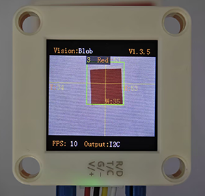
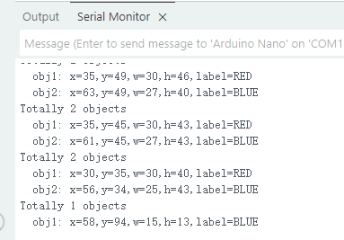

# 4.2 Color Block Detection

## 4.2.1 Algorithm



We specify a certain detection color, and it will determine whether there is a block of that color in the image. If yes, it will return its coordinates and size. The color label is the same as that in color recognition algorithm.

---------------------------

## 4.2.2 Configuration Parameters

Users can set the detection quantity, size and color labels of the color blocks to be recognized. If no new parameters are specified, it will run with the default values as follows:

| Mode |                          Definition                          |
| :--: | :----------------------------------------------------------: |
|  1   | At most 1 color block can be detected simultaneously for each color |
|  2   | At most 2 color block can be detected simultaneously for each color |
|  3   | At most 3 color block can be detected simultaneously for each color |
|  4   | At most 4 color block can be detected simultaneously for each color |
|  5   | At most 5 color block can be detected simultaneously for each color |

Code:

```c
  /* Set the maximum detection quantity for each color */
  err = sengo.VisionSetMode(VISION_TYPE, 2);  // A maximum of two color blocks can be detected
```

-------------------

## 4.2.3 Returned Values

When the main controller acquires the detection results, the algorithm will return the followings:

| Formal parameter |            Definition            |
| :--------------: | :------------------------------: |
|     kXValue      | color block central coordinate x |
|     kYValue      | color block central coordinate y |
|   kWidthValue    |       color block width w        |
|   kHeightValue   |       color block height h       |
|      kLabel      |           color label            |

Code:

```c
    // Traverse all the detected color blocks
    for (int i = 1; i <= obj_num; ++i) {
      // Obtain the position and size information of the color blocks
      int x = sengo.GetValue(VISION_TYPE, kXValue, i);      // coordinate x
      int y = sengo.GetValue(VISION_TYPE, kYValue, i);      // coordinate y
      int w = sengo.GetValue(VISION_TYPE, kWidthValue, i);  // width 
      int h = sengo.GetValue(VISION_TYPE, kHeightValue, i); // height 
      int l = sengo.GetValue(VISION_TYPE, kLabel, i);      // color lable
      
      // Format and output the detection results
      Serial.print("  obj");
      Serial.print(i);
      Serial.print(": ");
      Serial.print("x=");
      Serial.print(x);
      Serial.print(",y=");
      Serial.print(y);
      Serial.print(",w=");
      Serial.print(w);
      Serial.print(",h=");
      Serial.print(h);
      Serial.print(",label=");
      Serial.println(blob_classes[l]);  // Output color names instead of numbers
    }
```

---------------------

## 4.2.4 Test Code

```c
#include <Arduino.h>
#include <Sentry.h>  // Introduce the Sentry machine vision sensor library

typedef Sengo2 Sengo;  // Create an alias Sengo for the Sengo2 type to simplify subsequent usage

// Communication method (currently enabled I2C)
#define SENGO_I2C
// #define SENGO_UART   // UART alternative options (annotated)

#ifdef SENGO_I2C
#include <Wire.h>       // Libraries required for I2C communication
#endif

#ifdef SENGO_UART
#include <SoftwareSerial.h>
#define TX_PIN 11       // Customize the TX pin
#define RX_PIN 10       // Customize the RX pin
SoftwareSerial mySerial(RX_PIN, TX_PIN);  // Create a soft serial port object
#endif

#define VISION_TYPE Sengo::kVisionBlob  // Blob detection (color block recognition)
Sengo sengo;  // Create a Sengo sensor object

// The text description of the Blob detection result label
const char* blob_classes[] = {
  "UNKNOWN", "BLACK", "WHITE", "RED", "GREEN", "BLUE", "YELLOW"
};

void setup() {
  sentry_err_t err = SENTRY_OK;  // Error status variable

  Serial.begin(9600);  // Initialize the serial port for debugging the output
  Serial.println("Waiting for sengo initialize...");

// Initialize the sensor according to the selected communication mode
#ifdef SENGO_I2C
  Wire.begin();  // Initialize I2C bus
  // Keep trying to connect until succeed
  while (SENTRY_OK != sengo.begin(&Wire)) { 
    yield();  // Allow other tasks to run while waiting
  }
#endif

#ifdef SENGO_UART
  mySerial.begin(9600);
  while (SENTRY_OK != sengo.begin(&mySerial)) { 
    yield();
  }
#endif

  Serial.println("Sengo begin Success.");

  // ============== Blob detection parameter configuration ==============
  sengo.SetParamNum(VISION_TYPE, 2);  // Set the detection of color blocks of two colors
  
  sentry_object_t param = {0};  // Initialize the parameter structure
  
  /* Set the minimum detection size (pixels) of the color block*/
  param.width = 5;    // Minimum width: 5 pixels
  param.height = 5;   // Minimum height: 5 pixels
  
  /* Configure the first color block (red) */
  param.label = Sengo::kColorRed;  // Set the color label to red
  err = sengo.SetParam(VISION_TYPE, &param, 1);  // Apply to parameter 1
  
  // Output configuration result
  Serial.print("sengo.SetParam[");
  Serial.print(blob_classes[param.label]);  // Print the color name
  if (err) {
    Serial.print("] Error: 0x");
  } else {
    Serial.print("] Success: 0x");
  }
  Serial.println(err, HEX);  // Output the hexadecimal status code

  /* Configure the second color block (blue) */
  param.label = Sengo::kColorBlue;  // Set the color label to blue
  err = sengo.SetParam(VISION_TYPE, &param, 2);  // Apply to parameter 2
  
  Serial.print("sengo.SetParam[");
  Serial.print(blob_classes[param.label]);
  if (err) {
    Serial.print("] Error: 0x");
  } else {
    Serial.print("] Success: 0x");
  }
  Serial.println(err, HEX);

  /* Set the maximum detection quantity for each color */
  err = sengo.VisionSetMode(VISION_TYPE, 2);  // A maximum of two color blocks can be detected
  Serial.print("sengo.VisionSetMode");
  if (err) {
    Serial.print(" Error: 0x");
  } else {
    Serial.print(" Success: 0x");
  }
  Serial.println(err, HEX);

  // Start Blob visual recognition
  err = sengo.VisionBegin(VISION_TYPE);
  Serial.print("sengo.VisionBegin(kVisionBlob) ");
  if (err) {
    Serial.print("Error: 0x");
  } else {
    Serial.print("Success: 0x");
  }
  Serial.println(err, HEX);
}

void loop() {
  // Read the total number of detected objects
  int obj_num = sengo.GetValue(VISION_TYPE, kStatus);
  
  if (obj_num > 0) {  // If an object is detected
    Serial.print("Totally ");
    Serial.print(obj_num);
    Serial.println(" objects");
    
    // Traverse all the detected color blocks
    for (int i = 1; i <= obj_num; ++i) {
      // Obtain the position and size information of the color blocks
      int x = sengo.GetValue(VISION_TYPE, kXValue, i);      // coordinate x
      int y = sengo.GetValue(VISION_TYPE, kYValue, i);      // coordinate y
      int w = sengo.GetValue(VISION_TYPE, kWidthValue, i);  // width 
      int h = sengo.GetValue(VISION_TYPE, kHeightValue, i); // height 
      int l = sengo.GetValue(VISION_TYPE, kLabel, i);      // color lable
      
      // Format and output the detection results
      Serial.print("  obj");
      Serial.print(i);
      Serial.print(": ");
      Serial.print("x=");
      Serial.print(x);
      Serial.print(",y=");
      Serial.print(y);
      Serial.print(",w=");
      Serial.print(w);
      Serial.print(",h=");
      Serial.print(h);
      Serial.print(",label=");
      Serial.println(blob_classes[l]);  // Output color names instead of numbers
    }
  }
}
```

----------------------------

## 4.2.5 Test Result

After uploading the code, the module will detect the area captured by the camera. If there are red and blue blocks, they will be selected and marked. Then, their position coordinates x and y, width, height, and color label values will be printed on the serial monitor. In the example, we converted the label values into color names.




## 4.2.6 Extension Gameplay

**Smart sorting assistant**

- **Game rule:** The module distinguishes blocks of different colors and shapes (say, red square, blue circle…), and push different blocks into the corresponding collection boxes by controlling two servos.
- **Practice:** Program to set the recognition targets as “red circles” and “blue squares”. When target A is identified, servo A will act. When target B is identified, servo B will work. Here we pay attention to two attributes of **shape** and **color**.