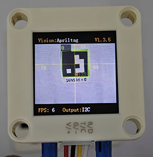
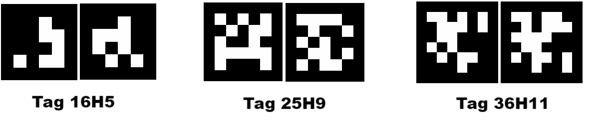
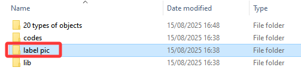
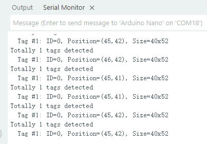

# 4.3 Label Recognition

## 4.3.1 Algorithm



It determines whether there is an Apriltag label in the image, here including only three encoding forms of labels: 16H5, 25H9, and 36H11. When the algorithm is running, we need to select a format first (36H11 by default). Different Apriltags labels cannot be detected simultaneously, but up to 25 tags with the same encoding label can be recognized at the same time.

<span style="color:red;font-size:20px">Note: This algorithm cannot operate simultaneously with other algorithms marked with a \*.</span>

----------

## 4.3.2 Classification Label



The Apriltag label is a set of predefined black and white square patterns. The number of squares used varies depending on the encoding form. Each pattern has a predefined tag label value that will be returned after recognition.



--------------------

## 4.3.3 Configuration Parameters

Users can set the encoding format of label. If no new parameters are specified, it will run in the default format 36H11. The parameter definitions are as follows:

|          Mode          | Tag label |
| :--------------------: | :-------: |
| kVisionModeFamily16H5  | Tag 16H5  |
| kVisionModeFamily25H9  | Tag 25H9  |
| kVisionModeFamily36H11 | Tag 36H11 |

Code:

```c
  // Set the AprilTag family type to 16H5 (Standard Tag Set)
  err = sengo.VisionSetMode(VISION_TYPE, Sengo::kVisionModeFamily16H5);
```

---------------

## 4.3.4 Returned Values


When the main controller detects a label, the algorithm will return its coordinates, size and label number.

When the register is read through the main controller, the following data will be returned:

|  Parameters  |         Definition         |
| :----------: | :------------------------: |
|   kXValue    | label central coordinate x |
|   kYValue    | label central coordinate y |
| kWidthValue  |       label width w        |
| kHeightValue |       label height h       |
|    kLabel    |          label ID          |

Code:

```c
// Traverse all the detected labels
    for (int i = 1; i <= obj_num; ++i) {
      // Get the center position of the tag
      int x = sengo.GetValue(VISION_TYPE, kXValue, i);
      int y = sengo.GetValue(VISION_TYPE, kYValue, i);
      
      // Obtain the size of the label bounding box
      int w = sengo.GetValue(VISION_TYPE, kWidthValue, i);
      int h = sengo.GetValue(VISION_TYPE, kHeightValue, i);
      
      // Obtain the tag label ID (unique identifier)
      int tag_id = sengo.GetValue(VISION_TYPE, kLabel, i);
      
      // Format and output the detection results
      Serial.print("  Tag #");
      Serial.print(i);
      Serial.print(": ");
      Serial.print("ID=");
      Serial.print(tag_id);
      Serial.print(", Position=(");
      Serial.print(x);
      Serial.print(",");
      Serial.print(y);
      Serial.print("), Size=");
      Serial.print(w);
      Serial.print("x");
      Serial.print(h);
      Serial.println();
    }
```

----------

## 4.3.5 Tips of Label Recognition Algorithm

1. The width and height values of the labels returned by the algorithm are relatively stable, so it is used to calculate distance. Rotation does not affect the size of the label, but tilting does.
2. The larger the label is, the farther the recognition distance will be.

## 4.3.6 Test Code

```c
#include <Arduino.h>
#include <Sentry.h>  // Introduce the Sentry machine vision sensor library

typedef Sengo2 Sengo;  // Create an alias Sengo for the Sengo2 type to simplify subsequent usage

// Communication method (currently enabled I2C)
#define SENGO_I2C
// #define SENGO_UART   // UART alternative options (annotated)

#ifdef SENGO_I2C
#include <Wire.h>  // Libraries required for I2C communication
#endif

#ifdef SENGO_UART
#include <SoftwareSerial.h>
#define TX_PIN 11  // Customize the TX pin
#define RX_PIN 10  // Customize the RX pin
SoftwareSerial mySerial(RX_PIN, TX_PIN);  // Create a soft serial port object
#endif

#define VISION_TYPE Sengo::kVisionAprilTag  // Enable AprilTag detection mode
Sengo sengo;  // Create a Sengo sensor object

void setup() {
  sentry_err_t err = SENTRY_OK;  // Error status variable

  Serial.begin(9600);  // Initialize the serial port for debugging the output
  Serial.println("Waiting for sengo initialize...");

// Initialize the sensor according to the selected communication method
#ifdef SENGO_I2C
  Wire.begin();  // Initialize the I2C bus
  // Keep trying to connect until succeed
  while (SENTRY_OK != sengo.begin(&Wire)) {
    yield();  // Allow other tasks to run while waiting
  }
#endif

#ifdef SENGO_UART
  mySerial.begin(9600);
  while (SENTRY_OK != sengo.begin(&mySerial)) {
    yield();
  }
#endif

  Serial.println("Sengo begin Success.");
  
  // ============== AprilTag Detection Configuration ==============
  
  // Set the AprilTag family type to 16H5 (Standard Tag Set)
  err = sengo.VisionSetMode(VISION_TYPE, Sengo::kVisionModeFamily16H5);
  
  // Set the detection level to speed priority (sacrificing accuracy to speed up)
  err = sengo.VisionSetLevel(VISION_TYPE, kLevelSpeed);
  
  if (err) {
    Serial.print("sengo.VisionSetMode Error: 0x");
    Serial.println(err, HEX);  // Output error code
  }
  
  // Activate the AprilTag visual recognition
  err = sengo.VisionBegin(VISION_TYPE);
  Serial.print("sengo.VisionBegin(kVisionAprilTag) ");
  if (err) {
    Serial.print("Error: 0x");
  } else {
    Serial.print("Success: 0x");
  }
  Serial.println(err, HEX);  // Output the initialization result
}

void loop() {
  // Read the number of detected Apriltags
  int obj_num = sengo.GetValue(VISION_TYPE, kStatus);
  
  if (obj_num > 0) {  // If AprilTag is detected
    Serial.print("Totally ");
    Serial.print(obj_num);
    Serial.println(" tags detected");
    
    // Traverse all the detected labels
    for (int i = 1; i <= obj_num; ++i) {
      // Get the center position of the tag
      int x = sengo.GetValue(VISION_TYPE, kXValue, i);
      int y = sengo.GetValue(VISION_TYPE, kYValue, i);
      
      // Obtain the size of the label bounding box
      int w = sengo.GetValue(VISION_TYPE, kWidthValue, i);
      int h = sengo.GetValue(VISION_TYPE, kHeightValue, i);
      
      // Obtain the tag label ID (unique identifier)
      int tag_id = sengo.GetValue(VISION_TYPE, kLabel, i);
      
      // Format and output the detection results
      Serial.print("  Tag #");
      Serial.print(i);
      Serial.print(": ");
      Serial.print("ID=");
      Serial.print(tag_id);
      Serial.print(", Position=(");
      Serial.print(x);
      Serial.print(",");
      Serial.print(y);
      Serial.print("), Size=");
      Serial.print(w);
      Serial.print("x");
      Serial.print(h);
      Serial.println();
    }
  }
  
  delay(100);  // Delay appropriately to reduce the refresh rate
}
```

-----------

## 4.3.7 Test Result

After uploading the code, the module will detect the area captured by the camera. If there are 16H5 tags, they will be recognized. Then, the coordinate x and y, width, height and the label value will be displayed on the serial monitor.




## 4.3.8 Extension Gameplay

**Label instruction card**

- **Game rule:** Match the labels from 0 to 4 to an action, such as a 90-degree rotation of the servo or car moving forward, etc.
- **Practice:** The development board reads the ID sequence of the labels and performs the corresponding operation according to the sequence.