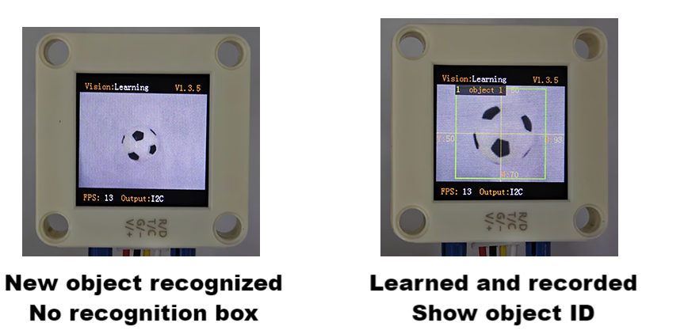

# 4.5 Deep Learning

## 4.5.1 Algorithm


It can perform offline learning, storage and recognition on any object, and store up to 15 objects. The stored objects can be deleted either entirely or individually. This algorithm only classifies objects and is unable to detect their position and size.

-------------------------

## 4.5.2 Classification Label

| Label value | Definition |
| :---------: | :--------: |
|    1-15     | Object ID  |

----------

## 4.5.3 Save Data

After enabling the deep learning algorithm, point the camera directly at the target object, press the function button for about 5 seconds and then release it. Sengo2 will start learning, and the data of this object will be stored and assigned an ID number (Note: up to 15 can be stored). 

The smallest number among the currently available numbers will be assigned to the label value. If there are no vacant numbers, Sengo2 will prompt a storage failure.



---------

## 4.5.4 Delete Data

After learning, press the function button for about 10 seconds and then release it to delete the data just stored. Press it again for 10 seconds, and all the stored data will be cleared. If no deep learning has been done after enabling the algorithm, all storage will be directly cleared when you press the function button for 10 seconds.

-------

## 4.5.5 Returned Values

When the controller acquires the recognition result, the algorithm will return the followings:

|  Parameter   | Definition  |
| :----------: | :---------: |
|   kXValue    | fixed value |
|   kYValue    | fixed value |
| kWidthValue  | fixed value |
| kHeightValue | fixed value |
|    kLabel    |  object ID  |

Code:

```c
 // Traverse all the detected objects
    for (int i = 1; i <= obj_num; ++i) {
      // Obtain the classification label of the current object (the ID defined during model training)
      int label = sengo.GetValue(VISION_TYPE, kLabel, i);
      
      // Print the object ID number and its label
      Serial.print("  obj");
      Serial.print(i);
      Serial.print(": ");
      Serial.print("label=");
      Serial.println(label);
    }
```

-------

## 4.5.6 Tips of Deep Learning Algorithm

1. For some applications with the need to identify the same object over a long distance or at a fixed position but from different angles (for example, the card is rotated by 90° or 180°), it need to learn the object at different distances/angles and store them as ID1, ID2, etc. During working, if the returned label value is one of above, it determines that they are the same object.
2. If there are differences in the background (including light conditions) between learning and recognizing, the result may be affected.

## 4.5.7 Test Code

```c
#include <Arduino.h>          // Arduino core library
#include <Sentry.h>           // Sentry machine vision sensor library

// Create an alias Sengo for the Sengo2 type to simplify subsequent usage
typedef Sengo2 Sengo;

// Communication method (currently enabled I2C).
#define SENGO_I2C             
// #define SENGO_UART          // UART serial communication solution (annotated as disabled)

// Include the corresponding library according to the selected communication mode
#ifdef SENGO_I2C
#include <Wire.h>             // Libraries required for I2C communication
#endif

#ifdef SENGO_UART
#include <SoftwareSerial.h>   // Soft serial library
#define TX_PIN 11  // Customize the TX pin
#define RX_PIN 10  // Customize the RX pin
SoftwareSerial mySerial(RX_PIN, TX_PIN);  // Create a soft serial port object
#endif

// Define the visual processing type as a machine learning mode
#define VISION_TYPE Sengo::kVisionLearning  

// Create a Sengo sensor object
Sengo sengo;

void setup() {
  sentry_err_t err = SENTRY_OK;  // Define the error state variable and initialize it to be error-free

  Serial.begin(9600);            // Initialize the serial port for debugging the output
  Serial.println("Waiting for sengo initialize...");  // Print the initialization prompt

// Initialize the sensor according to the selected communication mode
#ifdef SENGO_I2C
  Wire.begin();  // Initialize the I2C bus
  // Keep trying to connect until succeed
  while (SENTRY_OK != sengo.begin(&Wire)) { 
    yield();  // Allow other tasks to run while waiting
  }
#endif  // SENGO_I2C

#ifdef SENGO_UART
  mySerial.begin(9600);           // Initialize the soft serial port with a baud rate of 9600
  // Keep trying to connect until succeed
  while (SENTRY_OK != sengo.begin(&mySerial)) { 
    yield();  // Allow other tasks to run while waiting
  }
#endif  // SENGO_UART

  Serial.println("Sengo begin Success.");  // Print the successful initialization information of the sensor
  
  // Activate the machine learning visual recognition function
  err = sengo.VisionBegin(VISION_TYPE);
  
  // Print the initialization result of visual recognition
  Serial.print("sengo.VisionBegin(kVisionLearning) ");
  if (err) {
    Serial.print("Error: 0x");    // If an error occurs, print the error prefix
  } else {
    Serial.print("Success: 0x");  // If successful, print the success prefix
  }
  Serial.println(err, HEX);       // Print the error code in hexadecimal format
}

void loop() {
  // Obtain the number of detected objects (the kStatus parameter returns the total number of detected objects)
  int obj_num = sengo.GetValue(VISION_TYPE, kStatus);
  
  // If at least one object is detected
  if (obj_num) {
    // Print the total number of detected objects
    Serial.print("Totally ");
    Serial.print(obj_num);
    Serial.println(" objects");
    
 // Traverse all the detected objects
    for (int i = 1; i <= obj_num; ++i) {
      // Obtain the classification label of the current object (the ID defined during model training)
      int label = sengo.GetValue(VISION_TYPE, kLabel, i);
      
      // Print the object ID number and its label
      Serial.print("  obj");
      Serial.print(i);
      Serial.print(": ");
      Serial.print("label=");
      Serial.println(label);
    }
  }
  
  delay(200);
}
```

----------

## 4.5.8 Test Result

After uploading the code, press and hold the function button at the back of the AI vision module for 5 seconds, and then aim the camera at the object to be recognized in a white background. After completing deep learning, it can recognize objects.


## 4.5.9 Extension Gameplay

**Exclusive gesture recognizer** (high challenge)

- **Game rule:** Instead of recognizing regular objects, train it to recognize several of your custom gestures (such as “thumbs up”, “OK”, “palm”). Recognize different gestures to control light, play music, etc.

- **Practice:** In a clean background (white is recommended), recognize gestures. Each gesture needs to be recognized three times to improve accuracy. In the code, the IDs of the three identical gestures are placed and judged by logic. As long as one of them is satisfied the requirement, the corresponding function will be executed.

- **Possible difficulty:** This places high demands on the background, ambient lighting and gesture position during recognizing.