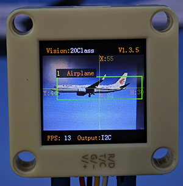
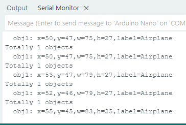

# 4.8 20 Types of Object Recognition

## 4.8.1 Algorithm

It can identify 20 common types of objects and return their coordinates and labels after recognition.

## 4.8.2 Classification Label

| Label |     name     | Label |     name     |
| :---: | :----------: | :---: | :----------: |
|   1   |   Airplane   |   2   |   Bicycle    |
|   3   |     Bird     |   4   |     Boat     |
|   5   |    Bottle    |   6   |     Bus      |
|   7   |     Car      |   8   |     Cat      |
|   9   |    Chair     |  10   |     Cow      |
|  11   | Dining Table |  12   |     Dog      |
|  13   |    Horse     |  14   |  Motorbike   |
|  15   |    Person    |  16   | Potted Plant |
|  17   |    Sheep     |  18   |     Sofa     |
|  19   |    Train     |  20   |  Tv monitor  |

We have provided 20 types of object images in the Resources folder.

---------------

## 4.8.3 Returned Values

When the controller acquires the recognition result, the algorithm will return the followings:

|  Parameter   |         Definition          |
| :----------: | :-------------------------: |
|   kXValue    | Object central coordinate x |
|   kYValue    | Object central coordinate y |
| kWidthValue  |       Object width w        |
| kHeightValue |       Object height h       |
|    kLabel    |     Object label value      |

Code:

```c
 // Traverse all the detected object
        for (int i = 1; i <= obj_num; ++i) {
            // Obtain the coordinate and size of the object in the image
            int x = sengo.GetValue(VISION_TYPE, kXValue, i);  // Object upper-left coordinate x
            int y = sengo.GetValue(VISION_TYPE, kYValue, i);  // Object upper-left coordinate y
            int w = sengo.GetValue(VISION_TYPE, kWidthValue, i);  // Object width
            int h = sengo.GetValue(VISION_TYPE, kHeightValue, i);  // Object height
            int l = sengo.GetValue(VISION_TYPE, kLabel, i);  // Object label value
            
            // Print the detailed information of the object
            Serial.print("  obj");
            Serial.print(i);
            Serial.print(": ");
            Serial.print("x=");
            Serial.print(x);
            Serial.print(",y=");
            Serial.print(y);
            Serial.print(",w=");
            Serial.print(w);
            Serial.print(",h=");
            Serial.print(h);
            Serial.print(",label=");
            Serial.println(classes20[l]);  // Obtain the object name through the index
        }
```

----------

## 4.8.4 Tips of Object Recognition Algorithm

1. The clarity of the image may affect the recognition. If the image is too small, the camera cannot focus on it, resulting in a blurry image and a poor recognition. At this time, a larger pattern should be used instead.
2. If you want to recognize patterns on a screen, please adjust its brightness appropriately to avoid overexposure.

-------

## 4.8.5 Test Code

```c
#include <Arduino.h>          // Arduino core library
#include <Sentry.h>           // Sentry machine vision sensor library

// Create an alias Sengo for the Sengo2 type to simplify subsequent usage
typedef Sengo2 Sengo;

// Communication method (currently enabled I2C).
#define SENGO_I2C             
// #define SENGO_UART         // UART serial communication solution (annotated as disabled)

// Include the corresponding library according to the selected communication mode
#ifdef SENGO_I2C
#include <Wire.h>             // Libraries required for I2C communication
#endif
#ifdef SENGO_UART
#include <SoftwareSerial.h>
#define TX_PIN 11  // Customize the TX pin
#define RX_PIN 10  // Customize the RX pin
SoftwareSerial mySerial(RX_PIN, TX_PIN);  // Create a soft serial port object
#endif

// Define the visual processing type as 20 types of objects recognition mode
#define VISION_TYPE Sengo::kVision20Classes
Sengo sengo;  // Create a Sengo sensor object

// 20 types of objects name and label value mapping table (0 is an unknown object)
const char* classes20[] = {
    "unknown",        // 0
    "Airplane",       // 1
    "Bicycle",        // 2
    "Bird",           // 3
    "Boat",           // 4
    "Bottle",         // 5
    "Bus",            // 6
    "Car",            // 7
    "Cat",            // 8
    "Chair",          // 9
    "Cow",            // 10
    "Dining Table",   // 11
    "Dog",            // 12
    "Horse",          // 13
    "Motorbike",      // 14
    "Person",         // 15
    "Potted Plant",   // 16
    "Sheep",          // 17
    "Sofa",           // 18
    "Train",          // 19
    "TV Monitor"      // 20
};

// Initialization
void setup() {
    sentry_err_t err = SENTRY_OK;  // error state variable

    Serial.begin(9600);  // Initialize the serial port for debugging the output
    Serial.println("Waiting for sengo initialize...");

    // I2C initialization
#ifdef SENGO_I2C
    Wire.begin();  // Initialize the I2C bus
  // Keep trying to connect until succeed
    while (SENTRY_OK != sengo.begin(&Wire)) { 
        yield();  // Give up CPU control during the waiting period
    }
#endif

    // UART initialization (disabled currently)
#ifdef SENGO_UART
    mySerial.begin(9600);
    while (SENTRY_OK != sengo.begin(&mySerial)) { 
        yield();
    }
#endif

    Serial.println("Sengo begin Success.");

    // Activate the recognition function of 20 types of objects
    err = sengo.VisionBegin(VISION_TYPE);
    
    // Print the initialization result
    Serial.print("sengo.VisionBegin(kVision20Classes) ");
    if (err) {
        Serial.print("Error: 0x");
    } else {
        Serial.print("Success: 0x");
    }
    Serial.println(err, HEX);  // Print the error code in hexadecimal format
}

// loop
void loop() {
    // Obtain the number of detected objects (kStatus is the query status)
    int obj_num = sengo.GetValue(VISION_TYPE, kStatus);
    
    if (obj_num) {  // If object is detected
        Serial.print("Totally ");
        Serial.print(obj_num);
        Serial.println(" objects");
        
 // Traverse all the detected object
        for (int i = 1; i <= obj_num; ++i) {
            // Obtain the coordinate and size of the object in the image
            int x = sengo.GetValue(VISION_TYPE, kXValue, i);  // Object upper-left coordinate x
            int y = sengo.GetValue(VISION_TYPE, kYValue, i);  // Object upper-left coordinate y
            int w = sengo.GetValue(VISION_TYPE, kWidthValue, i);  // Object width
            int h = sengo.GetValue(VISION_TYPE, kHeightValue, i);  // Object height
            int l = sengo.GetValue(VISION_TYPE, kLabel, i);  // Object label value
            
            // Print the detailed information of the object
            Serial.print("  obj");
            Serial.print(i);
            Serial.print(": ");
            Serial.print("x=");
            Serial.print(x);
            Serial.print(",y=");
            Serial.print(y);
            Serial.print(",w=");
            Serial.print(w);
            Serial.print(",h=");
            Serial.print(h);
            Serial.print(",label=");
            Serial.println(classes20[l]);  // Obtain the object name through the index
        }
    }
}
```

-----------

## 4.8.6 Test Result

After uploading the code, the AI vision module will detect the area captured by the camera. If any of the 20 types of objects is recognized, the name of the object will be shown on the serial monitor.





## 4.8.7 Extension Gameplay

**Children intelligent cognitive card**

- **Game rule:** Let children hold the cards of 20 types of objects in front of the camera. The AI module will recognize and read out their names and display them on the screen.
- **Practice:** After identifying cards, the name is sent to the voice module through the serial port, and the name in large font is also displayed on the screen.
- **Possible difficulty:** An audio module needs to be connected.