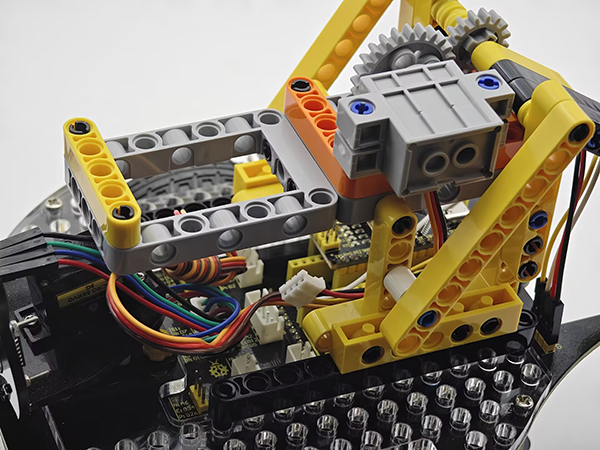
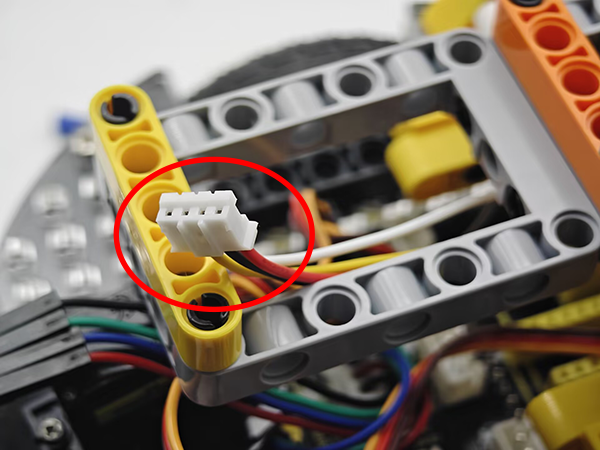
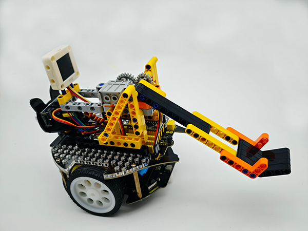

# 5.6 Smart Stone Thrower

## 5.6.1 Overview

In this project, we build an interesting stone thrower car with automatic recognition by the AI vision module. We first need to mount the module on the car to enable its recognition function. If a bottle is detected, the buzzer will emit a countdown beeping from three and then the car will throw the bottle. After that, the throwing arm will slowly lower down to wait for the next recognition of a bottle.

## 5.6.2 Mount the AI module to the stone thrower car

**Required Parts**


**Step 1:**


**Step 2:**




**Step 3:**




**Step 4:**

| AI vision module | Car pins |
| :--------------: | :------: |
|   T/C (yellow)   |   SCL    |
|   R/D (white)    |   SDA    |
|    V/+ (red)     |    5V    |
|   G/- (black)    |    G     |


**Completed:**



## 5.6.3 Code Flow


## 5.6.4 Test Code

```c
// Arduino core library
#include <Arduino.h>
// Sentry machine vision sensor library
#include <Sentry.h>
// Servo control library
#include <Servo.h>

Servo servo; // Create a servo object to control the servo system

#define BUZZER_PIN 3 // buzzer pin

// Create an alias Sengo for the Sengo2 type to simplify subsequent usage
typedef Sengo2 Sengo;

// Communication method (currently enabled I2C)
#define SENGO_I2C
// #define SENGO_UART  // UART is annotated as disabled

// Include the corresponding library according to the selected communication mode
#ifdef SENGO_I2C
#include <Wire.h>  // Libraries required for I2C communication
#endif
#ifdef SENGO_UART
#include <SoftwareSerial.h>
#define TX_PIN 11  // Software serial port transmitting pin
#define RX_PIN 10  // Software serial port receiving pin
SoftwareSerial mySerial(RX_PIN, TX_PIN);  // Create a soft serial port object
#endif

// Define the visual processing type as 20 types of objects recognition mode
#define VISION_TYPE Sengo::kVision20Classes
Sengo sengo;  // Create a Sengo sensor object

// Global state variable
unsigned long lastDetectionTime = 0;        // The timestamp of the last detected bottle
const unsigned long disappearDelay = 2000;  // Throwing interval time
bool currentBottleDetected = false;  // Has a bottle been detected

// Initialization (executed once when Arduino starts up)
void setup() {
    sentry_err_t err = SENTRY_OK;  // error state variable

    Serial.begin(9600);  // Initialize the serial port for debugging the output
    Serial.println("Waiting for sengo initialize...");

    // I2C initialization
#ifdef SENGO_I2C
    Wire.begin();  // Initialize the I2C bus
    // Wait in a loop for the successful initialization of the sensor
    while (SENTRY_OK != sengo.begin(&Wire)) { 
        yield();  // Give up CPU control during the waiting period
    }
#endif

    // UART initialization (disabled currently)
#ifdef SENGO_UART
    mySerial.begin(9600);
    while (SENTRY_OK != sengo.begin(&mySerial)) { 
        yield();
    }
#endif

    Serial.println("Sengo begin Success.");

    // Activate the recognition function of 20 types of objects
    err = sengo.VisionBegin(VISION_TYPE);
    
    // Print the initialization result
    Serial.print("sengo.VisionBegin(kVision20Classes) ");
    if (err) {
        Serial.print("Error: 0x");
    } else {
        Serial.print("Success: 0x");
    }
    Serial.println(err, HEX);  // Print the error code in hexadecimal format

    servo.attach(A0);
    servo.write(35);

    pinMode(BUZZER_PIN,OUTPUT);
}

// loop
void loop() {
    // Obtain the number of detected objects (kStatus is the query status)
    int obj_num = sengo.GetValue(VISION_TYPE, kStatus);
    unsigned long currentMillis = millis();

    
    if (obj_num) {  // If object is detected
        Serial.print("Totally ");
        Serial.print(obj_num);
        Serial.println(" objects");
        
        // Traverse all the detected object
        for (int i = 1; i <= obj_num; ++i) {
            // Obtain the object type label
            int l = sengo.GetValue(VISION_TYPE, kLabel, i);  // Object type label index
            if(l == 5 && !currentBottleDetected){
            lastDetectionTime = currentMillis;  // Update the last detection time
              // Countdown for throwing
              countdown(3);
              // Throw
              servo.write(90);
              delay(1000);
              // Slowly put down the arm
              for(int j = 90;j > 35;j--){
                servo.write(j);
                delay(15);
              }
              // servo.write(35);
              delay(500);
            }
        }
    }
    if((currentMillis - lastDetectionTime) > disappearDelay){
      currentBottleDetected = false; 
    }
}

void countdown(int seconds) {
  for (int i = seconds; i > 0; i--) {
    // Countdown beeping
    tone(BUZZER_PIN, 800, 100);
    delay(200);
    noTone(BUZZER_PIN);

    // Interval time
    delay(800);
  }
}
```

## 5.6.5 Test Result

After uploading the code, the AI vision module will activate the “20Class” mode and then recognize the captured images to determine if there is a bottle. If yes, it will throw the bottle. Before the throw, there will be three prompt sounds as a countdown. Once the countdown ends, the throw will proceed. After that, the throwing arm will slowly fall back to wait for the next instruction.
