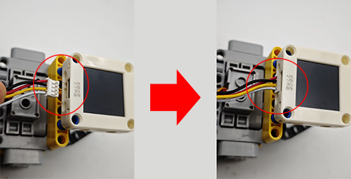

# 5.7 Red and Blue Sorting Car

## 5.7.1 Overview

In this project, we build an interesting color block sorting car by the AI vision module. We first need to mount the module on the soccer robot car to enable its recognition function. If a red block is detected, the car will convey it to the left side and return to its original position along the same path. If a blue one is detected, it will convey it to the right and come back.

## 5.7.2 Mount the AI module to the soccer robot car

**Required Parts**


**Step 1:**


**Step 2:**


**Step 3:**


**Step 4:**


**Step 5:**



**Step 6:**

| AI vision module | Car pins |
| :--------------: | :------: |
|   T/C (yellow)   |   SCL    |
|   R/D (white)    |   SDA    |
|    V/+ (red)     |    5V    |
|   G/- (black)    |    G     |


**Completed:**


## 5.7.3 Code Flow


## 5.7.4 Test Code

```c
#include <Arduino.h>
#include <Sentry.h>  // Sentry machine vision sensor library
#include <Servo.h>   //Servo control library

Servo servo;  // Create a servo object to control the servo system

typedef Sengo2 Sengo;  // Create an alias Sengo for the Sengo2 type to simplify subsequent usage

// Communication method (currently enabled I2C)
#define SENGO_I2C
// #define SENGO_UART   // UART alternative options (annotated as disabled)

#ifdef SENGO_I2C
#include <Wire.h>  // Libraries required for I2C communication
#endif

#ifdef SENGO_UART
#include <SoftwareSerial.h>
#define TX_PIN 11       // Customize the TX pin
#define RX_PIN 10       // Customize the RX pin
SoftwareSerial mySerial(RX_PIN, TX_PIN);  // Create a soft serial port object
#endif

#define VISION_TYPE Sengo::kVisionBlob  // Blob detection (color block recognition)
Sengo sengo;                            // Create a Sengo sensor object

// Motor drive pins
#define ML 4
#define ML_PWM 6
#define MR 2
#define MR_PWM 5


void setup() {
  sentry_err_t err = SENTRY_OK;  // Error status variable

  Serial.begin(9600);  // Initialize the serial port for debugging the output
  Serial.println("Waiting for sengo initialize...");

// Initialize the sensor according to the selected communication mode
#ifdef SENGO_I2C
  Wire.begin();  // Initialize I2C bus
  // Keep trying to connect until succeed
  while (SENTRY_OK != sengo.begin(&Wire)) { 
    yield();  // Allow other tasks to run while waiting
  }
#endif

#ifdef SENGO_UART
  mySerial.begin(9600);
  while (SENTRY_OK != sengo.begin(&mySerial)) {
    yield();
  }
#endif

  Serial.println("Sengo begin Success.");

  // ============== Blob detection parameter configuration ==============
  sengo.SetParamNum(VISION_TYPE, 2);  // Set the detection of color blocks of two colors

  sentry_object_t param = { 0 };  // Initialize the parameter structure

  /* Set the minimum detection size (pixels) of the color block */
  param.width = 50;   // Minimum width: 50 pixels
  param.height = 50;  // Minimum height: 50 pixels

  /* Configure the first color block (red) */
  param.label = Sengo::kColorRed;                // Set the color label to red
  err = sengo.SetParam(VISION_TYPE, &param, 1);  // Apply to parameter 1

  if (err) {
    Serial.print("] Error: 0x");
  } else {
    Serial.print("] Success: 0x");
  }
  Serial.println(err, HEX);  // Output the hexadecimal status code

  /* Configure the second color block (blue) */
  param.label = Sengo::kColorBlue;               // Set the color label to blue
  err = sengo.SetParam(VISION_TYPE, &param, 2);  // Apply to parameter 2

  if (err) {
    Serial.print("] Error: 0x");
  } else {
    Serial.print("] Success: 0x");
  }
  Serial.println(err, HEX);

  /* Set the maximum detection quantity for each color */
  err = sengo.VisionSetMode(VISION_TYPE, 1);  // A maximum of one color block can be detected
  Serial.print("sengo.VisionSetMode");
  if (err) {
    Serial.print(" Error: 0x");
  } else {
    Serial.print(" Success: 0x");
  }
  Serial.println(err, HEX);

  // Start Blob visual recognition
  err = sengo.VisionBegin(VISION_TYPE);
  Serial.print("sengo.VisionBegin(kVisionBlob) ");
  if (err) {
    Serial.print("Error: 0x");
  } else {
    Serial.print("Success: 0x");
  }
  Serial.println(err, HEX);

  servo.attach(A0);
  servo.write(160);

  pinMode(ML, OUTPUT);      //Set the left motor direction control pin to output
  pinMode(ML_PWM, OUTPUT);  //Set the left motor pwm pin to output
  pinMode(MR, OUTPUT);      //Set the right motor direction control pin to output
  pinMode(MR_PWM, OUTPUT);  //Set the right motor pwm pin to output
}

void loop() {
  // Read the total number of detected objects
  int obj_num = sengo.GetValue(VISION_TYPE, kStatus);

  if (obj_num > 0) {  // If an object is detected
    // Traverse all the detected color blocks
    for (int i = 1; i <= obj_num; ++i) {
      int l = sengo.GetValue(VISION_TYPE, kLabel, i);  // color lable
      if (l == 3) {
        sorting(l);
      } else if (l == 5) {
        sorting(1);
      } else car_stop();
    }
  } else car_stop();
}


// Color block sorting code (aimed at reducing the amount of repetitive code)
void sorting(int val) {
  // grab the color block
  servo.write(180);
  delay(500);
  // Distinguish the sorting directions of the red blocks and the blue blocks by "if"
  if (val == 3) {
    // turn left
    car_left();
  } else {
    // turn right
    car_right();
  }
  delay(300);
  // go forward
  car_forward();
  delay(300);
  car_stop();
  delay(300);
  // Loosen the color block
  servo.write(160);
  delay(300);
  // go back
  car_back();
  delay(300);
  // Distinguish the sorting directions of the red blocks and the blue blocks by "if"
  if (val == 3) {
    // turn right
    car_right();
  } else {
    // turn left
    car_left();
  }
  delay(300);
}


// car forward
void car_forward() {
  digitalWrite(ML, LOW);
  analogWrite(ML_PWM, 100);
  digitalWrite(MR, LOW);
  analogWrite(MR_PWM, 100);
}

// car back
void car_back() {
  digitalWrite(ML, HIGH);
  analogWrite(ML_PWM, 150);
  digitalWrite(MR, HIGH);
  analogWrite(MR_PWM, 150);
}

// car left
void car_left() {
  digitalWrite(ML, HIGH);
  analogWrite(ML_PWM, 155);
  digitalWrite(MR, LOW);
  analogWrite(MR_PWM, 100);
}

// car right
void car_right() {
  digitalWrite(ML, LOW);
  analogWrite(ML_PWM, 100);
  digitalWrite(MR, HIGH);
  analogWrite(MR_PWM, 155);
}

// car stop
void car_stop() {
  digitalWrite(ML, LOW);
  analogWrite(ML_PWM, 0);
  digitalWrite(MR, LOW);
  analogWrite(MR_PWM, 0);
}

```

## 5.7.5 Test Result

After uploading the code, the AI vision module will enable the “Blob” mode to recognize the captured image to determine whether there are red or blue blocks. If a red block is detected, the car will hold the red block and send it to the left side, and then it will return to its original position along the same path. If a blue one is detected, the car will convey it to the right side and come back. (There may be a slight deviation from the original position after the car moves back because it was set based on the driving time.)

Note: The code sets the minimum size of the color block. If the size of your block is smaller than this, it will not be recognized. These values can be modified in the following code according to your needs.

```c
  /* Set the minimum detection size (pixels) of the color block */
  param.width = 50;   // Minimum width: 50 pixels
  param.height = 50;  // Minimum height: 50 pixels
```

