# Sengo2 Smart Vision Card Maker Extension Kit


## 1. Introduction

Sengo2 AI Vision Card Maker Extension Kit (3-in-1 Car) includes a smart vision module specially designed for maker education, which is perfectly compatible with Lego building blocks and the Arduino ecosystem. This module integrates a multi-core AI processor and supports 10 machine vision functions such as color recognition, label code tracking, face detection, and real-time deep learning. Through plug-and-play hardware interfaces and open-source projects, students can quickly build vision-driven projects such as cars and robotic arms, and easily from graphical programming to Python/Arduino code development. What an ideal teaching aid for cultivating AI thinking and engineering capabilities!

**Features:**

**Compatible with LEGO**：Modular snap-on design, directly embedded in the Lego technic structure

**Full-stack visual Capability**：Basic → Advanced → Developed: Color block Tracking/QR Code Recognition → Object Detection → Custom Deep Learning Model Deployment

**Multiple Programming Languages**：KidsBlock Graphical Programming (for Primary and Secondary School Students) & Arduino/C++/MicroPython (High School/University Students)

**High Compatibility**：Compatible with development boards such as Arduino UNO, Arduino Nano, ESP32, and Pico

**AI Recognition Training**：Support model training. Students can independently train their own exclusive recognition models (such as garbage classification recognition)


## 2. Kit List

| N.O. |              NAME              | QTY  |           PIC           |
| :--: | :----------------------------: | :--: | :---------------------: |
|  1   |        AI vision module        |  1   | 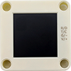 |
|  2   |             wires              |  1   |  |
|  3   |     Lego technic pin black     |  6   | 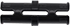 |
|  4   | Lego 1x3 technic long pin blue |  4   |  |
|  5   |        Lego 1*11 brick         |  2   |  |
|  6   |         Lego 1*9 brick         |  2   |  |
|  7   |      Apriltag card ID: 0       |  1   | 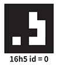 |
|  8   |      Apriltag card ID: 1       |  1   |  |
|  9   |      Apriltag card ID: 2       |  1   | 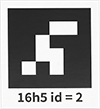 |
|  10  |      Apriltag card ID: 3       |  1   | 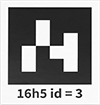 |
|  11  |      Apriltag card ID: 4       |  1   | 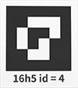 |
|  12  |            red card            |  1   |  |
|  13  |           green card           |  1   | 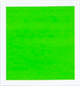 |
|  14  |           blue card            |  1   | 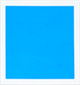 |
|  15  |           black card           |  1   | 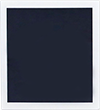 |
|  16  |           white card           |  1   | 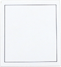 |
|  17  |          QR code Red           |  1   |  |
|  18  |         QR code Green          |  1   | 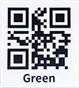 |
|  19  |          QR code Blue          |  1   | 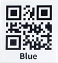 |
|  20  |         QR code Black          |  1   | 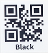 |
|  21  |         QR code White          |  1   | 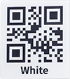 |
|  22  |      traffic card forward      |  1   |  |
|  23  |     traffic card left-turn     |  1   |  |
|  24  |    traffic card right-turn     |  1   |  |
|  25  |      traffic card U-turn       |  1   |  |
|  26  |       traffic card stop        |  1   |  |
|  27  |     traffic card red light     |  1   | 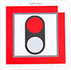 |
|  28  |    traffic card green light    |  1   | 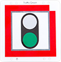 |
|  29  |     traffic card speed 40      |  1   | 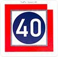 |
|  30  |     traffic card speed 60      |  1   | 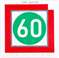 |
|  21  |     traffic card speed 80      |  1   |  |


## 3. Sengo2 Vision Sensor

### 3.1 Introduction

Sengo2 vision sensor is an image recognition device for artificial intelligence education in primary and secondary schools. It adopts Canaan’s K210 processor, and the NPU neural network core delivers powerful image recognition performance, so it comes with various offline image recognition algorithms, such as handling recognition of colors, line, face, QR code, and traffic cards, etc. It communicates with the main control board via UART serial port or I2C. Besides, its back is equipped with a 1.3-inch full-view high-definition LCD screen, which can display the image and recognition results in real time, facilitating operation and debugging.

Sengo2 supports mainstream educational development boards such as Arduino, control board, Micro:bit, Source Master, ESP32, etc. It also supports graphical programming platforms like MakeCode, Mind+, Mixly, OHCode V2, and code editors like Arduino and BXY/Thonny. The official provides a variety of driver libraries, fully meeting the needs of primary and secondary schools to carry out artificial intelligence education and AI competitions, and also suitable for individual students or makers to design AI vision products.

The sensor is lightweight and easy to use, and is surrounded by 12 Lego positioning holes for users to build and innovate products, theme teaching and competition designs.

### **3.2 Component Overview**

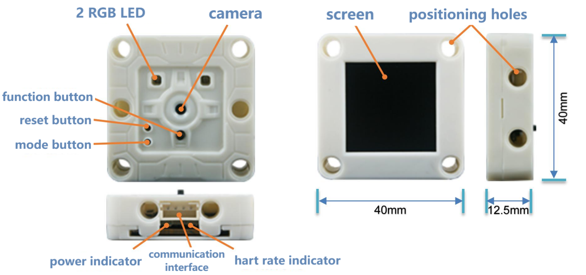

**Camera:** Collect image data

**Screen:** Display camera images and algorithm detection results in real time for observation and debugging

**Communication interface:** Achieve data communication between the sensor and the main control device, adopt a PH2.0-4Pin interface and support two communication modes: UART serial port and I2C

**Function button:** Short-press to quickly switch algorithms, long-press to train/delete data, press upon start-up to enter the firmware burning mode

**Mode button:** Short-press to switch communication mode, long-press to flip the camera image

**Reset button:** Reset hardware and is generally used for firmware burning

**RGB LED:** Different colors reflect the status recognized by the algorithm, and the LED colors can be set by programming

**Power indicator:** After powering on, this LED will remain constantly on

**Heartbeat indicator:** When the device is operating normally, this LED will flash rhythmically, just like a heartbeat

**Positioning holes:** Multiple 4mm positioning holes are reserved around the device, with a spacing of 16mm or 32mm, compatible with Lego building blocks


### **3.3 Parameters**

| Name                                     | Unit   | Parameter  | Remarks                                                      |
| ---------------------------------------- | ------ | ---------- | ------------------------------------------------------------ |
| Input voltage                            | V      | 3.3-5.0    | Beyond this range, it may cause abnormal operation or damage to the equipment |
| Operating current                        | mA     | 140@5V     | 5V power supply, the typical value when the face algorithm is enabled |
| IO level                                 | V      | 3.3-5.0    | IO level is consistent with the input voltage. It cannot be adapted to the 1.8V main control device |
| Dimensions                               | mm     | 40x40x12.5 | edge dimensions of the shell, with buttons slightly higher than the shell |
| Weight                                   | 9      | 15         |                                                              |
| Camera type                              | 1      | CMOS       |                                                              |
| Camera resolution                        | pixel  | 30W        | VGA lens, with a maximum resolution of 640x480               |
| Field of view of the lens                | degree | 83         | Diagonal Angle of the picture with infrared filtering        |
| Screen type                              | /      | TFT        | 262K color, full viewing Angle                               |
| Screen size                              | inch   | 1.3        | Diagonal Angle of the picture, with a resolution of 240x240  |
| LED indicator                            | piece  | 4          | Programmable RGB-LED X2, power indicator, heart rate indicator |
| Button                                   | piece  | 3          | Function, mode, reset buttons                                |
| Communication interface                  | piece  | 1          | PH2.0-4pin interface                                         |
| Communication mode                       | L      | UART, I2C  | Supports UART serial port and I2C mode                       |
| Hardware address                         | /      | 0x60       | 7-bit I2C bus address                                        |
| Positioning holes number                 | hole   | 12         | on the front and back sides, both sides and the bottom of the shell |
| Center distance of the positioning holes | mm     | 16, 32     |                                                              |
| Diameter of positioning hole             | mm     | 4          | Compatible with Lego technic blocks                          |


### **3.4 Button and Operation Instructions**

#### **3.4.1 Button Operation**

| Button          | short press                                  | long press 5s                                                | long press 10s                                               | long press when powering on                                  |
| --------------- | -------------------------------------------- | ------------------------------------------------------------ | ------------------------------------------------------------ | ------------------------------------------------------------ |
| Function button | Switch algorithm                             | When running algorithms such as face recognition, the current training data can be trained and stored | When running algorithms such as face recognition, the most recent or all training data can be deleted | Enter the firmware burning mode to update the process sequence |
| Mode button     | Alter between UART or I2C communication mode | Flip the camera up and down                                  | none                                                         | none                                                         |
| Reset button    | Reset the hardware                           | none                                                         | none                                                         | none                                                         |

#### **3.4.2 Algorithm Switching**

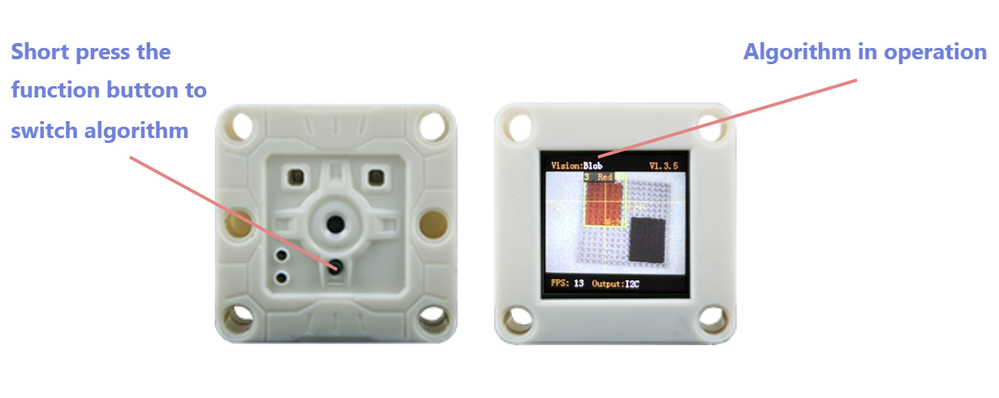

**Operation:** Press the function button.

**Introduction:** After this operation, Sengo2 will loop and switch algorithms in sequence according to the algorithm ID number. When switching algorithms, Sengo2 will automatically close the currently running algorithm. You can view the currently enabled algorithm at the top of the screen. However, the running status of algorithm will not be saved. All algorithms will be closed by default after Sengo2 restarts.

The algorithm switching sequence is: color recognition > color block detection > label recognition > line detection > deep learning > card recognition > face recognition > 20 types of objects > QR code > moving objects >...

**Note:** When in normal use, the main control device should send instructions to control the on and off of the algorithm

#### **3.4.3 Model Data Storage/Deletion**

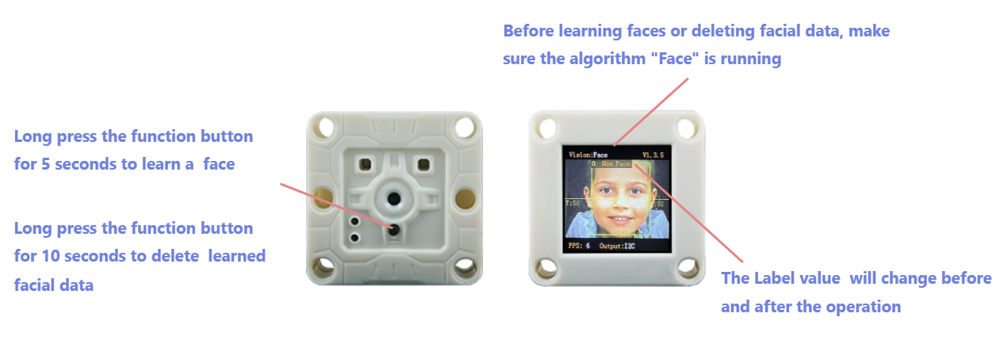

**Operation:** Press and hold the function button for 5 seconds and then release it.

**Introduction:** When running a face algorithm, the current face data can be trained and stored, and a face ID number can be assigned.

**Operation:** Press and hold the function button for 10 seconds and then release it.

**Introduction:** When running a face algorithm, the face data from the most recent training can be deleted. Press and hold the button again, all face data during this run will be deleted. If no operation to train the face data has been performed during the current run of the face algorithm, all face data will be directly deleted. This operation is also applicable to “deep learning” algorithms.

#### **3.4.4 Communication Mode**

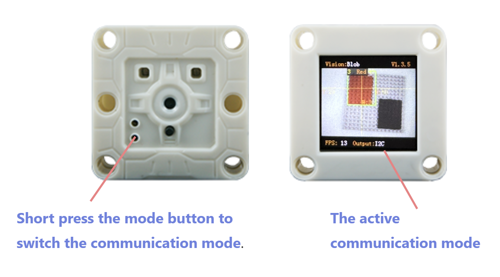

**Operation:** Short press the mode button.

**Introduction:** Switch communication mode in a loop. After this operation, the sensor will automatically store the communication mode and restart the device. You can view the current communication mode at the bottom of the screen.

Sengo2 offers five communication modes, namely I2C protocol mode, UART-9600 serial port protocol, UART-57600 serial port protocol, UART-115200 serial port protocol, and UART-9600 simple serial protocol. The default mode is I2C.

#### **3.4.5 Flip Camera Image**

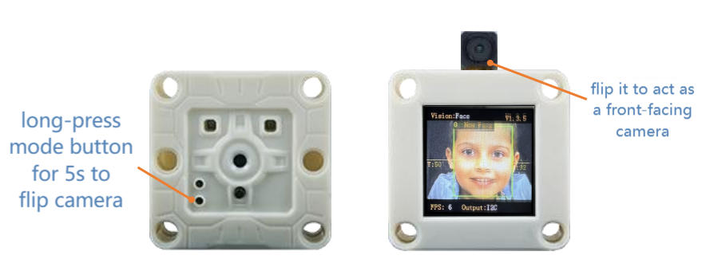

**Operation:** Press and hold the mode button for 5 seconds and then release it.

**Introduction:** Flip the camera direction to act as a front-facing camera (the lens and the screen are on the same side; press the function button to flip horizontal the screen image). After this operation, Sengo2 will save the current state, which remains valid even after the device restarts.

<span style="color:red;font-size:25px">ATTENTION: You need to disassemble the shell by yourselves and manually flip lens to the screen side. The shell itself contains no rotatable structure. Improper operation may cause damage to the product. Therefore, this operation is only suitable for users with such need and certain hands-on ability!</span>


#### **3.4.6 Firmware Burning Mode**

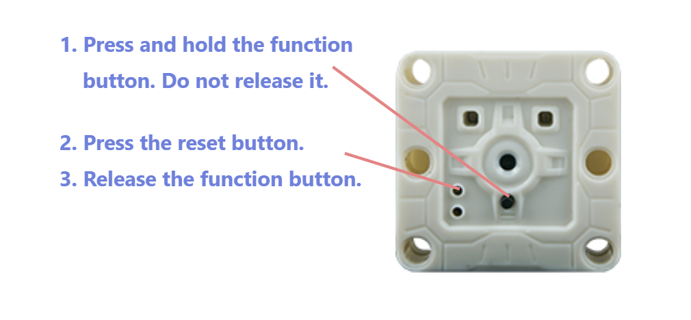

**Operation:** Users can enter the firmware burning mode in two ways:

1. After the device is powered on, press and hold the function button without releasing it. Short press the reset button to enter the burning mode, and then release the button.
2. Before powering on the device, press and hold the function button without releasing it. Then insert the data cable to power on the device, and it will enter the burning mode. After that, release the button.

**Introduction:** After entering the firmware burning mode, you can upgrade the program for Sengo2.


### 3.5 Wiring

#### 3.5.1 Interface Definition

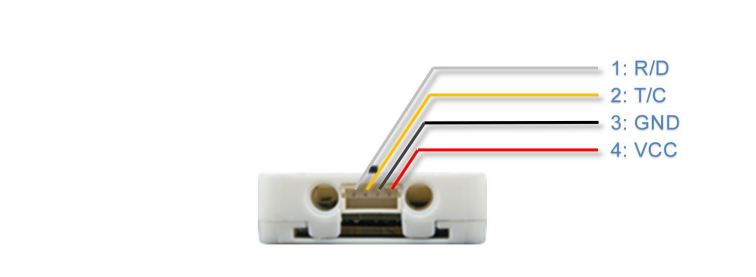

| Pin Number | Label |    Function    | UART | I2C  |
| :--------: | :---: | :------------: | :--: | :--: |
|     1      |  R/D  |    Signal 1    |  RX  | SDA  |
|     2      |  T/C  |    Signal 2    |  TX  | SCL  |
|     3      |  GND  | Power Ground - | GND  | GND  |
|     4      |  VCC  | Power Supply + | VCC  | VCC  |

<span style="color:red;font-size:25px;">Please make sure all wiring is correctly connected before powering on. Incorrect wiring may result in the device malfunctioning or even permanent damage.</span>

#### 3.5.2 Communication Mode

**• I2C** : This mode follows the I2C bus communication protocol, supports communication speeds of 100~400Kbps. The device address is **0x60**. Only one-byte read/write operations are permitted, batch read/write operations for consecutive addresses are not supported.  

**• UART-9600 serial port protocol, UART-57600 serial port protocol, UART-115200 serial port protocol** : These three modes are serial communication modes based on UART, with the numbers representing the baud rates, following the AITosee Standard Command protocol. This protocol includes a checksum for stable and reliable data transmission. Select an appropriate baud rate based on the performance of the main controller. A Higher baud rates will reduce communication time and improve the system's response speed. Lower baud rates are suitable for the main controller using the software serial method or communication via a longer cable.  

**• UART-9600 simple serial protocol** : Serial communication mode with a baud rate of 9600, following the AITosee Simple Command protocol. The main controller only needs to send and receive strings to start the algorithm and obtain results, without the need to develop a dedicated driver library. This protocol is compatible with any controller that supports UART communication mode.  

#### 3.5.3 Wiring Method

Sengo2 is compatible with a variety of main controllers. This manual uses the **UNO** as an example to illustrate the wiring method. For other development boards such as Micro:bit, Pico, ESP32 development board, etc., please refer to their respective documentation and user guides.

Sengo2 supports a power supply voltage of **3.3V to 5V**. Choose an appropriate power source based on the power supply capacity of the main controller. If the power source is unstable or has limited load capacity—especially when devices like motors, servos, or speakers share the same power supply with the Sengo2—power instability may occur, potentially causing the Sengo2 to restart unexpectedly.

##### **3.5.3.1 Hardware UART Serial Mode**

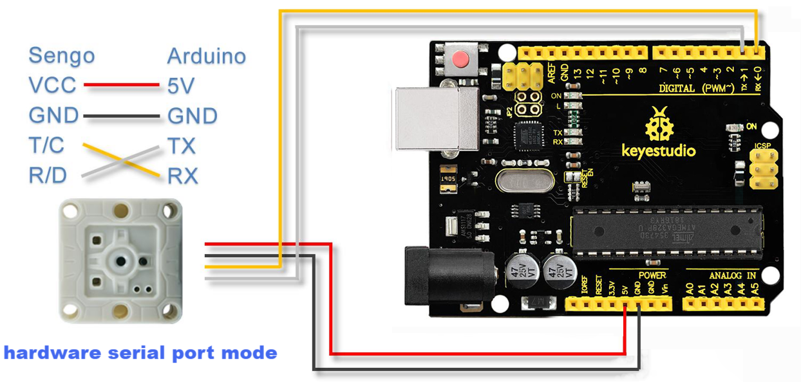

In the hardware UART mode, the RX pin of Sengo2 needs to be connected to the TX pin of Arduino, and the TX pin of Sengo2 should be connected to the RX pin of Arduino.

Some main controller, such as the Arduino UNO, only have only one hardware port, which is used for program downloading and code debugging. If Sengo2 is directly connected to this port, communication conflicts often occur. It is recommended to use I2C or Software Serial mode instead.

##### **3.5.3.2 Software Analog Serial Mode**

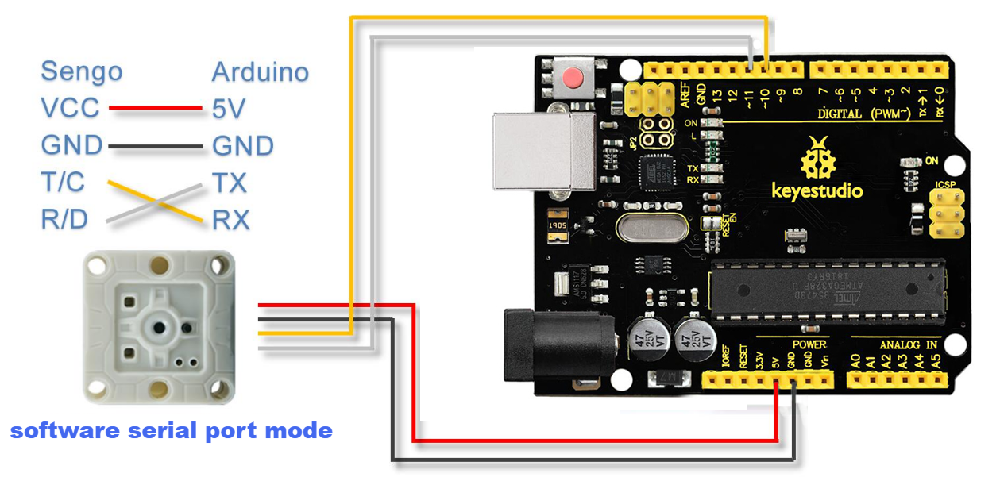

Also known as **software serial mode**. In the program, two general-purpose IO pins of Arduino are respectively defined as TX and RX pins, the software controls the voltage level changes of these two IO pins to simulate the signal waveforms of the UART port, thereby relizing data communication.

In the example diagram, Arduino IO pin **10** is defined as the RX pin, and pin 11 is defined as the TX pin. The pin definition code for Software Serial in the Arduino IDE is as follows:

```c
#include <SoftwareSerial.h>
#define TX_PIN 11
#define RX_PIN 10
SoftwareSerial mySerial(RX_PIN, TX_PIN);
```

<span style="color:red;font-size:25px;">Note: In software serial mode, it is recommended to set the communication baud rate to 9600~57,600. Data transmission may fail under a high baud rate.</span>

##### **3.5.3.3 I2C Mode**

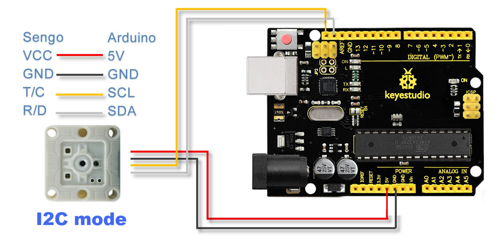

Connect the **T/C** pin of Sengo2 to the **SCL** pin of the main controller, and the **R/D** pin of Sengo2 to the **SDA** pin of the main controller.

To ensure stable communication, the length of the I2C communication wires should be kept as short as possible. Excessive cable length may lead to communication errors or instability.


### 3.6 Running Page

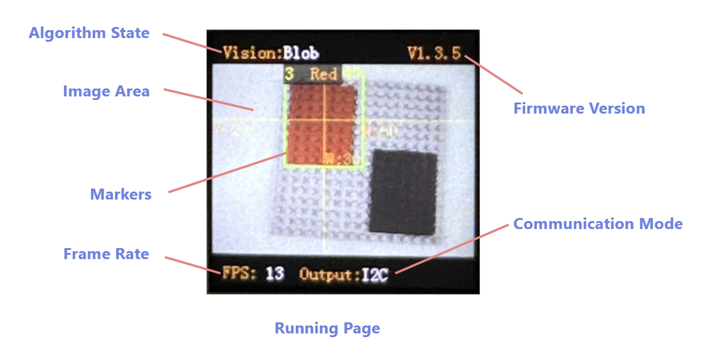

**Algorithm State:** Displays the algorithm currently running.

**Firmware Version:** Shows the current firmware's version .

**Image Area:** Displays the real-time images.

**Markers:** Mark a detected object, including a detection box ,coordinate lines and size and label information.

**Frame Rate:** Indicates the frame rate at which the algorithm is operating. Different algorithms may run at different speeds, and lighting conditions can also affect the frame rate.

**Communication Mode:** Shows the communication mode currently in use.  


### 3.7 Result Display

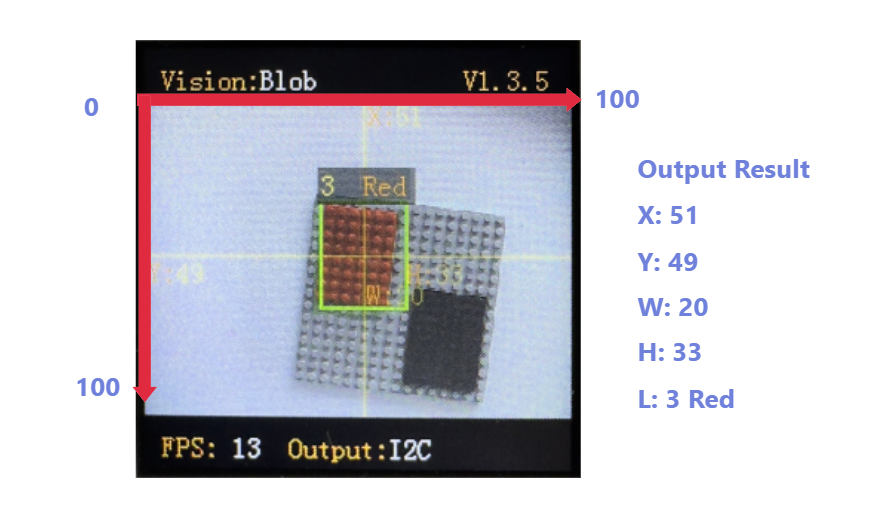

**Coordinate System:** Sengo2 uses the Percentage Coordinate System. The image is divided into 100 units along both the horizontal (X) and vertical (Y) directions. The top-left corner of the camera image is the origin (0,0), and the bottom-right corner is (100,100). The center of the image corresponds to (50,50).

**Detection Results:** When an object is detected or recognized, different algorithms may return different recognition results, normally including center coordinates, width and height of the object, and classification label. All of the above information will be displayed on the screen for observation and debugging. Since Sengo2 does not actively send out data, the results need to be read through protocol instructions.

**Horizontal Coordinate (X):** The horizontal position of the object's center, range: 0–100.

**Vertical Coordinate (Y):** The vertical position of the object's center, range: 0–100.

**Width (W):** The width of the rectangle detection box, range: 0–100.

**Height (H):** The height of the rectangle detection box, range: 0–100.

**Label (L):** A numeric ID representing the detected object type in classification-capable algorithms.  The meaning of the same label differs depending on the algorithm. For example, for algorithm Color, label=3 represents red, while for algorithm Card, it represents Right.  

**Special:** The algorithm Color returns RGB values. The algorithm Line returns coordinates of two endpoints and the inclination angle. The algorithm QR Code returns the character information encoded in the QR code. For more details, refer to the specific algorithm descriptions.	


### 3.8 Algorithm

Sengo2 integrates multiple practical and easy-to-use offline algorithms, each assigned a unique ID. The ID serves as the sole identifier for communication between the main controller and Sengo2, and is used to control algorithm activation, set parameters, and acquire results.

| Algorithm  ID | Description                    | Name      | Description                                                  |
| ------------- | ------------------------------ | --------- | ------------------------------------------------------------ |
| 1             | Color recognition              | Color     | Returns color information (RGB values and a classification label) of up to 25  recognition regions. |
| 2             | Color block detection          | Blob      | Detects color blobs in the image that meet specified parameters. Supports detection of black, white, red, green, blue, or yellow blobs. |
| 3             | Label recognition              | Apriltag* | Recognizes Apriltags in formats 16H5, 25H9, or 36H11 (default: 36H11). |
| 4             | Line detection                 | Line      | Detects line segments in the image and returns the coordinates of the two endpoints and the inclination angle. |
| 5             | Deep learning                  | Learning* | The lightweight deep learning algorithms running on Sengo2. No computer is required, and up to 15 new objects can be learned. |
| 6             | Card recognition               | Card*     | Recognizes a set of 10 predefined traffic-sign cards.        |
| 7             | Face recognition               | Face*     | Learns and recognizes human faces. Supports detecting whether a mask is worn. Up to 15 faces can be learned. |
| 8             | 20 types of object recognition | 20Class*  | Recognizes 20 classes of common objects such as cat, dog, car, etc. |
| 9             | QR code recognition            | QrCode    | Detects and decodes a QR code generated by no more than 25 characters. |
| 11            | Moving object detection        | Motion    | Detects whether there is a moving object in the image.       |

<span style="color:red;font-size:25px">Notes: ①Algorithms without an asterisk (*) can run simultaneously, while asterisk-marked algorithms can only run one at a time, though they can run in parallel with non-asterisk algorithms. Be aware that parallelization of multiple algorithms will reduce overall processing speed. ②Some algorithms support detecting or recognizing multiple objects at once. However, certain main controllers—such as the Arduino UNO—lack sufficient RAM to receive all result data, attention should be paid when using these controller to avoid data overflow. When it is necessary to obtain information on more than five detection/recognition results, it is recommended to choose a main control device with a chip such as ESP32 that has a larger RAM as the processor.</span>

