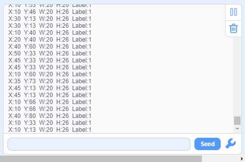

# 4.10 Moving Object Detection

## 4.10.1 Algorithm

Sengo2 needs to remain stationary, and the algorithm will determine whether there are any changed areas in the image by comparing the pixel differences between adjacent frames. If so, it is considered that there is a moving object within the field of view, and the coordinates of this area will be returned. Note that the algorithm returns only one detection result.

----------------

## 4.10.2 Test Code

1. In the code start-up, set the serial port baud rate to `9600`, and then set the communication mode of the AI vision module to `I2C`, and finally set it to run in `Motion` mode.
2. The if block determines the number of detections. Only when the number of detections is greater than 0 will the data be output. Note to choose `motion`.

**Complete code:**

-----

## 4.10.3 Test Result

After uploading the code, the AI vision module will detect the area captured by the camera. If it detects any moving object, it will recognize it and print its coordinates, width and height on the serial monitor.

## 4.10.4 Extension Gameplay

**Dynamic sensor lamp**

- **Game rule:** Align the module with the door or corridor of a room. When a large range of movement (someone passing by) is detected, the LED light will turn on and then turn off after a delay. This is “lights on when people come and off when they leave”.
- **Practice:** Program to continuously detect moving objects. Once detected, the digital pin outputs a high level to control the relay or MOS tube to light up the LED strip.