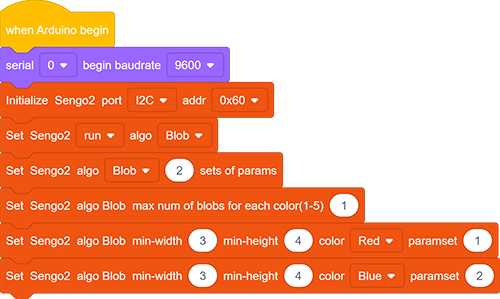
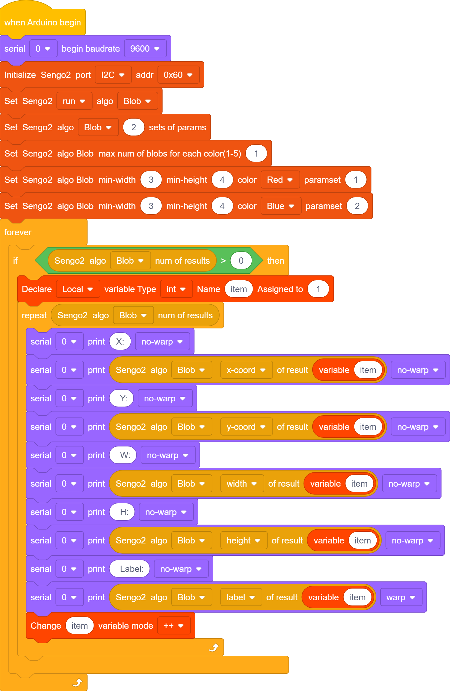

# 4.2 Color Block Detection

## 4.2.1 Algorithm

We specify a certain detection color, and it will determine whether there is a block of that color in the image. If yes, it will return its coordinates and size. The color label is the same as that in color recognition algorithm.

Color babel table:

| Label value | Meaning | Label value | Meaning |
| :---------: | :-----: | :---------: | :-----: |
|      1      |  Black  |      2      |  White  |
|      3      |   Red   |      4      |  Green  |
|      5      |  Blue   |      6      | Yellow  |
|      0      | Unknown |             |         |

---------------------------

## 4.2.2 Code Blocks

1.  sets the number of color blocks that the AI vision module can detect, with a minimum of 1 for each color and a maximum of 5 for each color.

	| Mode |                          Definition                          |
	| :--: | :----------------------------------------------------------: |
	|  1   | At most 1 color block can be detected simultaneously for each color |
	|  2   | At most 2 color block can be detected simultaneously for each color |
	|  3   | At most 3 color block can be detected simultaneously for each color |
	|  4   | At most 4 color block can be detected simultaneously for each color |
	|  5   | At most 5 color block can be detected simultaneously for each color |

2.  sets the minimum size of the detected color block and the color and parameter groups to be detected.

3.  returns the current position (y, z) and size (w, h) of the detected object on the screen, as well as the label. `result` sets the output corresponding parameter group.

| Formal parameter |            Definition            |
| :--------------: | :------------------------------: |
|     x-coord      | color block central coordinate x |
|     y-coord      | color block central coordinate y |
|      width       |       color block width w        |
|      height      |       color block height h       |
|      Libel       |           color label            |

---------------------

## 4.2.3 Test Code

1. In the code start-up, set the serial port baud rate to `9600`, and then set the communication mode of the AI vision module to `I2C`, and finally set it to run in `Blob` mode.

2. Set the parameter group to 2 (only two colors are recognized in the sample code), the number of each color recognized to 1, and set the minimum size of the recognized color block as well as the recognized color and the parameter group number.

3. The if block determines the number of detections. Only when the number of detections is greater than 0 will the color block data be output. Note to choose `Blob`.

4. Loop through the result quantity. When two color blocks are detected, loop twice and then use a variable on the parameter group. After each loop print, the variable adds by one. In this way, two blocks values can be printed.

**Complete code:**

----------------------------

## 4.2.4 Test Result

After uploading the code, the module will detect the area captured by the camera. If there are red and blue blocks, they will be selected and marked. Then, their position coordinates x and y, width, height, and color label values will be printed on the serial monitor. 

## 4.2.5 Extension Gameplay

**Smart sorting assistant**

- **Game rule:** The module distinguishes blocks of different colors and shapes (say, red square, blue circle…), and push different blocks into the corresponding collection boxes by controlling two servos.
- **Practice:** Program to set the recognition targets as “red circles” and “blue squares”. When target A is identified, servo A will act. When target B is identified, servo B will work. Here we pay attention to two attributes of **shape** and **color**.