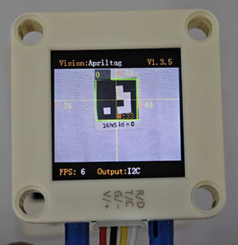

# 4.3 Label Recognition

## 4.3.1 Algorithm

It determines whether there is an Apriltag label in the image, here including only three encoding forms of labels: 16H5, 25H9, and 36H11. When the algorithm is running, we need to select a format first (36H11 by default). Different Apriltags labels cannot be detected simultaneously, but up to 25 tags with the same encoding label can be recognized at the same time.

Note: This algorithm cannot operate simultaneously with other algorithms marked with a \*.

----------

## 4.3.2 Classification Label

The Apriltag label is a set of predefined black and white square patterns. The number of squares used varies depending on the encoding form. Each pattern has a predefined tag label value that will be returned after recognition.

## 4.3.3 Code Blocks

1.  sets the type of tags, including `36H11`,`25H9`,`16H5`. All the tags used in the tutorial are `16H5`, and we also provide some 16h5 tag cards.

----------

## 4.3.4 Tips of Label Recognition Algorithm

1. The width and height values of the labels returned by the algorithm are relatively stable, so it is used to calculate distance. Rotation does not affect the size of the label, but tilting does.
2. The larger the label is, the farther the recognition distance will be.

## 4.3.5 Test Code

1. In the code start-up, set the serial port baud rate to `9600`, and then set the communication mode of the AI vision module to `I2C`, and finally set it to run in `AprilTag` mode.
2. Set the recognized tag type to `16H5`.

3. The if block determines the number of detections. Only when the number of detections is greater than 0 will the data be output. Note to choose `AprilTag`
4. Loop through the result quantity. When multiple tags are detected, loop multiple times and then use a variable on the parameter group. After each loop print, the variable adds by one. In this way, multiple tags values can be printed. (Note: Set the mode of the returned data to “AprilTag”.)

**Complete code:**

-----------

## 4.3.6 Test Result

After uploading the code, the module will detect the area captured by the camera. If there are 16H5 tags, they will be recognized. Then, the coordinate x and y, width, height and the label value will be displayed on the serial monitor.

## 4.3.7 Extension Gameplay

**Label instruction card**

- **Game rule:** Match the labels from 0 to 4 to an action, such as a 90-degree rotation of the servo or car moving forward, etc.
- **Practice:** The development board reads the ID sequence of the labels and performs the corresponding operation according to the sequence.