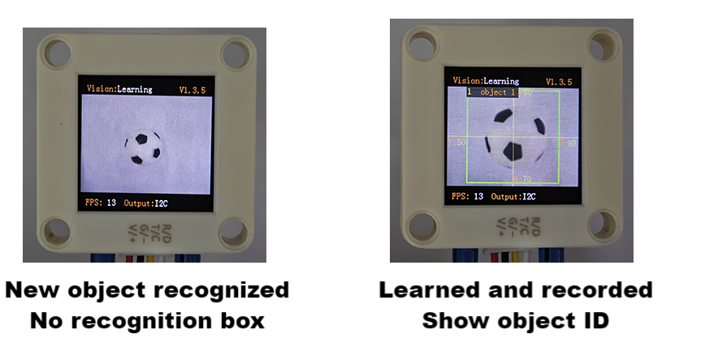
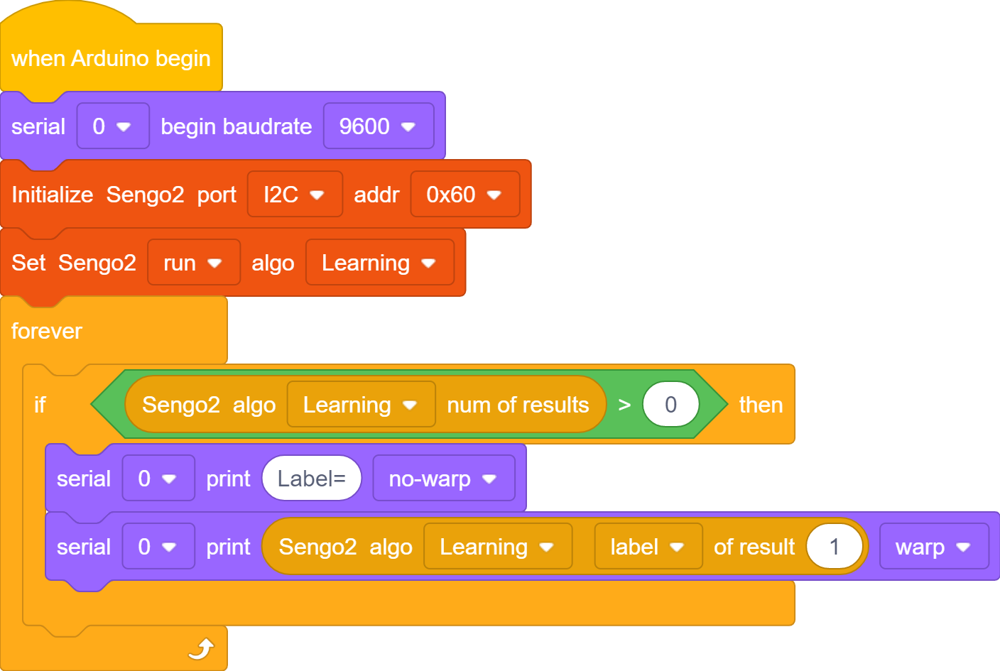
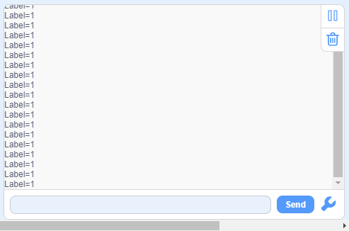

# 4.5 Deep Learning

## 4.5.1 Algorithm

It can perform offline learning, storage and recognition on any object, and store up to 15 objects. The stored objects can be deleted either entirely or individually. This algorithm only classifies objects and is unable to detect their position and size.

-------------------------

## 4.5.2 Classification Label

| Label value | Definition |
| :---------: | :--------: |
|    1-15     | Object ID  |

----------

## 4.5.3 Save Data

After enabling the deep learning algorithm, point the camera directly at the target object, press the function button for about 5 seconds and then release it. Sengo2 will start learning, and the data of this object will be stored and assigned an ID number (Note: up to 15 can be stored). 

The smallest number among the currently available numbers will be assigned to the label value. If there are no vacant numbers, Sengo2 will prompt a storage failure.

---------

## 4.5.4 Delete Data

After learning, press the function button for about 10 seconds and then release it to delete the data just stored. Press it again for 10 seconds, and all the stored data will be cleared. If no deep learning has been done after enabling the algorithm, all storage will be directly cleared when you press the function button for 10 seconds.

-------

## 4.5.5 Code Blocks

1.  deletes and stores the learned objects. When powered on, it will delete the old storage and then perform new recognition (not recommended for use, manual storage is enough for using).
2. Under `Learning` mode, Only the data in the `label` of  is available.

-------

## 4.5.6 Tips of Deep Learning Algorithm

1. For some applications with the need to identify the same object over a long distance or at a fixed position but from different angles (for example, the card is rotated by 90° or 180°), it need to learn the object at different distances/angles and store them as ID1, ID2, etc. During working, if the returned label value is one of above, it determines that they are the same object.
2. If there are differences in the background (including light conditions) between learning and recognizing, the result may be affected.

## 4.5.7 Test Code

1. In the code start-up, set the serial port baud rate to `9600`, and then set the communication mode of the AI vision module to `I2C`, and finally set it to run in `Learning`.

2. The if block determines the number of detections. Only when the number of detections is greater than 0 will the data be output. Note to choose `Learning`.

3. Output the `label` directly in the `Learning` mode.

**Complete code:**

----------

## 4.5.8 Test Result

After uploading the code, press and hold the function button at the back of the AI vision module for 5 seconds, and then aim the camera at the object to be recognized in a white background. After completing deep learning, it can recognize objects.

## 4.5.9 Extension Gameplay

**Exclusive gesture recognizer** (high challenge)

- **Game rule:** Instead of recognizing regular objects, train it to recognize several of your custom gestures (such as “thumbs up”, “OK”, “palm”). Recognize different gestures to control light, play music, etc.

- **Practice:** In a clean background (white is recommended), recognize gestures. Each gesture needs to be recognized three times to improve accuracy. In the code, the IDs of the three identical gestures are placed and judged by logic. As long as one of them is satisfied the requirement, the corresponding function will be executed.

- **Possible difficulty:** This places high demands on the background, ambient lighting and gesture position during recognizing.