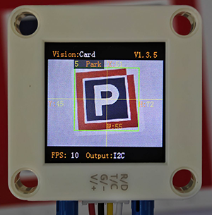
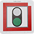
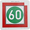
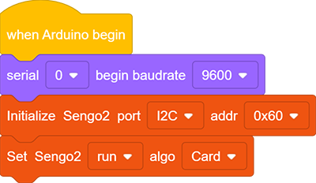
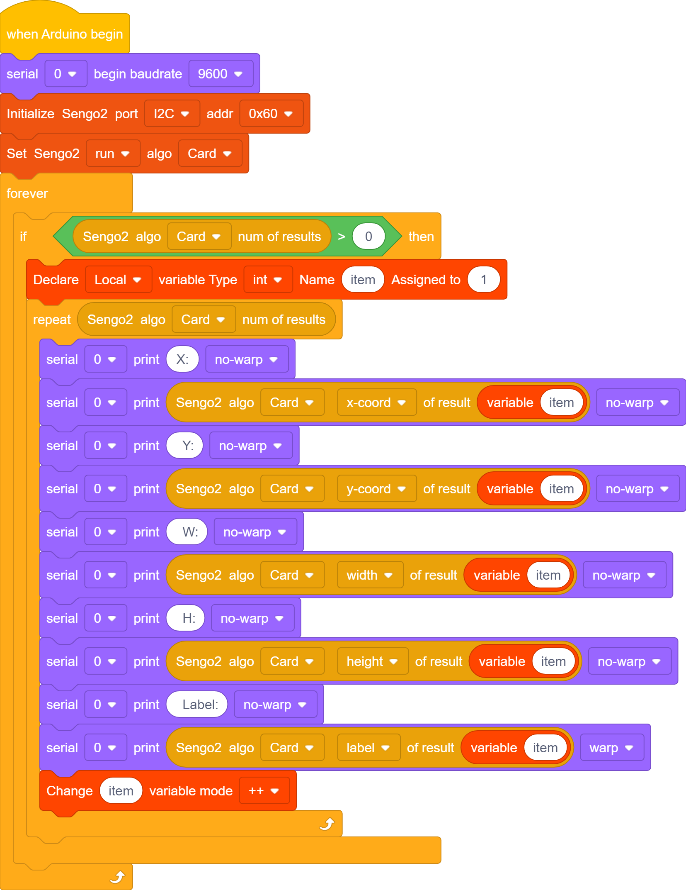
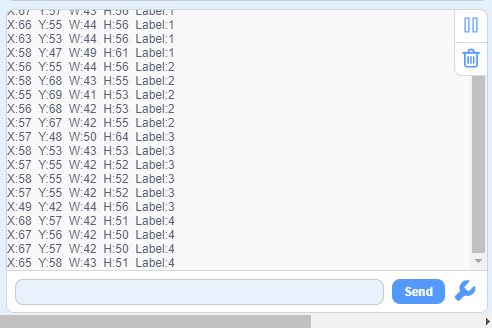

# 4.6 Card Recognition

## 4.6.1 Algorithm

It can identify whether there are corresponding traffic cards in the image. If yes, it will return information including the coordinates, size, and label values of the cards.

--------

## 4.6.2 Classification Label

| Label | Definition  |           Pic           |
| :---: | :---------: | :---------------------: |
|   1   | go forward  |  |
|   2   |  turn left  |  |
|   3   | turn right  |  |
|   4   | turn around |  |
|   5   |    stop     |  |
|   6   | green light |  |
|   7   |  red light  |  |
|   8   |  speed 40   |  |
|   9   |  speed 60   |  |
|  10   |  speed 80   |  |

Note: The algorithm can recognize multiple cards simultaneously. The card can still be recognized within a certain rotation, deflection and pitch angle. When using, please make the card face the camera as directly as possible for better recognition effect.

------------

## 4.6.3 Test Code

1. In the code start-up, set the serial port baud rate to `9600`, and then set the communication mode of the AI vision module to `I2C`, and finally set it to run in `Card` mode.

2. The if block determines the number of detections. Only when the number of detections is greater than 0 will the data be output. Note to choose `Card`.

3. Loop through the result quantity. When multiple cards are detected, it will loop multiple times and then use a variable on the parameter group. After each loop print, the variable adds by one. In this way, the information of cards can be printed (Note: Set the mode of the returned data to “Card”).

**Complete code:**

## 4.6.4 Test Result

After uploading the code, the AI vision module will scan the area captured by the camera. If there is a card, it will recognize the card and print its coordinates(x,y), width(w) and height(h) in the serial monitor. 

## 4.6.5 Extension Gameplay

**Color picker**

- **Game rule:** Rotate the card (to the right/left) to change WS2812 light colors. For example, the normal sequence of lights is: red > green > blue > yellow > purple, etc., yet we can adjust them by turning the card. Suppose the current color is red, and we rotate the card to the right to change it to green; rotate to the left to make it purple; in a loop.
- **Practice:** After identifying the card, control the light by performing addition or subtraction on a variable.
