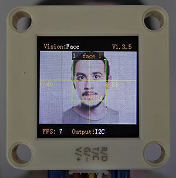
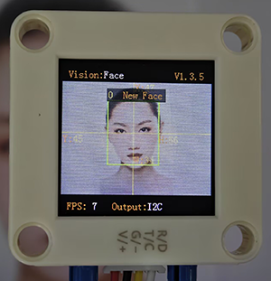
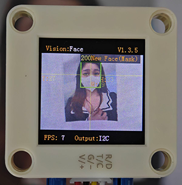
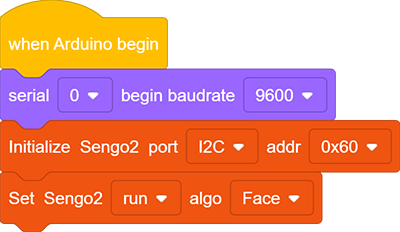
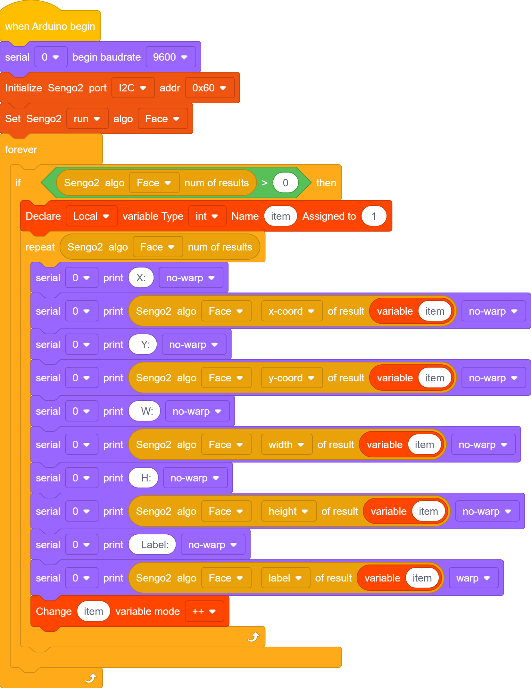
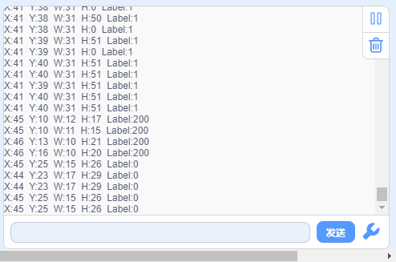

# 4.7 Face Recognition

## 4.7.1 Algorithm

It detects and recognizes human face in the image. Users can train to store or delete facial data by the function button. Sengo2 can store 15 faces at most.

-----------------

## 4.7.2 Classification Label

Sengo2 defines 17 classification labels for human faces:

| Label value |       Meaning       | Label value |                Meaning                 |
| :---------: | :-----------------: | :---------: | :------------------------------------: |
|      0      |      New face       |    1-15     | Classification number for stored faces |
|     200     | Face wearing a mask |             |                                        |

New face (label value 0):

Face wearing a mask (label value 200):

Stored face (label value 1-15):

---------------

## 4.7.3 Save Data

After enabling the face recognition algorithm, point the camera at the face, press the function button for 5 seconds and then release it. Sengo2 will start recording the face, and the current face data will be stored and assigned an ID number.

The smallest number among the currently available numbers will be assigned to the label value. If there are no vacant numbers, Sengo2 will prompt a storage failure.

----------------

## 4.7.4 Delete Data

After storing, press the function button for about 10 seconds and then release it to delete the data just stored. Press it again for 10 seconds, and all the stored faces will be cleared. If no face has been stored after enabling the algorithm, all storage of faces will be directly cleared when you press the function button for 10 seconds.

------------------

## 4.7.5 Tips of Face Recognition Algorithm

1. When the ambient light is sufficient, the complete face is directly facing the camera and occupies a large field of view, the module can recognize it much better.
2. When wearing glasses or covered by hair, the human face may not be detected completely.

----------------

## 4.7.6 Test Code

1. In the code start-up, set the serial port baud rate to `9600`, and then set the communication mode of the AI vision module to `I2C`, and finally set it to run in `Face` m

2. The if block determines the number of detections. Only when the number of detections is greater than 0 will the facial data be output. Note to choose `Face`.

3. Loop through the result quantity. When multiple faces are detected, it will loop multiple times and then use a variable on the parameter group. After each loop print, the variable adds by one. In this way, the facial data can be printed (Note: Set the mode of the returned data to “Face”).

**Complete code:**

--------------------

## 4.7.7 Test Result

After uploading the code, press and hold the function button for 5 seconds, and then the module will starts to learn and record the face on the screen. Wait for a while until the recording is completed. When encountering new faces or faces wearing masks, prompts will also be given on it.

## 4.7.8 Extension Gameplay

**Concentration monitor**

- **Game rule:** When studying, the camera is pointed at you. If it detects that your face has left the its field of view (when you turn your head to do something else), it will emit a friendly prompt sound “beep beep”.
- **Practice:** Program to continuously detect human faces. If no face is detected in several consecutive frames, it sounds a reminder audio from the connected voice module.