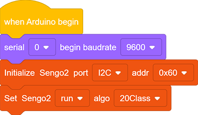

# 4.8 20 Types of Object Recognition

## 4.8.1 Algorithm

It can identify 20 common types of objects and return their coordinates and labels after recognition.

## 4.8.2 Classification Label

| Label |     name     | Label |     name     |
| :---: | :----------: | :---: | :----------: |
|   1   |   Airplane   |   2   |   Bicycle    |
|   3   |     Bird     |   4   |     Boat     |
|   5   |    Bottle    |   6   |     Bus      |
|   7   |     Car      |   8   |     Cat      |
|   9   |    Chair     |  10   |     Cow      |
|  11   | Dining Table |  12   |     Dog      |
|  13   |    Horse     |  14   |  Motorbike   |
|  15   |    Person    |  16   | Potted Plant |
|  17   |    Sheep     |  18   |     Sofa     |
|  19   |    Train     |  20   |  Tv monitor  |

We have provided 20 types of object images in the Resources folder.

----------

## 4.8.3 Tips of Object Recognition Algorithm

1. The clarity of the image may affect the recognition. If the image is too small, the camera cannot focus on it, resulting in a blurry image and a poor recognition. At this time, a larger pattern should be used instead.
2. If you want to recognize patterns on a screen, please adjust its brightness appropriately to avoid overexposure.

-------

## 4.8.4 Test Code

1. In the code start-up, set the serial port baud rate to `9600`, and then set the communication mode of the AI vision module to `I2C`, and finally set it to run in `20Class` mode.

2. The if block determines the number of detections. Only when the number of detections is greater than 0 will the data be output. Note to choose `20Class`.

**Complete code:**

-----------

## 4.8.5 Test Result

After uploading the code, the AI vision module will detect the area captured by the camera. If any of the 20 types of objects is recognized, the coordinate, size and label of the object will be shown on the monitor.

## 4.8.6 Extension Gameplay

**Children intelligent cognitive card**

- **Game rule:** Let children hold the cards of 20 types of objects in front of the camera. The AI module will recognize and read out their names and display them on the screen.
- **Practice:** After identifying cards, the name is sent to the voice module through the serial port, and the name in large font is also displayed on the screen.
- **Possible difficulty:** An audio module needs to be connected.