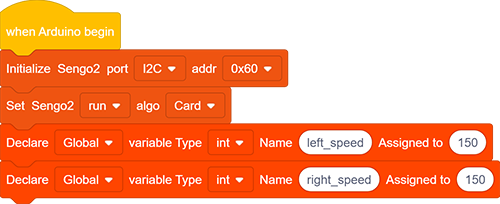
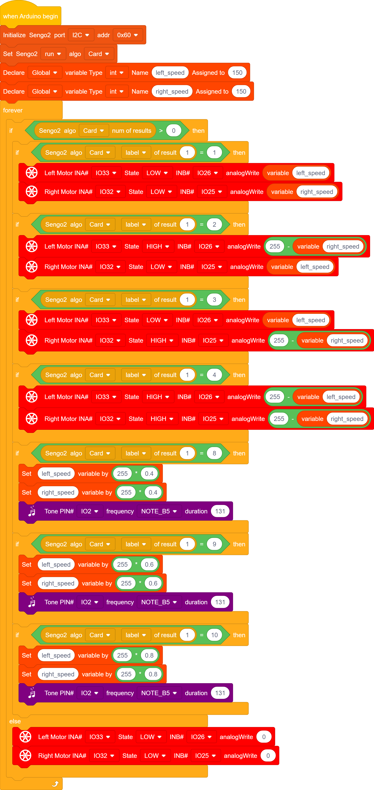

# 5.2 Card Control Car

## 5.2.1 Overview

In this project, we control the car through traffic cards. They include “forward”, “turn left”, “turn right”, “turn around(back)”, “stop”, “speed 40”, “speed 60”, “speed 80”, “red light”, and “green light”. The AI vision module can recognize them and control the car to perform corresponding actions based on the cards.

## 5.2.2 Code Flow

## 5.2.3 Test Code

Since the AI vision module interacts with the KS5002 car robot, the functional blocks of the car will be used. So please load the extension of this robot for direct use if you want to build blocks manually. 

1. In the code start-up, set pins (that control motors) to output mode, and then set the communication mode of the AI vision module to `I2C`, and set it to run in `Card` mode. 

	Define two global int variables and name them as `left_speed` and `right_speed` respectively.

2. The if block determines the number of detections. Only when the number of detections is greater than 0 will the data be output. Note to choose `Card`.

3. The if block detects the card `label`. You can check card label values in the project Card Recognition, such as, label =1: forward, label = 2: turn left; label = 3: turn right; label = 4: turn around(backward). After recognition, the car will perform corresponding actions.

	If the card of forward is recognized, run code blocks:

	

	If the card of backward(turn around) is recognized, run code blocks:

	

	You may find that a subtraction was made from 255 in the backward code. The reason is that, when moving back, 255 is the slowest while 0 is the fastest, which is exactly the opposite of forward one. You can also set speed to control the car forward or backward to observe this principle more intuitively.

4. As for speed setting codes, we perform the multiplication operation on the variables `left_speed` and `right_speed`. We get speed card of 40, 60 and 80, so we set `left_speed` and `right_speed` to multiply 0.4(when speed 40 is detected), 0.6(when speed 60 is detected) or 0.8(when speed 80 is detected) respectively. At the same time, the buzzer will beep when a new speed is set.

	If the card of speed 80 is recognized, run code blocks:

	

**Complete code:**

## 5.2.4 Test Result

After uploading the code, the AI vision module will detect the captured image to determine if there is a traffic card. If there is, assign the card label value to the variable Tags. 

Tags = 1: the car moves forward; Tags = 2: the car turns left; Tags = 3: the car turns right; Tags = 4: the car moves backward; Tags = 5: the car stops; 

Tags = 8: speed is set to 40% of full speed(255); Tags = 9: speed is set to 60% of full speed (255); Tags = 10: speed is set to 80% of full speed (255). 

