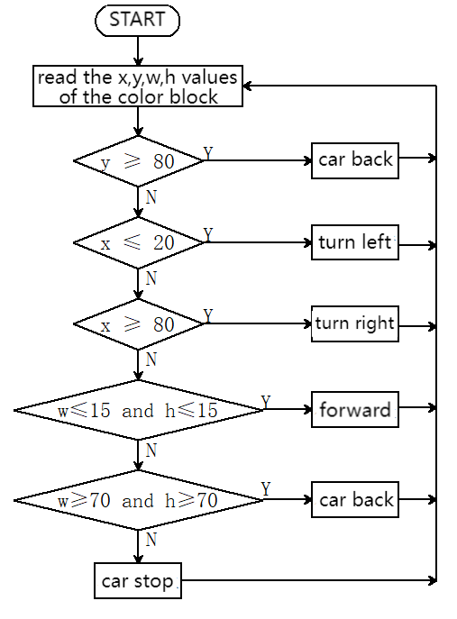
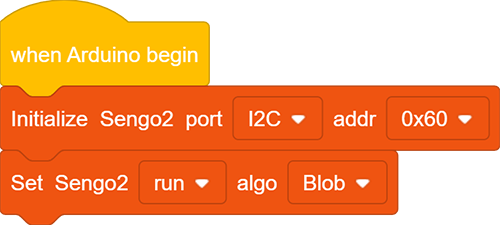
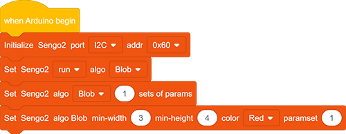
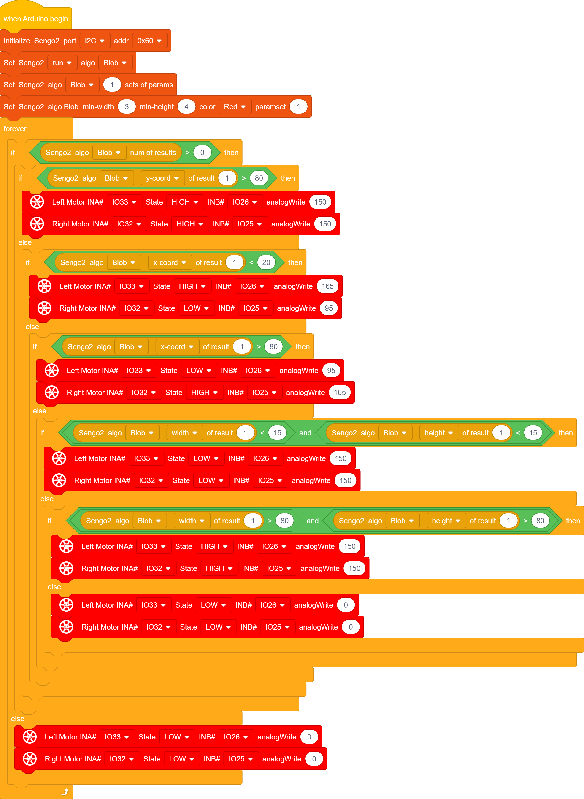

# 5.3 Color Block Following Car

## 5.3.1 Overview

In this project, we build a color block following car. Herein, the AI vision module locks a certain color block and detects its coordinates x and y, and width and height, and then it controls the car to move left, right, forward to track this color block.

## 5.3.2 Code Flow

## 5.3.3 Test Code

Since the AI vision module interacts with the KS5002 car robot, the functional blocks of the car will be used. So please load the extension of this robot for direct use if you want to build blocks manually. 

1. In the code start-up,then set the communication mode of the AI vision module to `I2C`, and set it to run in `Blob` mode.

2. Set the parameter group to 1 (only one color is recognized), set the minimum size of this recognized color block, define the recognized color, and set parameter group number to 1.

3. The if block determines the detection numbers. If it is greater than 0, read the data. Otherwise, the car stops. Note to choose `Blob`.

4. Determine whether “y” value of the color block is greater than “80”. If yes, the car goes back to the position of “y” within 80.

5. Determine whether “x” value of the color block is less than “20”. If yes, the car turns left to the position of “x” over 20.

6. Determine whether “x” value of the color block is greater than “80”. If yes, the car turns right to the position of “x” within 80.

7. Determine whether the width and height of the color block are both less than 15. If yes, the car goes forward till both values are greater than 15.

8. Determine whether the width and height of the color block are both greater than 80. If yes, the car goes back till both values are less than 80.

9. Nest these “if...else...” blocks.

**Complete code:**

## 5.3.4 Test Result

After uploading the code, the AI vision module will detect the captured image to determine if there is a red block. If there is, it will control the movement of the car based on the x, y, w, and h values of this color block. For example, if the red block is close to the right side of the display, the car will turn right; if it is in the left, the car will turn left; and if it is at the lower part of display, the car will move backward. (Please use the color cards we provide.)

