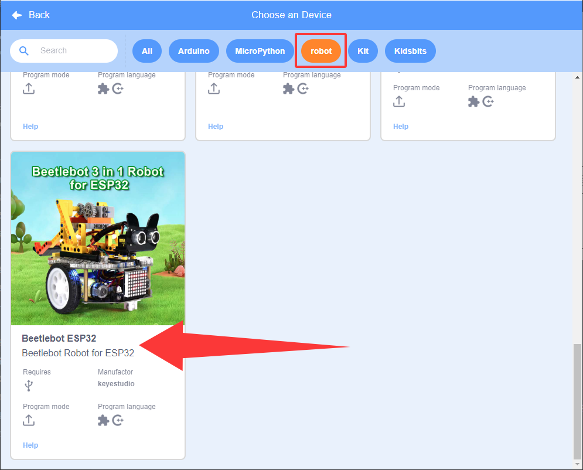

# 5.5 Jan-Ken Punch

## 5.5.1 Overview

In the Rock-paper-scissors game, we replace gestures with labels of 16h5, including 0(Rock), 1(Scissors) and 2(Paper), to compete with the car. The car will randomly generate 0(Rock), 1(Scissors) and 2(Paper). If the car wins, it will emit a green light and a victory sound. If the car loses, it will emit a red light and a defeat sound. If it’s a draw, the car will emit a blue light and a draw sound.

## 5.5.2 Code Flow

## 5.5.3 Test Code

Since the AI vision module interacts with the KS5002 car robot, the functional blocks of the car will be used. So please load the extension of this robot for direct use if you want to build blocks manually. 

1. In the code start-up, initialize the RGB LED, and then set the communication mode of the AI vision module to `I2C`, and set it to run in `AprilTag`. 

	Set the AprilTag to `16H5`, and define three int variables, namely `randomNumber`, `result` and `userNumber`.

2. Assign a random value within 0-2 to the variable `randomNumber`. 

	In ,  randomly returns a value within the specified range. We set it to start from 0 and end at 3 (note that the number 3 will not be generated).

3. The if block determines whether a set AprilTag is detected. If yes, run its following code, read its label value and assign it to `userNumber`.

4. Assign `result` a value to calculate the win or loss. `result = 0`: draw; `result = 1`: car wins; `result = 2`: car lose. 

	`result = ((userNumber - randomNumber) + 3) % 3`. The remainder module  is in the .

	

5. Add another if block to determine the value of `userNumber `. If it is greater than 3, do not run following codes. This prevents unwanted values from triggering the code of this game.

	

6. Add a repeat block to countdown. After the countdown ends, the if statement determines the value of `result`. 

	`result = 0`, emit a blue light and a draw sound, print “draw!!” on the serial monitor. 

	`result = 1`, emit a green light and a sound of victory, print “I won!!” on the serial monitor. 

	`result = 3`, emit a red light and a sound of defeat, print “I am lost!!” on the serial monitor.

**Complete code:**

## 5.5.4 Test Result

After uploading the code, the AI vision module will detect the captured image to determine if there is 16h5 label. If there is, the label value will be transmitted to the development board. We can randomly place the cards with label values of “0, 1, 2” in the camera recognition area to play Janken with the car. If it’s a draw, the car will emit a blue light and a draw sound. If the car wins, it will emit a green light and a victory sound. If the car loses, it will emit a red light and a defeat sound.
