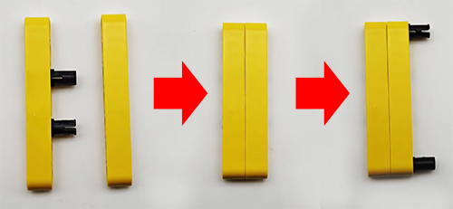
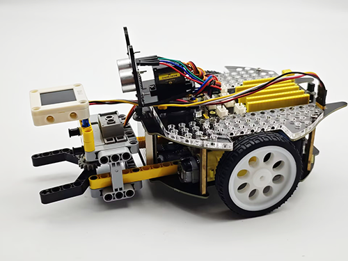
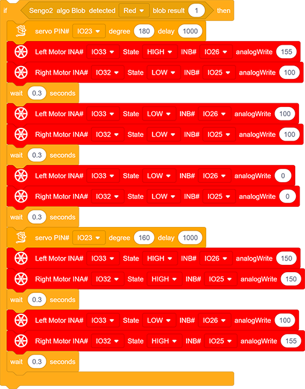
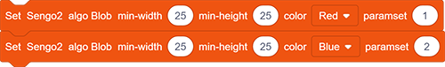

# 5.7 Red and Blue Sorting Car

## 5.7.1 Overview

In this project, we build an interesting color block sorting car by the AI vision module. We first need to mount the module on the soccer robot car to enable its recognition function. If a red block is detected, the car will convey it to the left side and return to its original position along the same path. If a blue one is detected, it will convey it to the right and come back.

## 5.7.2 Mount the AI module to the soccer robot car

**Required Parts**

**Step 1:**

**Step 2:**

**Step 3:**

**Step 4:**

**Step 5:**

**Step 6:**

| AI vision module | Car pins |
| :--------------: | :------: |
|   T/C (yellow)   |   SCL    |
|   R/D (white)    |   SDA    |
|    V/+ (red)     |    5V    |
|   G/- (black)    |    G     |

**Completed:**

## 5.7.3 Code Flow

## 5.7.4 Test Code

If you want to build the code blocks by yourself, please load the functions of KS5002 robot car. Since the AI vision module needs to interact with this car, its functions will be used. After loading, we can directly drag its code blocks without adding them one by one.

1. Set the communication mode of the AI vision module to `I2C`, and set it to run in `Blob` mode. 

	Set the parameter group to 2 (only two colors are recognized in the code) and the number of each color recognized to 1; 

	Set the minimum size (width 25, height 25) of the recognized color block, the color (red, blue) to be recognized and the parameter group number (red for 1, blue for 2); 

	Set servo to rotate to 160°.

2. The if block determines the number of detections. Only when the number of detections is greater than 0 will the color block data be output. Note to choose `Blob`. In the “else” part, put the code blocks to control the car to stop.

3. Use  to determine whether the detected color block is red. 

	If yes, the car will (1) control the servo to rotate to 180° so that the clip will grab the red block with a delay of 1000ms; (2) turn left for 0.3 seconds, move forward for 0.3s and stop; (3) control the servo to rotate to 160° so that the clip will put the red block down; (4) move back for 0.3s, turn right for 0.3s. 

	After the car completes these actions, the red block is moved to the left.

4. Similarly, also use  to determine whether the detected color block is blue. Here we need to modify “red” in it to “blue”.

	If a blue block is detected, the car will (1) control the servo to rotate to 180° so that the clip will grab the blue block with a delay of 1000ms; (2) turn right for 0.3 seconds, move forward for 0.3s and stop; (3) control the servo to rotate to 160° to put the blue block down; (4) move back for 0.3s, turn left for 0.3s.

	After the car completes these actions, the blue block is moved to the right.

**Complete code:**

## 5.7.5 Test Result

After uploading the code, the AI vision module will enable the “Blob” mode to recognize the captured image to determine whether there are red or blue blocks. If a red block is detected, the car will hold the red block and send it to the left side, and then it will return to its original position along the same path. If a blue one is detected, the car will convey it to the right side and come back. (There may be a slight deviation from the original position after the car moves back because it was set based on the driving time.)

Note: The code sets the minimum size of the color block. If the size of your block is smaller than this, it will not be recognized. These values can be modified in the following code blocks according to your needs.

