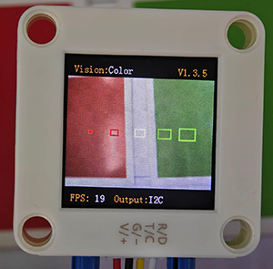

# 4.1 Color Recognition

## 4.1.1 Algorithm


It will specify one or more recognition areas, whose positions and sizes can be set as needed, and then it will return the color label of this area as well as the red component value R, green component value G and blue component value B.

---------------------

## 4.1.2 Color Label

Sengo2 defines 7 colors of labels:

| Label value | Meaning | Label value | Meaning |
| :---------: | :-----: | :---------: | :-----: |
|      1      |  Black  |      2      |  White  |
|      3      |   Red   |      4      |  Green  |
|      5      |  Blue   |      6      | Yellow  |
|      0      | Unknown |             |         |

<span style="color:red;font-size:20px;">Note: Common colors not listed in the table, such as purple, cyan(blue-green), orange, and gray, have relatively low color discrimination and are easily misidentified as the colors in the table. Therefore, they are classified as unknown ones. If you need to recognize the above colors, you can make your own judgment based on the returned RGB values.</span>

Sample 1:


The serial port outputs the label values: 


Sample 2:



The serial port outputs the label values: (The first two boxes recognize red, the middle one is white, and the last two are green, which all correspond to the color label table.)


-------------------------

## 4.1.3 Configuration Parameters

Users can set the coordinates of the recognition area and the size of the recognition box. If no new parameters are specified, it will run with the default values that are defined as follows:

| Parameters |                  Definition                  | Default |
| :--------: | :------------------------------------------: | :-----: |
|     x      | Central coordinate x of the recognition area |   50    |
|     y      | Central coordinate y of the recognition area |   50    |
|     w      |       Width w of the recognition area        |    3    |
|     h      |       Height h of the recognition area       |    4    |
|     0      |                     none                     |    /    |

Code: (5 for loops set 5 recognition boxes in the code)

```python
   num = 5  #Set the maximum number of detections to 5
    #Other codes...
    # num = 5, 5 cycles correspond to 5 recognition boxes respectively
    for i in range(1, (num + 1), 1):
        #Set the x-axis coordinates of the recognition box displayed on the screen
        x = (round(100 * i / (num + 1)))
        #Set the y-axis coordinates of the recognition box displayed on the screen
        y = 50
        #Set the width of the recognition box displayed on the screen
        w = (round(i * 2 + 1))
        #Set the height of the recognition box displayed on the screen
        h = (round(i * 2 + 1))
        #Write the box parameters
        sengo2.SetParam(sengo2_vision_e.kVisionColor,[x, y, w, h, 0],i)
```

---------------

## 4.1.4 Returned Values

When the main controller acquires the detection results, the algorithm will return the followings:

| Formal parameter |                   Definition                   |
| :--------------: | :--------------------------------------------: |
|     kRValue      |  red component value R, with a range of 0-255  |
|     kGValue      | green component value G, with a range of 0-255 |
|     kBValue      | blue component value B, with a range of 0-255  |
|      kLabel      |               color label value                |

Code:

```python
            #Obtain the label (color ID) of the i-th object
            label = sengo2.GetValue(sengo2_vision_e.kVisionColor,sentry_obj_info_e.kLabel,i)
```

In `sengo2.GetValue(sengo2_vision_e.kVisionColor,sentry_obj_info_e.kLabel,i)`, sentry_obj_info_e.kLabel, the returned value is that of the color label. If I replaced it with “sentry_obj_info_e.kLabel”, `sentry_obj_info_e.kRValue` will return the red component value R(0-255).

--------------------

## 4.1.5 Tips of Color Recognition Algorithm

1. When the recognition area is relatively small, such as 2x2, although the recognition speed is fast, there will be an impact on results due to the small number of pixels, thus with low credibility. It is only suitable for scenarios with a single controllable background.
2. When the recognition area is large, such as 20x20 with the large number of pixels, the interference of variegated colors will be filtered out, resulting in a relatively high credibility, but the recognition speed is slow.
3. Within the recognition area, when the areas occupied by different colors are approximately the same, the results may repeatedly change.

-----------------------

## 4.1.6 Test Code

```python
from machine import I2C,UART,Pin
from  Sengo2  import *
import time
import random

num = 5  #Set the maximum number of detections to 5
x = 0
y = 0
i = 0

def result_output():
    global num, x, y, i
    # Sengo2 does not actively return the detection and recognition results; it requires the main control board to send instructions for reading.
    # The reading process: 1.read the number of recognition results. 2.After receiving the instruction, Sengo2 will refresh the result data. 3.If the number of results is not zero, the board will then send instructions to read the relevant information. (Please be sure to build the program according to this process.)
    obj_num = sengo2.GetValue(sengo2_vision_e.kVisionColor, sentry_obj_info_e.kStatus)
    if obj_num:
        print("Totally %d points: "%( obj_num ))
        print("|",end='')
        for i in range(1, (obj_num + 1), 1):
            #Obtain the label (color ID) of the i-th object
            label = sengo2.GetValue(sengo2_vision_e.kVisionColor,sentry_obj_info_e.kLabel,i)
            print(label,end='|')
            time.sleep(0.2)
        print("\n")
        

# Wait for Sengo2 to  initialize the operating system. This waiting time cannot be removed to prevent the situation where the controller has already developed and sent instructions before Sengo2 has been fully initialized
time.sleep(2)

# Select UART or I2C communication mode. Sengo2 is I2C mode by default. You can change it by just pressing the button.
# 4 UART communication modes: UART9600(Standard Protocol Instruction); UART57600(Standard Protocol Instruction), UART115200(Standard Protocol Instruction); Simple9600(Simple Protocol Instruction)
#########################################################################################################
# port = UART(2,rx=Pin(16),tx=Pin(17),baudrate=9600)
i2c = I2C(0,scl=Pin(21),sda=Pin(20),freq=400000)

# Sengo2 communication address: 0x60. If multiple devices are connected to the I2C bus, please avoid address conflicts.
sengo2 = Sengo2(0x60)

err = sengo2.begin(i2c)
print("sengo2.begin: 0x%x"% err)


# Set the colors of the two LEDs of Sengo2. Available: Close,White,Red,Green,Yellow,Blue,Purple,Cyan
# The three parameters in sequence: the color when the target is detected and recognized, the color when the target is not detected, the brightness
# When the ambient light is insufficient, all LEDs can be set to White, and the brightness value can be set to a maximum of 15 (range: 1-15).
# Two LEDs cannot be set separately
sengo2.LedSetColor(sentry_led_color_e.kLedBlue,sentry_led_color_e.kLedBlue,1)


# The default parameters of the algorithm. If they do not need to be changed, this line of code can be deleted
sengo2.SetParamNum(sengo2_vision_e.kVisionColor,1)
# The default parameters of the algorithm. If they do not need to be changed, this line of code can be deleted
sengo2.SetParam(sengo2_vision_e.kVisionColor,[50, 50, 3, 4, 0],1)
 
 
err = sengo2.VisionBegin(sengo2_vision_e.kVisionColor)
print("sengo2.VisionBegin(sengo2_vision_e.kVisionColor):0x%x"% err)

#Set the num group parameters of the color recognition algorithm, control the number of the num group parameters by setting the num
sengo2.SetParamNum(sengo2_vision_e.kVisionColor,num)

while True:
    # num = 5 : 5 loops correspond to 5 recognition boxes respectively
    for i in range(1, (num + 1), 1):
        #Set the X-coordinate of the recognition box displayed on the screen
        x = (round(100 * i / (num + 1)))
        #Set the Y-coordinate of the recognition box displayed on the screen
        y = 50
        #Set the width at which the recognition box is displayed on the screen
        w = (round(i * 2 + 1))
        #Set the height at which the recognition box is displayed on the screen
        h = (round(i * 2 + 1))
        #Write the identification box parameters
        sengo2.SetParam(sengo2_vision_e.kVisionColor,[x, y, w, h, 0],i)
        #Delay 0.1S
        time.sleep(0.1)
    result_output()
    time.sleep(0.3)

```

----------------

## 4.1.7 Test Result

After uploading the code, 5 recognition boxes of different sizes will appear on the AI vision module. Each box will match a color, and then their corresponding label values will be printed on the serial monitor.


## 4.1.8 Extension Gameplay

**Color Password Lock**

- **Game rule:** Set a color sequence as the “password”(e.g., red - blue - green). Only when the colors are displayed to the camera in the correct order can the success signal (such as rotating servo or the lighting on) be triggered.
- **Practice:** Program to record the color sequence recognized within a short period of time. Only when the sequence exactly matches the preset “password” will it be unlocked. This can be used to simply open a box or start a device.