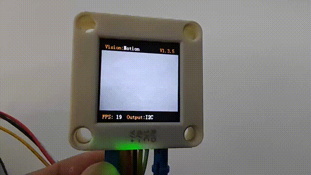
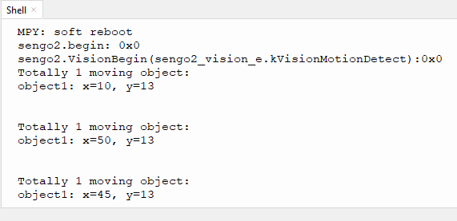

# 4.10 Moving Object Detection

## 4.10.1 Algorithm

Sengo2 needs to remain stationary, and the algorithm will determine whether there are any changed areas in the image by comparing the pixel differences between adjacent frames. If so, it is considered that there is a moving object within the field of view, and the coordinates of this area will be returned. Note that the algorithm returns only one detection result.

## 4.10.2 Returned Values

When the controller acquires the recognition result, the algorithm will return the followings:

| Parameter |         Definition          |
| :-------: | :-------------------------: |
|  kXValue  | Object central coordinate x |
|  kYValue  | Object central coordinate y |

Code:

```python
            x = sengo2.GetValue(sengo2_vision_e.kVisionMotionDetect, sentry_obj_info_e.kXValue, i)
            y = sengo2.GetValue(sengo2_vision_e.kVisionMotionDetect, sentry_obj_info_e.kYValue, i)
```

----------------

## 4.10.3 Test Code

```python
from machine import I2C,UART,Pin
from  Sengo2  import *
import time

# Wait for Sengo2 to complete the initialization of the operating system. This waiting time cannot be removed to prevent the situation where the controller has already developed and sent instructions before Sengo2 has been fully initialized
time.sleep(2)

# Choose UART or I2C communication mode. Sengo2 is I2C mode by default. You can switch between the two by short pressing the mode button.
# Four UART communication modes: UART9600 (Standard Protocol Instruction), UART57600 (Standard Protocol Instruction), UART115200 (Standard Protocol Instruction), Simple9600 (Simple Protocol Instruction)
#########################################################################################################
# port = UART(2,rx=Pin(16),tx=Pin(17),baudrate=9600)
port = I2C(0,scl=Pin(21),sda=Pin(20),freq=400000)

# The communication address of Sengo2 is 0x60. If multiple devices are connected to the I2C bus, please avoid address conflicts.
sengo2 = Sengo2(0x60)

err = sengo2.begin(port)
print("sengo2.begin: 0x%x"% err)

# 1. Algorithm Introduction Reference
# 2. When in use, keep sengo2 stationary and do not shake it. Otherwise, the result will contain error information.
# 3. During normal use, the main controller sends commands to control the on and off of Sengo2 algorithm, rather than manual operation by joystick.
err = sengo2.VisionBegin(sengo2_vision_e.kVisionMotionDetect)
print("sengo2.VisionBegin(sengo2_vision_e.kVisionMotionDetect):0x%x"% err)

while True:
# Sengo2 does not actively return the detection and recognition results; it requires the main control board to send instructions for reading.
# The reading process: 1.read the number of recognition results. 2.After receiving the instruction, Sengo2 will refresh the result data. 3.If the number of results is not zero, the board will then send instructions to read the relevant information. 
# (Please be sure to build the program according to this process.)
    obj_num = sengo2.GetValue(sengo2_vision_e.kVisionMotionDetect, sentry_obj_info_e.kStatus)
    if obj_num:
        print("Totally %d moving object: "%( obj_num ))
        for i in range(1,obj_num+1):
            x = sengo2.GetValue(sengo2_vision_e.kVisionMotionDetect, sentry_obj_info_e.kXValue, i)
            y = sengo2.GetValue(sengo2_vision_e.kVisionMotionDetect, sentry_obj_info_e.kYValue, i)
            # The w and h values are fixed and have no practical significance, so there is no need to read and process them
            print("object%d: x=%d, y=%d"%(i, x, y))
            time.sleep(0.2)
            print("\n")

```

-----

## 4.10.4 Test Result

After uploading the code, the AI vision module will detect the area captured by the camera. If it detects any moving object, it will recognize it and print its coordinates on the serial monitor.





## 4.10.5 Extension Gameplay

**Dynamic sensor lamp**

- **Game rule:** Align the module with the door or corridor of a room. When a large range of movement (someone passing by) is detected, the LED light will turn on and then turn off after a delay. This is “lights on when people come and off when they leave”.
- **Practice:** Program to continuously detect moving objects. Once detected, the digital pin outputs a high level to control the relay or MOS tube to light up the LED strip.