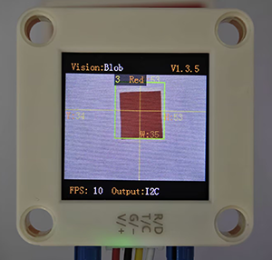
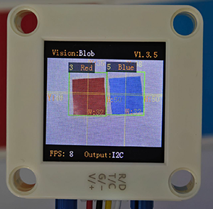
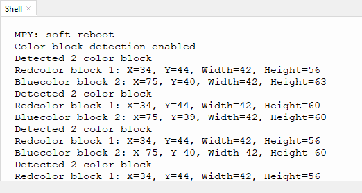

# 4.2 Color Block Detection

## 4.2.1 Algorithm



We specify a certain detection color, and it will determine whether there is a block of that color in the image. If yes, it will return its coordinates and size. The color label is the same as that in color recognition algorithm.

---------------------------

## 4.2.2 Configuration Parameters

Users can set the detection quantity, size and color labels of the color blocks to be recognized.

Code:

```python
# Set the color block detection parameters - only detect red and blue
sentry.SetParamNum(sengo2_vision_e.kVisionBlob, 2)  # Set two sets of parameters

# Red parameter group
sentry.SetParam(
    sengo2_vision_e.kVisionBlob,
    [0, 0, 10, 10, color_label_e.kColorRed],  # Parameter format
    param_id=1
)

# Blue parameter group
sentry.SetParam(
    sengo2_vision_e.kVisionBlob,
    [0, 0, 10, 10, color_label_e.kColorBlue],  # Parameter format
    param_id=2
)
```

-------------------

## 4.2.3 Returned Values

When the main controller acquires the detection results, the algorithm will return the followings:

| Formal parameter |            Definition            |
| :--------------: | :------------------------------: |
|     kXValue      | color block central coordinate x |
|     kYValue      | color block central coordinate y |
|   kWidthValue    |       color block width w        |
|   kHeightValue   |       color block height h       |
|      kLabel      |           color label            |

Code:

```python
            # Process each detected color block
            for i in range(1, obj_num + 1):
                # Obtain the color label
                color_label = sentry.GetValue(
                    sengo2_vision_e.kVisionBlob,
                    sentry_obj_info_e.kLabel,
                    i
                )
                 # Only handle red and blue
                if color_label in [color_label_e.kColorRed, color_label_e.kColorBlue]:
                    # Get the location and size
                    x = sentry.GetValue(
                        sengo2_vision_e.kVisionBlob,
                        sentry_obj_info_e.kXValue,
                        i
                    )
                    y = sentry.GetValue(
                        sengo2_vision_e.kVisionBlob,
                        sentry_obj_info_e.kYValue,
                        i
                    )
                    w = sentry.GetValue(
                        sengo2_vision_e.kVisionBlob,
                        sentry_obj_info_e.kWidthValue,
                        i
                    )
                    h = sentry.GetValue(
                        sengo2_vision_e.kVisionBlob,
                        sentry_obj_info_e.kHeightValue,
                        i
                    )
                    
                    # Determine the color name
                    color_name = "Red" if color_label == color_label_e.kColorRed else "Blue"
                    
                    print(f"{color_name}color block {i}: X={x}, Y={y}, Width={w}, Height={h}")
        
        time.sleep(0.1)  # Brief delay

```

---------------------

## 4.2.4 Test Cod

```python
from machine import I2C, Pin
import time
import random
from Sengo2 import *

# Initialize I2C (adjust the pins according to the actual wiring
i2c = I2C(0, scl=Pin(21), sda=Pin(20), freq=400000)  # Use the pins in the reference code

# Wait for the initialization of Sengo2 (important!)
time.sleep(2)

# Create a Sengo2 object
sentry = Sengo2()

# Start sensor
if sentry.begin(i2c) != SENTRY_OK:
    print("Sentry initialization failed!")
    while True: pass

# Set the color block detection parameters - only detect red and blue
sentry.SetParamNum(sengo2_vision_e.kVisionBlob, 2)  # Set two sets of parameters

# Red parameter group
sentry.SetParam(
    sengo2_vision_e.kVisionBlob,
    [0, 0, 10, 10, color_label_e.kColorRed],  # Parameter format
    param_id=1
)

# Blue parameter group
sentry.SetParam(
    sengo2_vision_e.kVisionBlob,
    [0, 0, 10, 10, color_label_e.kColorBlue],  # Parameter format
    param_id=2
)

# Enable the color block detection function
if sentry.VisionBegin(sengo2_vision_e.kVisionBlob) == SENTRY_OK:
    print("Color block detection enabled")

# Main detection loop
try:
    while True:
        # Obtain the number of detected color blocks
        obj_num = sentry.GetValue(sengo2_vision_e.kVisionBlob,sentry_obj_info_e.kStatus)
        
        if obj_num:
            print(f"Detected {obj_num} color block")
            
            # Process each detected color block
            for i in range(1, obj_num + 1):
                # Obtain the color label
                color_label = sentry.GetValue(
                    sengo2_vision_e.kVisionBlob,
                    sentry_obj_info_e.kLabel,
                    i
                )
                 # Only handle red and blue
                if color_label in [color_label_e.kColorRed, color_label_e.kColorBlue]:
                    # Get the location and size
                    x = sentry.GetValue(
                        sengo2_vision_e.kVisionBlob,
                        sentry_obj_info_e.kXValue,
                        i
                    )
                    y = sentry.GetValue(
                        sengo2_vision_e.kVisionBlob,
                        sentry_obj_info_e.kYValue,
                        i
                    )
                    w = sentry.GetValue(
                        sengo2_vision_e.kVisionBlob,
                        sentry_obj_info_e.kWidthValue,
                        i
                    )
                    h = sentry.GetValue(
                        sengo2_vision_e.kVisionBlob,
                        sentry_obj_info_e.kHeightValue,
                        i
                    )
                    
                    # Determine the color name
                    color_name = "Red" if color_label == color_label_e.kColorRed else "Blue"
                    
                    print(f"{color_name}color block {i}: X={x}, Y={y}, Width={w}, Height={h}")
        
        time.sleep(0.1)  # Brief delay

except KeyboardInterrupt:
    sentry.VisionEnd(sengo2_vision_e.kVisionBlob)
    print("The program has stopped")

```

----------------------------

## 4.2.5 Test Result

After uploading the code, the module will detect the area captured by the camera. If there are red and blue blocks, they will be selected and marked. Then, their position coordinates x and y, width, height, and color label values will be printed on the serial monitor. (The color label is the same as that in color recognition algorithm.) In the example, we converted the label values into color names.





## 4.2.6 Extension Gameplay

**Smart sorting assistant**

- **Game rule:** The module distinguishes blocks of different colors and shapes (say, red square, blue circle…), and push different blocks into the corresponding collection boxes by controlling two servos.
- **Practice:** Program to set the recognition targets as “red circles” and “blue squares”. When target A is identified, servo A will act. When target B is identified, servo B will work. Here we pay attention to two attributes of **shape** and **color**.