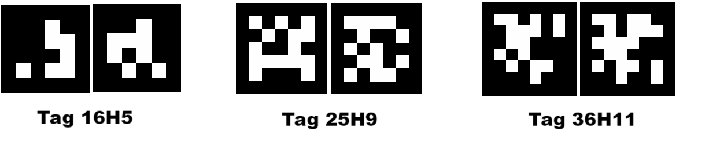

# 4.3 Label Recognition

## 4.3.1 Algorithm


It determines whether there is an Apriltag label in the image, here including only three encoding forms of labels: 16H5, 25H9, and 36H11. When the algorithm is running, we need to select a format first (36H11 by default). Different Apriltag labels cannot be detected simultaneously, but up to 25 tags with the same encoding label can be recognized at the same time.

<span style="color:red;font-size:20px">Note: This algorithm cannot operate simultaneously with other algorithms marked with a \*.</span>

----------

## 4.3.2 Classification Label



The Apriltag label is a set of predefined black and white square patterns. The number of squares used varies depending on the encoding form. Each pattern has a predefined tag label value that will be returned after recognition.


--------------------

## 4.3.3 Configuration Parameters

Users can set the encoding format of label. If no new parameters are specified, it will run in the default format 36H11. The parameter definitions are as follows:

|          Mode          | Tag label |
| :--------------------: | :-------: |
| kVisionModeFamily16H5  | Tag 16H5  |
| kVisionModeFamily25H9  | Tag 25H9  |
| kVisionModeFamily36H11 | Tag 36H11 |

Code:

```python
# Select the encoding format. The default is 36H11. If you need to switch the encoding format during the program's operation, please first turn off the Apriltag algorithm, set the encoding format, and then enable the new algorithm
#sengo2.VisionSetMode(sengo2_vision_e.kVisionAprilTag, apriltag_vision_mode_e.kVisionModeFamily36H11)
#sengo2.VisionSetMode(sengo2_vision_e.kVisionAprilTag, apriltag_vision_mode_e.kVisionModeFamily25H9)
sengo2.VisionSetMode(sengo2_vision_e.kVisionAprilTag, apriltag_vision_mode_e.kVisionModeFamily16H5)
```

---------------

## 4.3.4 Returned Values


When the main controller detects a label, the algorithm will return its coordinates, size and label number.

When the register is read through the main controller, the following data will be returned:

|  Parameter   |         Definition         |
| :----------: | :------------------------: |
|   kXValue    | label central coordinate x |
|   kYValue    | label central coordinate y |
| kWidthValue  |       label width w        |
| kHeightValue |       label height h       |
|    kLabel    |          label ID          |

Code:

```python
        for i in range(1,obj_num+1):
            x = sengo2.GetValue(sengo2_vision_e.kVisionAprilTag, sentry_obj_info_e.kXValue, i)
            y = sengo2.GetValue(sengo2_vision_e.kVisionAprilTag, sentry_obj_info_e.kYValue, i)
            w = sengo2.GetValue(sengo2_vision_e.kVisionAprilTag, sentry_obj_info_e.kWidthValue, i)
            h = sengo2.GetValue(sengo2_vision_e.kVisionAprilTag, sentry_obj_info_e.kHeightValue, i)
            l = sengo2.GetValue(sengo2_vision_e.kVisionAprilTag, sentry_obj_info_e.kLabel, i)
            print("tag#%d: x=%d, y=%d, w=%d, h=%d, label=%d"%(i, x, y, w, h, l))
```

----------

## 4.3.5 Tips of Label Recognition Algorithm

1. The width and height values of the labels returned by the algorithm are relatively stable, so it is used to calculate distance. Rotation does not affect the size of the label, but tilting does.
2. The larger the label is, the farther the recognition distance will be.

## 4.3.6 Test Code

```python
from machine import I2C,UART,Pin
from Sengo2 import *
import time

# Wait for Sengo2 to complete the initialization of the operating system. This waiting time cannot be removed to prevent the situation where the controller has already developed and sent instructions before Sengo2 has been fully initialized
time.sleep(2)

# Choose UART or I2C communication mode. Sengo2 is I2C mode by default. You can switch between the two by short pressing the mode button.
# Four UART communication modes: UART9600 (Standard Protocol Instruction), UART57600 (Standard Protocol Instruction), UART115200 (Standard Protocol Instruction), Simple9600 (Simple Protocol Instruction)
#########################################################################################################
# port = UART(2,rx=Pin(16),tx=Pin(17),baudrate=9600)
port = I2C(0,scl=Pin(21),sda=Pin(20),freq=400000)

# The communication address of Sengo2 is 0x60. If multiple devices are connected to the I2C bus, please avoid address conflicts.
sengo2 = Sengo2(0x60)
 
err = sengo2.begin(port)
print("sengo2.begin: 0x%x"% err)

# Select the encoding format. The default is 36H11. 
# If you need to switch the encoding format during the program's operation, please first turn off the Apriltag algorithm, set the encoding format, and then enable the new algorithm
#sengo2.VisionSetMode(sengo2_vision_e.kVisionAprilTag, apriltag_vision_mode_e.kVisionModeFamily36H11)
#sengo2.VisionSetMode(sengo2_vision_e.kVisionAprilTag, apriltag_vision_mode_e.kVisionModeFamily25H9)
sengo2.VisionSetMode(sengo2_vision_e.kVisionAprilTag, apriltag_vision_mode_e.kVisionModeFamily16H5)
time.sleep(1)
 
# 1. Pay attention that Apriltag is not QR code. When in use, we should remain a blank space around them.
# 2. sengo2 can run multiple algorithms simultaneously, but there are certain restrictions.
# 3. Parameter and result numbers of the Sengo series products all start from 1.
# 4. During normal use, the main controller sends commands to control the on and off of Sengo2 algorithm, rather than manual operation by joystick.
err = sengo2.VisionBegin(sengo2_vision_e.kVisionAprilTag)
print("sengo2.VisionBegin(sengo2_vision_e.kVisionAprilTag):0x%x"% err)

while True:
# Sengo2 does not actively return the detection and recognition results; it requires the main control board to send instructions for reading.
# The reading process: 1.read the number of recognition results. 2.After receiving the instruction, Sengo2 will refresh the result data. 3.If the number of results is not zero, the board will then send instructions to read the relevant information. 
# (Please be sure to build the program according to this process.)
    obj_num = sengo2.GetValue(sengo2_vision_e.kVisionAprilTag, sentry_obj_info_e.kStatus)
    
    if obj_num:
        print("Totally %d tags: "%( obj_num ))
        for i in range(1,obj_num+1):
            #Get the coordinate and size
            x = sengo2.GetValue(sengo2_vision_e.kVisionAprilTag, sentry_obj_info_e.kXValue, i)
            y = sengo2.GetValue(sengo2_vision_e.kVisionAprilTag, sentry_obj_info_e.kYValue, i)
            w = sengo2.GetValue(sengo2_vision_e.kVisionAprilTag, sentry_obj_info_e.kWidthValue, i)
            h = sengo2.GetValue(sengo2_vision_e.kVisionAprilTag, sentry_obj_info_e.kHeightValue, i)
            #Obtain the tag ID
            l = sengo2.GetValue(sengo2_vision_e.kVisionAprilTag, sentry_obj_info_e.kLabel, i)
            print("tag#%d: x=%d, y=%d, w=%d, h=%d, label=%d"%(i, x, y, w, h, l))
            time.sleep(0.2)
        print("\n")
```

-----------

## 4.3.7 Test Result

After uploading the code, the module will detect the area captured by the camera. If there are 16H5 tags, they will be recognized. Then, the coordinate x and y, width, height and the label value will be displayed on the serial monitor.


## 4.3.8 Extension Gameplay

**Label instruction card**

- **Game rule:** Match the labels from 0 to 4 to an action, such as a 90-degree rotation of the servo or car moving forward, etc.
- **Practice:** The development board reads the ID sequence of the labels and performs the corresponding operation according to the sequence.