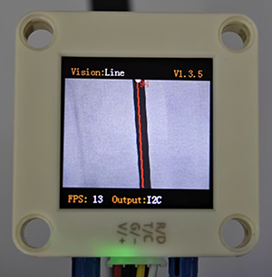
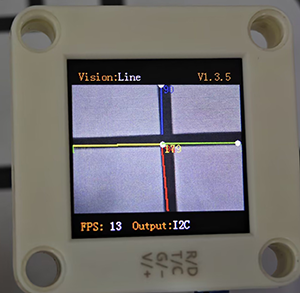
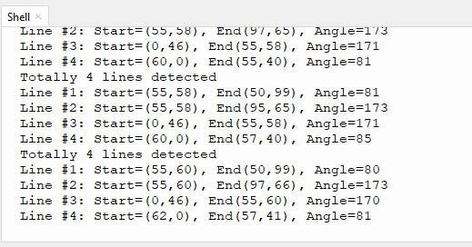

# 4.4 Line Detection

## 4.4.1 Algorithm



It will determine whether there are line segments in the image. If there are, it will return the coordinates of the two endpoints of the line segment and the inclination angle. If the line is a curve, it will return the inclination angle of the straight line formed by the connection of the starting and the ending point of the curve.

-----------

## 4.4.2 Configuration Parameters

Users can set the maximum of detections (1-5). If no new parameters are specified, the default detection will be 1 item. The parameter definitions are as follows:

| Parameter |                   Definition                   |
| :-------: | :--------------------------------------------: |
|     1     |         1 line segment can be detected         |
|     2     | 2 line segments can be detected simultaneously |
|     3     | 3 line segments can be detected simultaneously |
|     4     | 4 line segments can be detected simultaneously |
|     5     | 5 line segments can be detected simultaneously |

<span style="color:red;">Note: The first line on the display is red, the second is yellow, the third is green, the fourth is blue, and the fifth is purple.</span>

Code:

```python
# Set the number of detection lines. The algorithm is set to 1 by default and can detect up to 5 items at most
sengo2.VisionSetMode(sengo2_vision_e.kVisionLine,1)
```

---------------

## 4.4.3 Returned Values

When the controller acquires the recognition result, the algorithm will return the followings:

|  Parameters  |                          Definition                          |
| :----------: | :----------------------------------------------------------: |
|   kXValue    | x-coordinate of the end point (distal end) of the line segment |
|   kYValue    | y-coordinate of the end point (distal end) of the line segment |
| kWidthValue  | x-coordinate of the starting point (proximal end) of the line segment |
| kHeightValue | y-coordinate of the starting point (proximal end) of the line segment |
|    kLabel    |            inclination angle of the line segment             |

<span style="color:red;font-size:20px;">Note: The inclination angle increases counterclockwise. When it is horizontally tilted to the right, the angle is 0°; when it is vertically tilted upwards, it is 90°; and when it is horizontally tilted to the left, it is 180°. The algorithm does not detect the angle downward.</span>

Code:

```python
        for i in range(1,obj_num+1):
           #Obtain the line angle (0-180 degrees)
           angle = sengo2.GetValue(sengo2_vision_e.kVisionLine,sentry_obj_info_e.kLabel,i)
           #Obtain the coordinates of the line endpoints
           x1 = sengo2.GetValue(sengo2_vision_e.kVisionLine,sentry_obj_info_e.kXValue,i)
           y1 = sengo2.GetValue(sengo2_vision_e.kVisionLine,sentry_obj_info_e.kYValue,i)
           x2 = sengo2.GetValue(sengo2_vision_e.kVisionLine,sentry_obj_info_e.kWidthValue,i)
           y2 = sengo2.GetValue(sengo2_vision_e.kVisionLine,sentry_obj_info_e.kHeightValue,i)
           print("Line #%d: Start=(%d,%d), End(%d,%d), Angle=%d"%(i,x1,y1,x2,y2,angle))
```

---------------

## 4.4.4 Tips of Line Detection Algorithm

1. Do not use glossy maps to avoid reflect light which may lead to detection failure.
2. The line boundaries should be clear and with obvious color differences from background, such as a white background with black lines;
3. The background should be as simple as possible, for example, containing a single color. If it is messy, lines of the background may be detected.
4. The thickness of the lines should be moderate. Both being too thin and too wide will affect the detection.
5. When traversing, the first line segment is always the one first detected at the bottom of the screen.

--------------

## 4.4.5 Test Code

```python
from machine import I2C,UART,Pin
from  Sengo2  import *
import time

# Wait for Sengo2 to complete the initialization of the operating system. This waiting time cannot be removed to prevent the situation where the controller has already developed and sent instructions before Sengo2 has been fully initialized
time.sleep(2)

# Choose UART or I2C communication mode. Sengo2 is I2C mode by default. You can switch between the two by short pressing the mode button.
# Four UART communication modes: UART9600 (Standard Protocol Instruction), UART57600 (Standard Protocol Instruction), UART115200 (Standard Protocol Instruction), Simple9600 (Simple Protocol Instruction)
#########################################################################################################
# port = UART(2,rx=Pin(16),tx=Pin(17),baudrate=9600)
port = I2C(0,scl=Pin(21),sda=Pin(20),freq=400000)

# The communication address of Sengo2 is 0x60. If multiple devices are connected to the I2C bus, please avoid address conflicts.
sengo2 = Sengo2(0x60)

err = sengo2.begin(port)
print("sengo2.begin: 0x%x"% err)

# Set the number of detection lines. The algorithm is set to 1 by default and can detect up to 5 items at most
sengo2.VisionSetMode(sengo2_vision_e.kVisionLine,4)
 
# 1. Algorithm documentation
# 2. Please keep the default settings: Only detect one line segment
# 3. During normal use, the main controller sends commands to control the on and off of Sengo2 algorithm, rather than manual operation by joystick.
# 4. Under specific restrictive conditions, Sengo2 can run multiple recognition algorithms in parallel
err = sengo2.VisionBegin(sengo2_vision_e.kVisionLine)
print("sengo2.VisionBegin(sengo2_vision_e.kVisionLine):0x%x"% err)
        
while True:
# Sengo2 does not actively return the detection and recognition results; it requires the main control board to send instructions for reading.
# The reading process: 1.read the number of recognition results. 2.After receiving the instruction, Sengo2 will refresh the result data. 3.If the number of results is not zero, the board will then send instructions to read the relevant information. 
# (Please be sure to build the program according to this process.)
    obj_num = sengo2.GetValue(sengo2_vision_e.kVisionLine, sentry_obj_info_e.kStatus)
    
    if obj_num:
        print(f"Totally {obj_num} lines detected")
        for i in range(1,obj_num+1):
           #Obtain the line angle (0-180 degrees)
           angle = sengo2.GetValue(sengo2_vision_e.kVisionLine,sentry_obj_info_e.kLabel,i)
           #Obtain the coordinates of the line endpoints
           x1 = sengo2.GetValue(sengo2_vision_e.kVisionLine,sentry_obj_info_e.kXValue,i)
           y1 = sengo2.GetValue(sengo2_vision_e.kVisionLine,sentry_obj_info_e.kYValue,i)
           x2 = sengo2.GetValue(sengo2_vision_e.kVisionLine,sentry_obj_info_e.kWidthValue,i)
           y2 = sengo2.GetValue(sengo2_vision_e.kVisionLine,sentry_obj_info_e.kHeightValue,i)
           print("Line #%d: Start=(%d,%d), End(%d,%d), Angle=%d"%(i,x1,y1,x2,y2,angle))
        time.sleep(0.2)
        
```

--------------------

## 4.4.6 Test Result

After uploading the code, the module will detect the area captured by the camera. If there are lines, they will be recognized and the starting and ending coordinates of lines as well as their angles will be printed in the serial monitor (the angle determination is 90 degrees for vertical lines and 180 degrees for horizontal lines).





## 4.4.7 Extension Gameplay

**Distinguish triangles and rectangles**

- **Game rule:** Print triangles and rectangles onto an A4 paper with thick lines. Then, enable line detection function to detect them. If three lines are detected, it is a triangle; if four lines are detected, it is a rectangle.
- **Practice:** The development board reads and counts the number of recognized lines. If the number of lines is 3, it is a triangle; if it is 4, it is a rectangle.