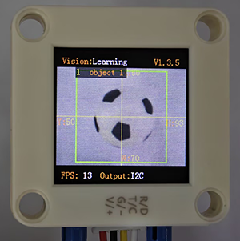
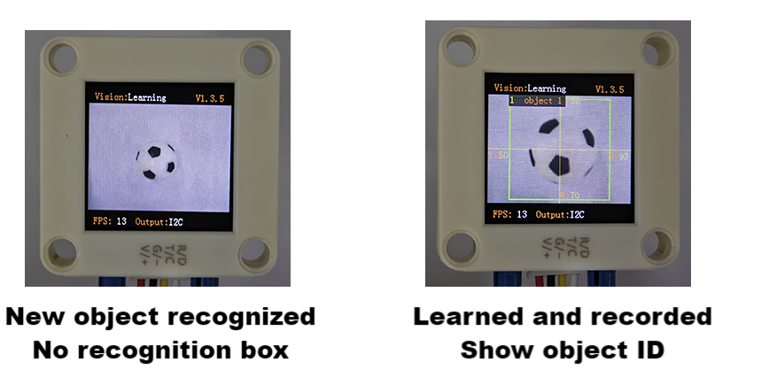
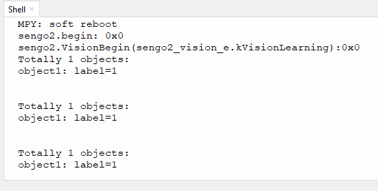

# 4.5 Deep Learning

## 4.5.1 Algorithm



It can perform offline learning, storage and recognition on any object, and store up to 15 objects. The stored objects can be deleted either entirely or individually. This algorithm only classifies objects and is unable to detect their position and size.

-------------------------

## 4.5.2 Classification Label

| Label value | Definition |
| :---------: | :--------: |
|    1-15     | Object ID  |

----------

## 4.5.3 Save Data

After enabling the deep learning algorithm, point the camera directly at the target object, press the function button for about 5 seconds and then release it. Sengo2 will start learning, and the data of this object will be stored and assigned an ID number (Note: up to 15 can be stored). 

The smallest number among the currently available numbers will be assigned to the label value. If there are no vacant numbers, Sengo2 will prompt a storage failure.



---------

## 4.5.4 Delete Data

After learning, press the function button for about 10 seconds and then release it to delete the data just stored. Press it again for 10 seconds, and all the stored data will be cleared. If no deep learning has been done after enabling the algorithm, all storage will be directly cleared when you press the function button for 10 seconds.

-------

## 4.5.5 Returned Values

When the controller acquires the recognition result, the algorithm will return the followings:

|  Parameter   | Definition  |
| :----------: | :---------: |
|   kXValue    | fixed value |
|   kYValue    | fixed value |
| kWidthValue  | fixed value |
| kHeightValue | fixed value |
|    kLabel    |  object ID  |

Code:

```python
 for i in range(1,obj_num+1):
            #The x, y, w, h values returned by the deep learning algorithm are fixed so do not require reading processing.
            l = sengo2.GetValue(sengo2_vision_e.kVisionLearning, sentry_obj_info_e.kLabel, i)
            print("object%d: label=%d"%(i,l))
```

-------

## 4.5.6 Tips of Deep Learning Algorithm

1. For some applications with the need to identify the same object over a long distance or at a fixed position but from different angles (for example, the card is rotated by 90° or 180°), it need to learn the object at different distances/angles and store them as ID1, ID2, etc. During working, if the returned label value is one of above, it determines that they are the same object.
2. If there are differences in the background (including light conditions) between learning and recognizing, the result may be affected.

## 4.5.7 Test Code

```python
from machine import I2C,UART,Pin
from  Sengo2  import *
import time

# Wait for Sengo2 to complete the initialization of the operating system. This waiting time cannot be removed to prevent the situation where the controller has already developed and sent instructions before Sengo2 has been fully initialized
time.sleep(2)

# Choose UART or I2C communication mode. Sengo2 is I2C mode by default. You can switch between the two by short pressing the mode button.
# Four UART communication modes: UART9600 (Standard Protocol Instruction), UART57600 (Standard Protocol Instruction), UART115200 (Standard Protocol Instruction), Simple9600 (Simple Protocol Instruction)
#########################################################################################################
# port = UART(2,rx=Pin(16),tx=Pin(17),baudrate=9600)
port = I2C(0,scl=Pin(21),sda=Pin(20),freq=400000)

# The communication address of Sengo2 is 0x60. If multiple devices are connected to the I2C bus, please avoid address conflicts.
sengo2 = Sengo2(0x60)

err = sengo2.begin(port)
print("sengo2.begin: 0x%x"% err)
 
# 1. sengo2 can learn 15 objects;
# 2. For better recognition results, the learning scenarios (including but not limited to background, lighting, angle, etc.) should be consistent with or relatively similar to the actual usage ones.
# 3. If it is necessary to detect an object from multiple angles within a large range, the object needs to be learned from different angles at different distances, and they will be stored as ID1...IDn respectively. When in use, the output label value only needs to be one of the above IDs.
err = sengo2.VisionBegin(sengo2_vision_e.kVisionLearning)
print("sengo2.VisionBegin(sengo2_vision_e.kVisionLearning):0x%x"% err)


while True:
# Sengo2 does not actively return the detection and recognition results; it requires the main control board to send instructions for reading.
# The reading process: 1.read the number of recognition results. 2.After receiving the instruction, Sengo2 will refresh the result data. 3.If the number of results is not zero, the board will then send instructions to read the relevant information. 
# (Please be sure to build the program according to this process.)
    obj_num = sengo2.GetValue(sengo2_vision_e.kVisionLearning, sentry_obj_info_e.kStatus)
    if obj_num:
        print("Totally %d objects: "%obj_num)
        for i in range(1,obj_num+1):
            #The x, y, w, h values returned by the deep learning algorithm are fixed so do not require reading processing.
            l = sengo2.GetValue(sengo2_vision_e.kVisionLearning, sentry_obj_info_e.kLabel, i)
            print("object%d: label=%d"%(i,l))
            time.sleep(0.2)
            print("\n")

```

----------

## 4.5.8 Test Result

After uploading the code, press and hold the function button at the back of the AI vision module for 5 seconds, and then aim the camera at the object to be recognized in a white background. After completing deep learning, it can recognize objects.




## 4.5.9 Extension Gameplay

**Exclusive gesture recognizer** (high challenge)

- **Game rule:** Instead of recognizing regular objects, train it to recognize several of your custom gestures (such as “thumbs up”, “OK”, “palm”). Recognize different gestures to control light, play music, etc.

- **Practice:** In a clean background (white is recommended), recognize gestures. Each gesture needs to be recognized three times to improve accuracy. In the code, the IDs of the three identical gestures are placed and judged by logic. As long as one of them is satisfied the requirement, the corresponding function will be executed.

- **Possible difficulty:** This places high demands on the background, ambient lighting and gesture position during recognizing.