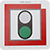

# 4.6 Card Recognition

## 4.6.1 Algorithm


It can identify whether there are corresponding traffic cards in the image. If yes, it will return information including the coordinates, size, and label values of the cards.

--------

## 4.6.2 Classification Label

| Label | Definition  |           Pic           |
| :---: | :---------: | :---------------------: |
|   1   | go forward  |  |
|   2   |  turn left  |  |
|   3   | turn right  |  |
|   4   | turn around |  |
|   5   |    stop     |  |
|   6   | green light |  |
|   7   |  red light  |  |
|   8   |  speed 40   |  |
|   9   |  speed 60   |  |
|  10   |  speed 80   |  |

Note: The algorithm can recognize multiple cards simultaneously. The card can still be recognized within a certain rotation, deflection and pitch angle. When using, please make the card face the camera as directly as possible for better recognition effect.

----------------------

## 4.6.3 Returned Values

When the controller acquires the recognition result, the algorithm will return the followings:

|  Parameter   |        Definition         |
| :----------: | :-----------------------: |
|   kXValue    | Card central coordinate x |
|   kYValue    | Card central coordinate y |
| kWidthValue  |       Card width w        |
| kHeightValue |       Card height h       |
|    kLabel    |     Card label value      |

Code:

```python
for i in range(1,obj_num+1):
            # Obtain the coordinate and size of the card
            x = sengo2.GetValue(sengo2_vision_e.kVisionCard, sentry_obj_info_e.kXValue, i)
            y = sengo2.GetValue(sengo2_vision_e.kVisionCard, sentry_obj_info_e.kYValue, i)
            w = sengo2.GetValue(sengo2_vision_e.kVisionCard, sentry_obj_info_e.kWidthValue, i)
            h = sengo2.GetValue(sengo2_vision_e.kVisionCard, sentry_obj_info_e.kHeightValue, i)
            # Card label value
            cardType = sengo2.GetValue(sengo2_vision_e.kVisionCard,sentry_obj_info_e.kLabel,i)      
            print("Card%d: x=%d, y=%d, w=%d, h=%d, Type=%s"%(i,x, y, w, h,cardName[cardType]))
```

------------

## 4.6.4 Test Code

```python
from machine import I2C,UART,Pin
from Sengo2 import *
import time

# Wait for Sengo2 to complete the initialization of the operating system. This waiting time cannot be removed to prevent the situation where the controller has already developed and sent instructions before Sengo2 has been fully initialized
time.sleep(2)

# Choose UART or I2C communication mode. Sengo2 is I2C mode by default. You can switch between the two by short pressing the mode button.
# Four UART communication modes: UART9600 (Standard Protocol Instruction), UART57600 (Standard Protocol Instruction), UART115200 (Standard Protocol Instruction), Simple9600 (Simple Protocol Instruction)
#########################################################################################################
# port = UART(2,rx=Pin(16),tx=Pin(17),baudrate=9600)
port = I2C(0,scl=Pin(21),sda=Pin(20 ),freq=400000)

# The communication address of Sengo2 is 0x60. If multiple devices are connected to the I2C bus, please avoid address conflicts.
sengo2 = Sengo2(0x60)

err = sengo2.begin(port)
print("sengo2.begin: 0x%x"% err)
 
# 1. Sengo2 can recognize 10 traffic cards.
# 2. If you need to recognize custom cards, first try to integrate the deep learning algorithm; If fialed, you may get a Sentry2, burn Sentry2MV firmware, collect images by yourself to train the model, and then write a python script to call the model.
# 3. Sengo2 can simultaneously recognize 8 cards (2 rows x 4 columns). Generally, the results are output in the order from top to bottom and from left to right.
# 4. During normal use, the main controller sends commands to control the on and off of Sengo2 algorithm, rather than manual operation by joystick.
# 5. Under specific restrictive conditions, Sengo2 can run multiple recognition algorithms in parallel
err = sengo2.VisionBegin(sengo2_vision_e.kVisionCard)
print("sengo2.VisionBegin(sengo2_vision_e.kVisionCard):0x%x"% err)

# The card names, from 1 to 10, all correspond to the card label values
cardName = ["unknown","Forward","Left","Right","TurnAround","Park","GreenLight","RedLight","Speed-40","Speed-60","Speed-80"]

while True:
# Sengo2 does not actively return the detection and recognition results; it requires the main control board to send instructions for reading.
# The reading process: 1.read the number of recognition results. 2.After receiving the instruction, Sengo2 will refresh the result data. 3.If the number of results is not zero, the board will then send instructions to read the relevant information. 
# (Please be sure to build the program according to this process.)
    obj_num = (sengo2.GetValue(sengo2_vision_e.kVisionCard, sentry_obj_info_e.kStatus))
    if obj_num:
        print("Totally %d cards: "%obj_num)
        for i in range(1,obj_num+1):
            # Obtain the coordinate and size of the card
            x = sengo2.GetValue(sengo2_vision_e.kVisionCard, sentry_obj_info_e.kXValue, i)
            y = sengo2.GetValue(sengo2_vision_e.kVisionCard, sentry_obj_info_e.kYValue, i)
            w = sengo2.GetValue(sengo2_vision_e.kVisionCard, sentry_obj_info_e.kWidthValue, i)
            h = sengo2.GetValue(sengo2_vision_e.kVisionCard, sentry_obj_info_e.kHeightValue, i)
            # Card label value
            cardType = sengo2.GetValue(sengo2_vision_e.kVisionCard,sentry_obj_info_e.kLabel,i)      
            print("Card%d: x=%d, y=%d, w=%d, h=%d, Type=%s"%(i,x, y, w, h,cardName[cardType]))
            time.sleep(0.2)    

```

## 4.6.5 Test Result

After uploading the code, the AI vision module will scan the area captured by the camera. If there is a card, it will recognize the card and print its type (forward, turn around, turn left, turn right, etc.) in the serial monitor. 


## 4.6.6 Extension Gameplay

**Color picker**

- **Game rule:** Rotate the card (to the right/left) to change WS2812 light colors. For example, the normal sequence of lights is: red > green > blue > yellow > purple, etc., yet we can adjust them by turning the card. Suppose the current color is red, and we rotate the card to the right to change it to green; rotate to the left to make it purple; in a loop.
- **Practice:** After identifying the card, control the light by performing addition or subtraction on a variable.
