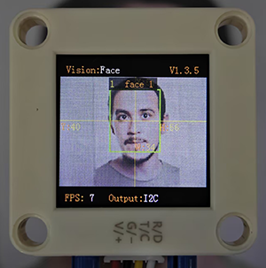

# 4.7 Face Recognition

## 4.7.1 Algorithm



It detects and recognizes human face in the image. Users can train to store or delete facial data by the function button. Sengo2 can store 15 faces at most.

-----------------

## 4.7.2 Classification Label

Sengo2 defines 17 classification labels for human faces:

| Label value |       Meaning       | Label value |                Meaning                 |
| :---------: | :-----------------: | :---------: | :------------------------------------: |
|      0      |      New face       |    1-15     | Classification number for stored faces |
|     200     | Face wearing a mask |             |                                        |

New face (label value 0):


Face wearing a mask (label value 200):


Stored face (label value 1-15):


---------------

## 4.7.3 Save Data

After enabling the face recognition algorithm, point the camera at the face, press the function button for 5 seconds and then release it. Sengo2 will start recording the face, and the current face data will be stored and assigned an ID number.

The smallest number among the currently available numbers will be assigned to the label value. If there are no vacant numbers, Sengo2 will prompt a storage failure.

----------------

## 4.7.4 Delete Data

After storing, press the function button for about 10 seconds and then release it to delete the data just stored. Press it again for 10 seconds, and all the stored faces will be cleared. If no face has been stored after enabling the algorithm, all storage of faces will be directly cleared when you press the function button for 10 seconds.

## 4.7.5 Returned Values

When the controller acquires the recognition result, the algorithm will return the followings:

|  Parameter   |        Definition         |
| :----------: | :-----------------------: |
|   kXValue    | Face central coordinate x |
|   kYValue    | Face central coordinate y |
| kWidthValue  |       Face width w        |
| kHeightValue |       Face height h       |
|    kLabel    |     Face label value      |

Code:

```python
for i in range(1,obj_num+1):
            print("person%d: "%i, end='')
            # Face recognition is only conducted when the height of the face is no less than 50, avoiding misidentification due to excessive distance
            h = sengo2.GetValue(sengo2_vision_e.kVisionFace, sentry_obj_info_e.kHeightValue, i)            
            if h >= 50:
                #Face label =0: stranger; Face label within 1-15: faces that have been memorized; Face label =200: face wearing a mask;
                l = sengo2.GetValue(sengo2_vision_e.kVisionFace, sentry_obj_info_e.kLabel, i)
                if l == 0:
                    print("stranger, ", end='')
                elif l == 200:
                    print("masked  , ", end='')
                else:
                    print("id=%d   , "%l, end='')

            x = sengo2.GetValue(sengo2_vision_e.kVisionFace, sentry_obj_info_e.kXValue, i)
            y = sengo2.GetValue(sengo2_vision_e.kVisionFace, sentry_obj_info_e.kYValue, i)
            w = sengo2.GetValue(sengo2_vision_e.kVisionFace, sentry_obj_info_e.kWidthValue, i)
            print("x=%d, y=%d, w=%d, h=%d"%(x, y, w, h))
```

---------------

## 4.7.6 Tips of Face Recognition Algorithm

1. When the ambient light is sufficient, the complete face is directly facing the camera and occupies a large field of view, the module can recognize it much better.
2. When wearing glasses or covered by hair, the human face may not be detected completely.

----------------

## 4.7.7 Test Code

```python
from machine import I2C,UART,Pin
from  Sengo2  import *
import time

# Wait for Sengo2 to complete the initialization of the operating system. This waiting time cannot be removed to prevent the situation where the controller has already developed and sent instructions before Sengo2 has been fully initialized
time.sleep(2)

# Choose UART or I2C communication mode. Sengo2 is I2C mode by default. You can switch between the two by short pressing the mode button.
# Four UART communication modes: UART9600 (Standard Protocol Instruction), UART57600 (Standard Protocol Instruction), UART115200 (Standard Protocol Instruction), Simple9600 (Simple Protocol Instruction)
#########################################################################################################
# port = UART(2,rx=Pin(16),tx=Pin(17),baudrate=9600)
port = I2C(0,scl=Pin(21),sda=Pin(20),freq=400000)

# The communication address of Sengo2 is 0x60. If multiple devices are connected to the I2C bus, please avoid address conflicts.
sengo2 = Sengo2(0x60)

err = sengo2.begin(port)
print("sengo2.begin: 0x%x"% err)
 
# 1. Sengo2 can recognize 15 faces.
# 2. It can remember or delete facial data by the joystick or through serial port instructions.
# 3. During normal use, the main controller sends commands to control the on and off of Sengo2 algorithm, rather than manual operation by joystick.
err = sengo2.VisionBegin(sengo2_vision_e.kVisionFace)
print("sengo2.VisionBegin(sengo2_vision_e.kVisionFace):0x%x"% err)


while True:
# Sengo2 does not actively return the detection and recognition results; it requires the main control board to send instructions for reading.
# The reading process: 1.read the number of recognition results. 2.After receiving the instruction, Sengo2 will refresh the result data. 3.If the number of results is not zero, the board will then send instructions to read the relevant information. 
# (Please be sure to build the program according to this process.)
    obj_num = sengo2.GetValue(sengo2_vision_e.kVisionFace, sentry_obj_info_e.kStatus)
    if obj_num:
        print("Totally %d persons: "%obj_num)
        for i in range(1,obj_num+1):
            print("person%d: "%i, end='')
            # Face recognition is only conducted when the height of the face is no less than 50, avoiding misidentification due to excessive distance
            h = sengo2.GetValue(sengo2_vision_e.kVisionFace, sentry_obj_info_e.kHeightValue, i)            
            if h >= 50:
            #Face label =0: stranger; Face label within 1-15: faces that have been memorized; Face label =200: face wearing a mask;
                l = sengo2.GetValue(sengo2_vision_e.kVisionFace, sentry_obj_info_e.kLabel, i)
                if l == 0:
                    print("stranger, ", end='')
                elif l == 200:
                    print("masked  , ", end='')
                else:
                    print("id=%d   , "%l, end='')

            x = sengo2.GetValue(sengo2_vision_e.kVisionFace, sentry_obj_info_e.kXValue, i)
            y = sengo2.GetValue(sengo2_vision_e.kVisionFace, sentry_obj_info_e.kYValue, i)
            w = sengo2.GetValue(sengo2_vision_e.kVisionFace, sentry_obj_info_e.kWidthValue, i)
            print("x=%d, y=%d, w=%d, h=%d"%(x, y, w, h))
            time.sleep(0.2)
        print("\n")

```

--------------------

## 4.7.8 Test Result

After uploading the code, press and hold the function button for 5 seconds, and then the module will starts to learn and record the face on the screen. Wait for a while until the recording is completed. When encountering new faces or faces wearing masks, prompts will also be given on it.


## 4.7.9 Extension Gameplay

**Concentration monitor**

- **Game rule:** When studying, the camera is pointed at you. If it detects that your face has left the its field of view (when you turn your head to do something else), it will emit a friendly prompt sound “beep beep”.
- **Practice:** Program to continuously detect human faces. If no face is detected in several consecutive frames, it sounds a reminder audio from the connected voice module.