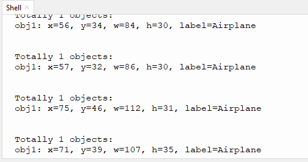

# 4.8 20 Types of Object Recognition

## 4.8.1 Algorithm

It can identify 20 common types of objects and return their coordinates and labels after recognition.

## 4.8.2 Classification Label

| Label |     name     | Label |     name     |
| :---: | :----------: | :---: | :----------: |
|   1   |   Airplane   |   2   |   Bicycle    |
|   3   |     Bird     |   4   |     Boat     |
|   5   |    Bottle    |   6   |     Bus      |
|   7   |     Car      |   8   |     Cat      |
|   9   |    Chair     |  10   |     Cow      |
|  11   | Dining Table |  12   |     Dog      |
|  13   |    Horse     |  14   |  Motorbike   |
|  15   |    Person    |  16   | Potted Plant |
|  17   |    Sheep     |  18   |     Sofa     |
|  19   |    Train     |  20   |  Tv monitor  |

We have provided 20 types of object images in the Resources folder.

---------------

## 4.8.3 Returned Values

When the controller acquires the recognition result, the algorithm will return the followings:

|  Parameter   |         Definition          |
| :----------: | :-------------------------: |
|   kXValue    | Object central coordinate x |
|   kYValue    | Object central coordinate y |
| kWidthValue  |       Object width w        |
| kHeightValue |       Object height h       |
|    kLabel    |     Object label value      |

Code:

```python
for i in range(1,obj_num+1):
            l = sengo2.GetValue(sengo2_vision_e.kVision20Classes,sentry_obj_info_e.kLabel,i)
            x = sengo2.GetValue(sengo2_vision_e.kVision20Classes, sentry_obj_info_e.kXValue, i)
            y = sengo2.GetValue(sengo2_vision_e.kVision20Classes, sentry_obj_info_e.kYValue, i)
            w = sengo2.GetValue(sengo2_vision_e.kVision20Classes, sentry_obj_info_e.kWidthValue, i)
            h = sengo2.GetValue(sengo2_vision_e.kVision20Classes, sentry_obj_info_e.kHeightValue, i)
            print("obj%d: x=%d, y=%d, w=%d, h=%d, label=%s"%(i,x, y, w, h,classes20Name[l]))
```

----------

## 4.8.4 Tips of Object Recognition Algorithm

1. The clarity of the image may affect the recognition. If the image is too small, the camera cannot focus on it, resulting in a blurry image and a poor recognition. At this time, a larger pattern should be used instead.
2. If you want to recognize patterns on a screen, please adjust its brightness appropriately to avoid overexposure.

-------

## 4.8.5 Test Code

```python
from machine import I2C,UART,Pin
from Sengo2 import *
import time

# Wait for Sengo2 to complete the initialization of the operating system. This waiting time cannot be removed to prevent the situation where the controller has already developed and sent instructions before Sengo2 has been fully initialized
time.sleep(2)

# Choose UART or I2C communication mode. Sengo2 is I2C mode by default. You can switch between the two by short pressing the mode button.
# Four UART communication modes: UART9600 (Standard Protocol Instruction), UART57600 (Standard Protocol Instruction), UART115200 (Standard Protocol Instruction), Simple9600 (Simple Protocol Instruction)
#########################################################################################################
# port = UART(2,rx=Pin(16),tx=Pin(17),baudrate=9600)
port = I2C(0,scl=Pin(21),sda=Pin(20),freq=400000)

# The communication address of Sengo2 is 0x60. If multiple devices are connected to the I2C bus, please avoid address conflicts.
sengo2 = Sengo2(0x60)
 
err = sengo2.begin(port)
print("sengo2.begin: 0x%x"% err)
 
# 1: Sengo2 can run multiple algorithms simultaneously, but there are certain restrictions.
# 2. The parameter and result numbers of the sengo/sentry series products all start from 1.
# 3. During normal use, the main controller sends commands to control the on and off of Sengo2 algorithm, rather than manual operation by joystick.
err = sengo2.VisionBegin(sengo2_vision_e.kVision20Classes)
print("sengo2.VisionBegin(sengo2_vision_e.kVision20Classes):0x%x"% err)

#20classes object names
classes20Name = ["unknown",			"Airplane", 		"Bicycle",  	"Bird",			"Boat",
                 "Bottle",			"Bus",				"Car",			"Cat",			"Chair",
                 "Cow",				"Dining Table",		"Dog",			"Horse",    	"Motorbike",
                 "Person",			"Potted Plant",		"Sheep",		"Sofa",			"Train",
                 "TV Monitor"]

while True:
# Sengo2 does not actively return the detection and recognition results; it requires the main control board to send instructions for reading.
# The reading process: 1.read the number of recognition results. 2.After receiving the instruction, Sengo2 will refresh the result data. 3.If the number of results is not zero, the board will then send instructions to read the relevant information. 
# (Please be sure to build the program according to this process.)
    obj_num = (sengo2.GetValue(sengo2_vision_e.kVision20Classes, sentry_obj_info_e.kStatus))
    if obj_num:
        print("Totally %d objects: "%( obj_num ))
        for i in range(1,obj_num+1):
            l = sengo2.GetValue(sengo2_vision_e.kVision20Classes,sentry_obj_info_e.kLabel,i)
            x = sengo2.GetValue(sengo2_vision_e.kVision20Classes, sentry_obj_info_e.kXValue, i)
            y = sengo2.GetValue(sengo2_vision_e.kVision20Classes, sentry_obj_info_e.kYValue, i)
            w = sengo2.GetValue(sengo2_vision_e.kVision20Classes, sentry_obj_info_e.kWidthValue, i)
            h = sengo2.GetValue(sengo2_vision_e.kVision20Classes, sentry_obj_info_e.kHeightValue, i)
            print("obj%d: x=%d, y=%d, w=%d, h=%d, label=%s"%(i,x, y, w, h,classes20Name[l]))
            time.sleep(0.2)
            print("\n")
        time.sleep(0.5);
       
```

-----------

## 4.8.6 Test Result

After uploading the code, the AI vision module will detect the area captured by the camera. If any of the 20 types of objects is recognized, the name of the object will be shown on the serial monitor.

Attention: If there is an error in the AI module, please power off and restart.




## 4.8.7 Extension Gameplay

**Children intelligent cognitive card**

- **Game rule:** Let children hold the cards of 20 types of objects in front of the camera. The AI module will recognize and read out their names and display them on the screen.
- **Practice:** After identifying cards, the name is sent to the voice module through the serial port, and the name in large font is also displayed on the screen.
- **Possible difficulty:** An audio module needs to be connected.