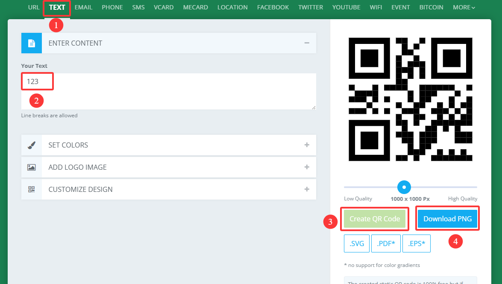

# 4.9 QR Code Recognition

## 4.9.1 Algorithm


It can recognize a simple QR code and return its coordinates, size and text content, but the QR code information should not exceed 25 characters. ASCII code characters can be displayed on the screen. Note that if it is a Chinese QR code, it cannot be displayed, but the recognition result can still be read by the main control.

-------------

## 4.9.2 Returned Values

The algorithm will return the coordinates and sizes of the QR code.

|  Parameter   |          Definition          |
| :----------: | :--------------------------: |
|   kXValue    | QR code central coordinate x |
|   kYValue    | QR code central coordinate y |
| kWidthValue  |       QR code width w        |
| kHeightValue |       QR code height h       |

Code:

```python
    # Sengo2 can only recognize and decode a QR code with no more than 10 characters. So when the returned result is not 0, it is only necessary to obtain and process the relevant data of the first result.
    if obj_num:
        x = sengo2.GetValue(sengo2_vision_e.kVisionQrCode, sentry_obj_info_e.kXValue, 1)
        y = sengo2.GetValue(sengo2_vision_e.kVisionQrCode, sentry_obj_info_e.kYValue, 1)
        w = sengo2.GetValue(sengo2_vision_e.kVisionQrCode, sentry_obj_info_e.kWidthValue, 1)
        h = sengo2.GetValue(sengo2_vision_e.kVisionQrCode, sentry_obj_info_e.kHeightValue, 1)
        value = sengo2.GetQrCodeValue()
        #print((sengo2.GetQrCodeValue()))
        print("x=%d, y=%d, w=%d, h=%d, value=%s"%(x, y, w, h,value))
```

----------

## 4.9.3 Generate a QR Code

We provide 5 paper QR code cards, with the contents of “Red”, “Green”, “Blue”, “White”, “Black” respectively.


If these QR codes do not meet your needs, you can search for “QR code generation for free” in your browser. There will be many links for generating QR codes online. Just find the one you like and use it. Here we also provide a generator:

[Online QR code generator](https://www.qrcode-monkey.com/#text)

After entering the link:

① Select the TEXT format

② Input the text to be generated (no Chinese characters, no more than 25 characters)

③ Click to generate a QR code

④ Download the QR code image



------------

## 4.9.4 Test Code

```python
from machine import I2C,UART,Pin
from  Sengo2  import *
import time

# Wait for Sengo2 to complete the initialization of the operating system. This waiting time cannot be removed to prevent the situation where the controller has already developed and sent instructions before Sengo2 has been fully initialized
time.sleep(2)

# Choose UART or I2C communication mode. Sengo2 is I2C mode by default. You can switch between the two by short pressing the mode button.
# Four UART communication modes: UART9600 (Standard Protocol Instruction), UART57600 (Standard Protocol Instruction), UART115200 (Standard Protocol Instruction), Simple9600 (Simple Protocol Instruction)
#########################################################################################################
# port = UART(2,rx=Pin(16),tx=Pin(17),baudrate=9600)
port = I2C(0,scl=Pin(21),sda=Pin(20),freq=400000)

# The communication address of Sengo2 is 0x60. If multiple devices are connected to the I2C bus, please avoid address conflicts.
sengo2 = Sengo2(0x60)

err = sengo2.begin(port)
print("sengo2.begin: 0x%x"% err)

 
# 1 Sengo2 can only recognize and decode a QR code with no more than 10 characters.
# 2. Pay attention that QR code is not Apriltag. When in use, we should remain a blank space around them.
# 3. During normal use, the main controller sends commands to control the on and off of Sengo2 algorithm, rather than manual operation by joystick.
# 4. Sengo2 can run multiple algorithms simultaneously, but there are certain restrictions.
err = sengo2.VisionBegin(sengo2_vision_e.kVisionQrCode)
print("sengo2.VisionBegin(sengo2_vision_e.kVisionQrCode):0x%x"% err)

while True:
# Sengo2 does not actively return the detection and recognition results; it requires the main control board to send instructions for reading.
# The reading process: 1.read the number of recognition results. 2.After receiving the instruction, Sengo2 will refresh the result data. 3.If the number of results is not zero, the board will then send instructions to read the relevant information. 
# (Please be sure to build the program according to this process.)
    obj_num = sengo2.GetValue(sengo2_vision_e.kVisionQrCode, sentry_obj_info_e.kStatus)
    # Sengo2 can only recognize and decode a QR code with no more than 10 characters. So when the returned result is not 0, it is only necessary to obtain and process the relevant data of the first result.
    if obj_num:
        x = sengo2.GetValue(sengo2_vision_e.kVisionQrCode, sentry_obj_info_e.kXValue, 1)
        y = sengo2.GetValue(sengo2_vision_e.kVisionQrCode, sentry_obj_info_e.kYValue, 1)
        w = sengo2.GetValue(sengo2_vision_e.kVisionQrCode, sentry_obj_info_e.kWidthValue, 1)
        h = sengo2.GetValue(sengo2_vision_e.kVisionQrCode, sentry_obj_info_e.kHeightValue, 1)
        value = sengo2.GetQrCodeValue()
        #print((sengo2.GetQrCodeValue()))
        print("x=%d, y=%d, w=%d, h=%d, value=%s"%(x, y, w, h,value))
        time.sleep(0.2)

```

-------

## 4.9.5 Test Result

After uploading the code, the AI vision module will detect the area captured by the camera. If there is a QR code, it will be recognized and its size and content will be printed on the serial monitor.


## 4.9.6 Extension Gameplay

**Multifunctional instruction card**

- **Game rule:** Generate many QR codes whose content is not website address but direct control instructions (such as `LED_ON`, `SERVO_90`). Scan these QR codes to directly control the hardware to perform corresponding actions.
- **Practice:** Program and parse the scanned string, and directly execute them as command. This is a hardware control method without keyboard input.