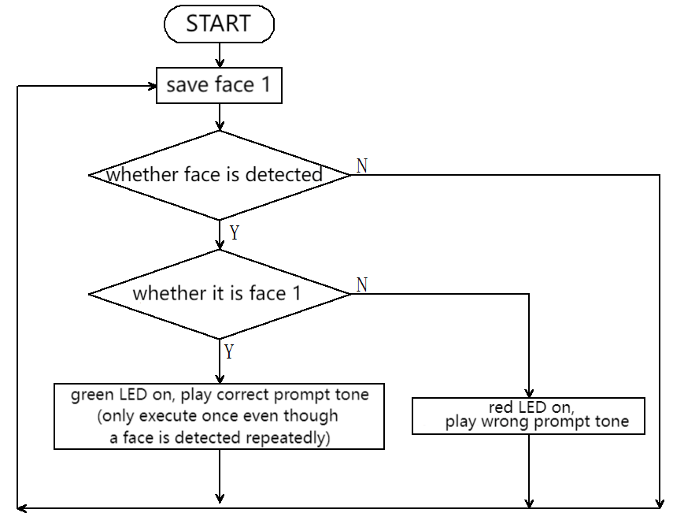

# 5.1 Face Unlock

## 5.1.1 Overview

For face unlock, the module determines whether the face is a stored one. If it is, a correct prompt tone will be played with the green LED on; if not, an error prompt tone will be played with a red LED on. We can train and store faces by long-pressing the function button of the module, and then it will recognize the face by code.

## 5.1.2 Code Flow



## 5.1.3 Test Code

```python
from machine import I2C,UART,Pin,PWM
from  Sengo2  import *
import time
from neopixel import myNeopixel

# Wait for Sengo2 to complete the initialization of the operating system. This waiting time cannot be removed to prevent the situation where the controller has already developed and sent instructions before Sengo2 has been fully initialized
time.sleep(2)

# Choose UART or I2C communication mode. Sengo2 is I2C mode by default. You can switch between the two by short pressing the mode button.
# Four UART communication modes: UART9600 (Standard Protocol Instruction), UART57600 (Standard Protocol Instruction), UART115200 (Standard Protocol Instruction), Simple9600 (Simple Protocol Instruction)
#########################################################################################################
# port = UART(2,rx=Pin(16),tx=Pin(17),baudrate=9600)
port = I2C(0,scl=Pin(21),sda=Pin(20),freq=400000)

# The communication address of Sengo2 is 0x60. If multiple devices are connected to the I2C bus, please avoid address conflicts.
sengo2 = Sengo2(0x60)

err = sengo2.begin(port)
print("sengo2.begin: 0x%x"% err)
 
# 1. Sengo2 can recognize 15 faces.
# 2. It can remember or delete facial data by the joystick or through serial port instructions.
# 3. During normal use, the main controller sends commands to control the on and off of Sengo2 algorithm, rather than manual operation by joystick.
err = sengo2.VisionBegin(sengo2_vision_e.kVisionFace)
print("sengo2.VisionBegin(sengo2_vision_e.kVisionFace):0x%x"% err)

#Initialize the passive buzzer
buzzer = PWM(Pin(12))

#Define the number of pin and LEDs connected to neopixel.
NUM_LEDS = 4
np = myNeopixel(NUM_LEDS, 13)
np.brightness(150) #brightness: 0 ~ 255

previousMillis = 0
lastDetectionTime = 0
disappearDelay = 5000  # 1000ms = 1s
currentFaceDetected = False


def play_success_sound():
    """Correct prompt tone: two crisp short tones"""
    for i in range(2):
        buzzer.freq(1500)    # 1500Hz high frequency
        buzzer.duty_u16(32768)  # 50% duty cycle (65536/2)
        time.sleep_ms(100)    # last 100ms
        buzzer.duty_u16(0)   # no tone
        time.sleep_ms(50)     # 50ms interval between tones

def play_error_sound():
    """Wrong prompt tone: single deep long note"""
    buzzer.freq(300)        # 300Hz low frequency
    buzzer.duty_u16(32768)  # 50% duty cycle
    time.sleep_ms(500)       # last 500ms
    buzzer.duty_u16(0)      # no tone


while True:
# Sengo2 does not actively return the detection and recognition results; it requires the main control board to send instructions for reading.
# The reading process: 1.read the number of recognition results. 2.After receiving the instruction, Sengo2 will refresh the result data. 3.If the number of results is not zero, the board will then send instructions to read the relevant information. 
# (Please be sure to build the program according to this process.)
    obj_num = sengo2.GetValue(sengo2_vision_e.kVisionFace, sentry_obj_info_e.kStatus)
    # Get the running time
    currentMillis = time.ticks_ms()
    if obj_num:
        for i in range(1,obj_num+1):        
            # Face label =0: stranger; Face label within 1-15: faces that have been memorized; Face label =200: face wearing a mask;
            l = sengo2.GetValue(sengo2_vision_e.kVisionFace, sentry_obj_info_e.kLabel, i)
            if l == 1 and not currentFaceDetected:
                lastDetectionTime = currentMillis
                currentFaceDetected = True
                np.fill(0, 255, 0)
                np.show()
                play_success_sound()
                time.sleep(0.2)
                np.fill(0, 0, 0)
                np.show()
                # Play tone
            elif l == 0 or l == 200:
                np.fill(255, 0, 0)
                np.show()
                play_error_sound()
                time.sleep(0.2)
                np.fill(0, 0, 0)
                np.show()
                # Play tone
            time.sleep(0.2)
          # 5-second delay code
        if currentFaceDetected and (currentMillis - lastDetectionTime >= disappearDelay): 
            currentFaceDetected = False  # Exit the activation status
            
```

## 5.1.4 Test Result

After uploading the code, the AI vision module will detect the image captured by the camera to determine if there is a face. If there is, it will judge whether it is the one we set. If yes, the car will emit a correct prompt tone with green LED on. If not, the car will emit a wrong prompt sound with red LED on.