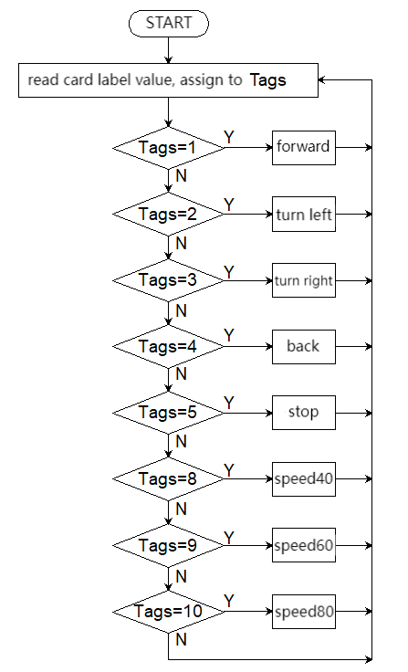

# 5.2 Card Control Car

## 5.2.1 Overview

In this project, we control the car through traffic cards. They include “forward”, “turn left”, “turn right”, “turn around(back)”, “stop”, “speed 40”, “speed 60”, “speed 80”, “red light”, and “green light”. The AI vision module can recognize them and control the car to perform corresponding actions based on the cards.

## 5.2.2 Code Flow



## 5.2.3 Test Code

```python
from machine import I2C,UART,Pin,PWM
from Sengo2 import *
import time

# Wait for Sengo2 to complete the initialization of the operating system. This waiting time cannot be removed to prevent the situation where the controller has already developed and sent instructions before Sengo2 has been fully initialized
time.sleep(2)

# Choose UART or I2C communication mode. Sengo2 is I2C mode by default. You can switch between the two by short pressing the mode button.
# Four UART communication modes: UART9600 (Standard Protocol Instruction), UART57600 (Standard Protocol Instruction), UART115200 (Standard Protocol Instruction), Simple9600 (Simple Protocol Instruction)
#########################################################################################################
# port = UART(2,rx=Pin(16),tx=Pin(17),baudrate=9600)
port = I2C(0,scl=Pin(21),sda=Pin(20 ),freq=400000)

# The communication address of Sengo2 is 0x60. If multiple devices are connected to the I2C bus, please avoid address conflicts.
sengo2 = Sengo2(0x60)

err = sengo2.begin(port)
print("sengo2.begin: 0x%x"% err)
 
# 1. Sengo2 can recognize 10 traffic cards.
# 2. If you need to recognize custom cards, first try to integrate the deep learning algorithm; If fialed, you may get a Sentry2, burn Sentry2MV firmware, collect images by yourself to train the model, and then write a python script to call the model.
# 3. Sengo2 can simultaneously recognize 8 cards (2 rows x 4 columns). Generally, the results are output in the order from top to bottom and from left to right.
# 4. During normal use, the main controller sends commands to control the on and off of Sengo2 algorithm, rather than manual operation by joystick.
# 5. Under specific restrictive conditions, Sengo2 can run multiple recognition algorithms in parallel
err = sengo2.VisionBegin(sengo2_vision_e.kVisionCard)
print("sengo2.VisionBegin(sengo2_vision_e.kVisionCard):0x%x"% err)

#Initialize the passive buzzer
buzzer = PWM(Pin(12))

# right wheel
pin1=Pin(14,Pin.OUT)
pin2=PWM(Pin(16))
pin2.freq(50)

# left wheel
pin3=Pin(15,Pin.OUT)
pin4=PWM(Pin(17))
pin4.freq(50)

# speed variables
right_speed = 50000
left_speed = 50000

# As a function of the car going forward.
def car_forward(): 
  pin1.value(0)
  pin2.duty_u16(right_speed) 
  pin3.value(0)
  pin4.duty_u16(left_speed)

# As a function of the car going backwards.
def car_back(): 
  pin1.value(1)
  pin2.duty_u16(50000 - right_speed)  
  pin3.value(1)
  pin4.duty_u16(50000 - left_speed)

# As a function of the car going left.
def car_left(): 
  pin1.value(0)
  pin2.duty_u16(25000)  
  pin3.value(1)
  pin4.duty_u16(25000)
# As a function of the car going right.
def car_right(): 
  pin1.value(1)
  pin2.duty_u16(25000)  
  pin3.value(0)
  pin4.duty_u16(25000)

# As a function of the car stopping.
def car_stop(): 
  pin1.value(0)
  pin2.duty_u16(0)  
  pin3.value(0)
  pin4.duty_u16(0)

# set the speed to 40% of 50000, corresponding to card of speed 40
def speed_40():
    # Declare that a global variable needs to be modified
    global left_speed,right_speed
    buzzer_play(20000)
    left_speed = int(50000 * 0.4)
    right_speed = int(50000 * 0.4)

# set the speed to 60% of 50000, corresponding to card of speed 60
def speed_60():
    # Declare that a global variable needs to be modified
    global left_speed,right_speed
    buzzer_play(30000)
    left_speed = int(50000 * 0.6)
    right_speed = int(50000 * 0.6)

# set the speed to 80% of 50000, corresponding to card of speed 80
def speed_80():
    # Declare that a global variable needs to be modified
    global left_speed,right_speed
    buzzer_play(40000)
    left_speed = int(50000 * 0.8)
    right_speed = int(50000 * 0.8)

# A prompt sound indicating a successful speed setting
def buzzer_play(speed):
    print("left_speed = %d",left_speed)
    if left_speed != speed:
        buzzer.freq(1000)    # 1000Hz high frequency
        buzzer.duty_u16(32768)  # 50% duty cycle (65536/2)
        time.sleep_ms(100)    # last 100ms
        buzzer.duty_u16(0)   # no tone
        time.sleep_ms(50)     # 50ms interval between tones

while True:
# Sengo2 does not actively return the detection and recognition results; it requires the main control board to send instructions for reading.
# The reading process: 1.read the number of recognition results. 2.After receiving the instruction, Sengo2 will refresh the result data. 3.If the number of results is not zero, the board will then send instructions to read the relevant information. 
# (Please be sure to build the program according to this process.)
    obj_num = (sengo2.GetValue(sengo2_vision_e.kVisionCard, sentry_obj_info_e.kStatus))
    #  to avoid confusion when multiple cards are recognized
    if obj_num == 1:
        for i in range(1,obj_num+1):
            # Card label value
            Tags = sengo2.GetValue(sengo2_vision_e.kVisionCard,sentry_obj_info_e.kLabel,i)
            if Tags == 1:
                car_forward()
            elif Tags == 2:
                car_left()
            elif Tags == 3:
                car_right()
            elif Tags == 4:
                car_back()
            elif Tags == 5:
                car_stop()
            elif Tags == 8:
                speed_40()
            elif Tags == 9:
                speed_60()
            elif Tags == 10:
                speed_80()
    else : car_stop()
    time.sleep(0.2)    

```

## 5.2.4 Test Result

After uploading the code, the AI vision module will detect the captured image to determine if there is a traffic card. If there is, assign the card label value to the variable Tags. 

Tags = 1: the car moves forward; Tags = 2: the car turns left; Tags = 3: the car turns right; Tags = 4: the car moves backward; Tags = 5: the car stops; 

Tags = 8: speed is set to 40% of full speed(255); Tags = 9: speed is set to 60% of full speed (255); Tags = 10: speed is set to 80% of full speed (255). 

(Note: The “beep” sound will only be emitted when the speed to be set is inconsistent with the current speed.)

