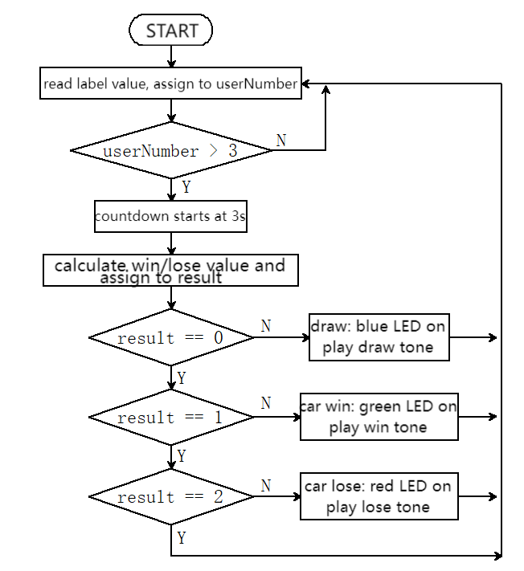

# 5.5 Jan-Ken Punch

## 5.5.1 Overview

In the Rock-paper-scissors game, we replace gestures with labels of 16h5, including 0(Rock), 1(Scissors) and 2(Paper), to compete with the car. The car will randomly generate 0(Rock), 1(Scissors) and 2(Paper). If the car wins, it will emit a green light and a victory sound. If the car loses, it will emit a red light and a defeat sound. If it’s a draw, the car will emit a blue light and a draw sound.

## 5.5.2 Code Flow



## 5.5.3 Test Code

```python
from machine import I2C,UART,Pin,PWM
from Sengo2 import *
import time
import random
from neopixel import myNeopixel

# Wait for Sengo2 to complete the initialization of the operating system. This waiting time cannot be removed to prevent the situation where the controller has already developed and sent instructions before Sengo2 has been fully initialized
time.sleep(3)

# Choose UART or I2C communication mode. Sengo2 is I2C mode by default. You can switch between the two by short pressing the mode button.
# Four UART communication modes: UART9600 (Standard Protocol Instruction), UART57600 (Standard Protocol Instruction), UART115200 (Standard Protocol Instruction), Simple9600 (Simple Protocol Instruction)
#########################################################################################################
# port = UART(2,rx=Pin(16),tx=Pin(17),baudrate=9600)
port = I2C(0,scl=Pin(21),sda=Pin(20),freq=400000)

# The communication address of Sengo2 is 0x60. If multiple devices are connected to the I2C bus, please avoid address conflicts.
sengo2 = Sengo2(0x60)
 
err = sengo2.begin(port)
print("sengo2.begin: 0x%x"% err)

# Select the encoding format. The default is 36H11. 
# If you need to switch the encoding format during the program's operation, please first turn off the Apriltag algorithm, set the encoding format, and then enable the new algorithm
#sengo2.VisionSetMode(sengo2_vision_e.kVisionAprilTag, apriltag_vision_mode_e.kVisionModeFamily36H11)
#sengo2.VisionSetMode(sengo2_vision_e.kVisionAprilTag, apriltag_vision_mode_e.kVisionModeFamily25H9)
sengo2.VisionSetMode(sengo2_vision_e.kVisionAprilTag, apriltag_vision_mode_e.kVisionModeFamily16H5)
time.sleep(1)
 
# 1. Pay attention that Apriltag is not QR code. When in use, we should remain a blank space around them.
# 2. sengo2 can run multiple algorithms simultaneously, but there are certain restrictions.
# 3. Parameter and result numbers of the Sengo series products all start from 1.
# 4. During normal use, the main controller sends commands to control the on and off of Sengo2 algorithm, rather than manual operation by joystick.
err = sengo2.VisionBegin(sengo2_vision_e.kVisionAprilTag)
print("sengo2.VisionBegin(sengo2_vision_e.kVisionAprilTag):0x%x"% err)

#Initialize the passive buzzer
buzzer = PWM(Pin(12))

#Define the number of pin and LEDs connected to neopixel.
NUM_LEDS = 4
np = myNeopixel(NUM_LEDS, 13)
np.brightness(150) #brightness: 0 ~ 255

def tone(pin, frequency, duration):
    """Play the sound of the specified frequency"""
    if frequency > 0:
        pin.freq(frequency)
        pin.duty_u16(32768)  # 50% duty cycle
    time.sleep_ms(duration)
    pin.duty_u16(0)  # stop play tone

def no_tone(pin):
    """no tone"""
    pin.duty_u16(0)

def countdown(seconds):
    """countdown sound"""
    for i in range(seconds, 0, -1):
        # The ticking of the countdown
        tone(buzzer, 800, 100)
        time.sleep_ms(200)
        no_tone(buzzer)
        
        # Interval time
        time.sleep_ms(500)

def play_start_sound():
    """game start sound"""
    # Ascending scale + ending note
    tones = [
        (523, 100),  # C5
        (659, 100),  # E5
        (784, 100),  # G5
        (1046, 300)  # C6 high
    ]
    
    for freq, dur in tones:
        tone(buzzer, freq, dur)
        time.sleep_ms(120)  # Note interval
    
    no_tone(buzzer)
    time.sleep_ms(350)

def victory_sound():
    """Victory sound"""
    tones = [
        (587, 150),  # D5
        (784, 100),  # G5
        (1046, 200)  # C6
    ]
    
    delays = [200, 120, 250]
    
    for (freq, dur), dly in zip(tones, delays):
        tone(buzzer, freq, dur)
        time.sleep_ms(dly)
    
    no_tone(buzzer)

def defeat_sound():
    """Defeat sound"""
    tones = [
        (220, 400),  # A3
        (196, 600)   # G3
    ]
    
    delays = [500, 700]
    
    for (freq, dur), dly in zip(tones, delays):
        tone(buzzer, freq, dur)
        time.sleep_ms(dly)
    
    no_tone(buzzer)

def draw_sound():
    """Draw sound"""
    for _ in range(3):
        tone(buzzer, 349, 80)  # F4
        time.sleep_ms(100)
        tone(buzzer, 330, 80)  # E4
        time.sleep_ms(100)
    no_tone(buzzer)

gesture = ["Rock","Scissors","Paper  "]

while True:
# Sengo2 does not actively return the detection and recognition results; it requires the main control board to send instructions for reading.
# The reading process: 1.read the number of recognition results. 2.After receiving the instruction, Sengo2 will refresh the result data. 3.If the number of results is not zero, the board will then send instructions to read the relevant information. 
# (Please be sure to build the program according to this process.)
    obj_num = sengo2.GetValue(sengo2_vision_e.kVisionAprilTag, sentry_obj_info_e.kStatus)
    # Randomly generate a number within 0 to 2
    randomNumber = random.randint(0,2)
    
    if obj_num:
            # label value
            userNumber = sengo2.GetValue(sengo2_vision_e.kVisionAprilTag, sentry_obj_info_e.kLabel, 1)
            if userNumber < 3:
                np.fill(0,0,0)
                np.show()
                result = (userNumber - randomNumber + 3) % 3
                countdown(3)
                play_start_sound()
                print(f"Robot:{gesture[randomNumber]}  You:{gesture[userNumber]}  Robot says:",end='')
                if result == 0:
                    print("Draw")
                    draw_sound()
                    np.fill(0,0,255)
                elif result == 1:
                    print("I win")
                    np.fill(0,255,0)
                    victory_sound()
                elif result == 2:
                    print("I lose")
                    np.fill(255,0,0)
                    defeat_sound()
                # refresh display
                np.show()
                # turn off PWM
                buzzer.deinit()

```

## 5.5.4 Test Result

After uploading the code, the AI vision module will detect the captured image to determine if there is 16h5 label. If there is, the label value will be transmitted to the development board. We can randomly place the cards with label values of “0, 1, 2” in the camera recognition area to play Janken with the car. If it’s a draw, the car will emit a blue light and a draw sound. If the car wins, it will emit a green light and a victory sound. If the car loses, it will emit a red light and a defeat sound.
