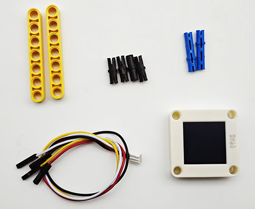

# 5.7 Red and Blue Sorting Car

## 5.7.1 Overview

In this project, we build an interesting color block sorting car by the AI vision module. We first need to mount the module on the soccer robot car to enable its recognition function. If a red block is detected, the car will convey it to the left side and return to its original position along the same path. If a blue one is detected, it will convey it to the right and come back.

## 5.7.2 Mount the AI module to the soccer robot car

**Required Parts**



**Step 1:**


**Step 2:**


**Step 3:**


**Step 4:**


**Step 5:**


**Step 6:**

| AI vision module | Car pins |
| :--------------: | :------: |
|   T/C (yellow)   |   SCL    |
|   R/D (white)    |   SDA    |
|    V/+ (red)     |    5V    |
|   G/- (black)    |    G     |


**Completed:**


## 5.7.3 Code Flow


## 5.7.4 Test Code

```python
from machine import I2C, Pin, PWM
import time
import random
from Sengo2 import *

# Initialize the PWM object, set srevo control pin GPIO 3
servo_pin = Pin(3)
servo = PWM(servo_pin)

# Set the PWM frequency to 50Hz (standard servo frequency)
servo.freq(50)

# Initialize I2C (adjust the pins according to the actual wiring
i2c = I2C(0, scl=Pin(21), sda=Pin(20), freq=400000)  # Use the pins in the reference code

# Wait for the initialization of Sengo2 (important!)
time.sleep(2)

# Create a Sengo2 object
sentry = Sengo2()

# Start sensor
if sentry.begin(i2c) != SENTRY_OK:
    print("Sentry initialization failed!")
    while True: pass

# Set the color block detection parameters - only detect red and blue
sentry.SetParamNum(sengo2_vision_e.kVisionBlob, 2)  # Set two sets of parameters

# Red parameter group
sentry.SetParam(
    sengo2_vision_e.kVisionBlob,
    [0, 0, 25, 25, color_label_e.kColorRed],  # Parameter format
    param_id=1
)

# Blue parameter group
sentry.SetParam(
    sengo2_vision_e.kVisionBlob,
    [0, 0, 25, 25, color_label_e.kColorBlue],  # Parameter format
    param_id=2
)

# Enable the color block detection function
if sentry.VisionBegin(sengo2_vision_e.kVisionBlob) == SENTRY_OK:
    print("Color block detection enabled")
    
    
# Define the conversion function from the servo angle to the duty cycle
def set_servo_angle(angle):
    # Make sure the angle is within the range of 0 to 270 degrees
    if angle < 0:
        angle = 0
    elif angle > 270:
        angle = 270
    
    # Convert the angle to the duty cycle
    # For a 270-degree servo, a 0.5ms pulse usually corresponds to 0 degrees, and a 2.5ms pulse corresponds to 270 degrees
    min_duty = 1638  # 0.5ms duty cycle (0.5/20 * 65535)
    max_duty = 8192  # 2.5ms duty cycle (2.5/20 * 65535)
    
    # Calculate the duty cycle of the corresponding angle
    duty = int(min_duty + (max_duty - min_duty) * angle / 270)
    servo.duty_u16(duty)
    
# right wheel
pin1=Pin(14,Pin.OUT)
pin2=PWM(Pin(16))
pin2.freq(50)

# left wheel
pin3=Pin(15,Pin.OUT)
pin4=PWM(Pin(17))
pin4.freq(50)

# As a function of the car going forward.
def car_forward(): 
  pin1.value(0)
  pin2.duty_u16(20000) 
  pin3.value(0)
  pin4.duty_u16(20000)

# As a function of the car going backwards.
def car_back(): 
  pin1.value(1)
  pin2.duty_u16(40000)  
  pin3.value(1)
  pin4.duty_u16(40000)

# As a function of the car going left.
def car_left(): 
  pin1.value(0)
  pin2.duty_u16(10000)  
  pin3.value(1)
  pin4.duty_u16(45000)
# As a function of the car going right.
def car_right(): 
  pin1.value(1)
  pin2.duty_u16(45000)  
  pin3.value(0)
  pin4.duty_u16(10000)

# As a function of the car stopping.
def car_stop(): 
  pin1.value(0)
  pin2.duty_u16(0)  
  pin3.value(0)
  pin4.duty_u16(0)
    
# color block sorting
def sorting(val):
    # grab the color block
    set_servo_angle(270)
    time.sleep(1)
    # Determine val, 0 is the red block and 1 is the blue block
    if val == 0:
        # car turns left
        car_left()
    else :
        # car turns right
        car_right()
    time.sleep(0.3)
    # The car moves forward for 0.3 seconds
    car_forward()
    time.sleep(0.3)
    car_stop()
    time.sleep(0.3)
    # Open the clip and put down the color block
    set_servo_angle(240)
    time.sleep(0.5)
    # The car moves back for 0.3 seconds
    car_back()
    time.sleep(0.3)
    # Determine val, 0 is the red block and 1 is the blue block
    if val == 0:
        # car turns right
        car_right()
    else :
        # car turns left
        car_left()
    time.sleep(0.3)

# loop
try:
    while True:
        # Obtain the number of detected color blocks
        obj_num = sentry.GetValue(sengo2_vision_e.kVisionBlob,sentry_obj_info_e.kStatus)
        if obj_num:
            # Process each detected color block
            for i in range(1, obj_num + 1):
                # Obtain the color label
                color_label = sentry.GetValue(sengo2_vision_e.kVisionBlob,sentry_obj_info_e.kLabel,i)
                # Determine whether a red block has been detected
                if color_label == color_label_e.kColorRed:
                    sorting(0)
                # Determine whether a blue block has been detected
                elif color_label == color_label_e.kColorBlue:
                    sorting(1)
        else :
            car_stop()
        time.sleep(0.1)  # short delay

except KeyboardInterrupt:
    sentry.VisionEnd(sengo2_vision_e.kVisionBlob)
    # Turn off PWM when the program is interrupted
    servo.duty_u16(0)
    servo.deinit()
    print("The program has stopped")

```

## 5.7.5 Test Result

After uploading the code, the AI vision module will enable the “Blob” mode to recognize the captured image to determine whether there are red or blue blocks. If a red block is detected, the car will hold the red block and send it to the left side, and then it will return to its original position along the same path. If a blue one is detected, the car will convey it to the right side and come back. (There may be a slight deviation from the original position after the car moves back because it was set based on the driving time.)

Note: The code sets the minimum width 25 and minimum height 25 of the color block. If the size of your block is smaller than this, it will not be recognized. These values can be modified in the following code according to your needs.

```python
# Red parameter group
sentry.SetParam(
    sengo2_vision_e.kVisionBlob,
    [0, 0, 25, 25, color_label_e.kColorRed],  # Parameter format
    param_id=1
)

# Blue parameter group
sentry.SetParam(
    sengo2_vision_e.kVisionBlob,
    [0, 0, 25, 25, color_label_e.kColorBlue],  # Parameter format
    param_id=2
)
```

